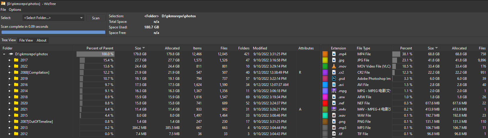

# 保留真正重要的照片
*Posted on 2022.09.15 by [Pengwei](http://pwz.wiki) under [CC BY-SA 4.0](https://creativecommons.org/licenses/by-sa/4.0/)*  

[TOC]

## 照片库规模和管理方案

两周前我的照片库规模有`24,356 Files, 684 Folders，435 GB`，现在两周多过去，数据变成了`12,045 Files, 421 Folders, 179 GB`，无论从照片数量还是整体体积上，都已经达到开始清理时（拍脑门定下的）的目标——缩减一半。有些删上瘾了，这种清理工作，没有个清晰的边界，2012~2022，11年跨度的照片算下来平均每年仍1000多张，我真的每年有1000多张值得保留的照片么？并没有，还可以继续删下去。到什么时候为止呢？

采用`年份/月份/日期及主题`三级目录的树状形式进行划分，完全通过文件管理器进行手动管理

## 哪些照片是真正重要的

* 搞清楚自己真正的想法
* 明确界限、判断标准

## 照片管理以及清理的辅助工具

* 需求场景 --> 解决方案

## 别人是怎么想以及怎么做的

* 博客（前日在阮一峰博客中翻出的
* 书籍
* 白日梦想家