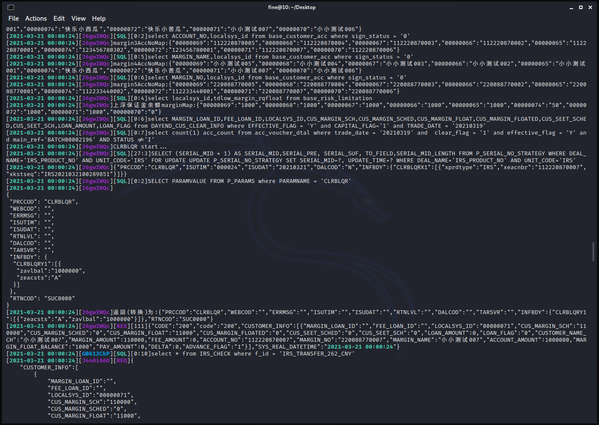

# 使用Perl正则替换优化tail-f命令查看日志的显示效果
Tail -f logs with syntax highlighting through perl regex replace  
*Posted on 2021.05.16 by [Pengwei Zhang](http://pwz.wiki) under [CC BY-SA 4.0](https://creativecommons.org/licenses/by-sa/4.0/)*  

<!-- TOC -->

- [1. 脚本及效果](#1-脚本及效果)
    - [1.1. 日志样本](#11-日志样本)
    - [1.2. 着色效果](#12-着色效果)
    - [1.3. 脚本](#13-脚本)
        - [1.3.1. 基线](#131-基线)
        - [1.3.2. 改进](#132-改进)
- [2. 笔记及解析](#2-笔记及解析)
    - [2.1. stdin、stdout与管道](#21-stdinstdout与管道)
    - [2.2. tail -f](#22-tail--f)
    - [2.3. perl basic](#23-perl-basic)
    - [2.4. perl 正则表达式](#24-perl-正则表达式)
    - [2.5. perl -pe](#25-perl--pe)
    - [2.6. perl 特殊变量](#26-perl-特殊变量)
    - [2.7. console_codes](#27-console_codes)

<!-- /TOC -->

日常运维频繁使用`tail -f`看日志，可以通过能控制显示效果的转义序列及Perl-pe模式下的正则替换实现tail命令的自定义语法高亮支持。

## 1. 脚本及效果

### 1.1. 日志样本

样本的格式为：*[时间][线程标识][执行类型][执行时间]具体日志*

```log
[2021-03-21 16:19:01][QOfY4eI3][SQL][0:3]select * from IRS_CHECK where f_id = 'GET_MSGID'
[2021-03-21 16:19:01][ydyHfeuy][REQ]{"code":"67a5298c8cf6a78e91f9c7cc461a5695d467b0f7da956e84c1013cde4d3b427da58430ccad744628","u":"FRONT","f":"GET_MSGID","l":"34C3B3B3D3B343B324C3C334D3344616165615ea6125913f266c157bf69549b6f991b0"}
[2021-03-21 16:19:01][ydyHfeuy][SQL][0:3]SELECT FUNCTION_NO F, OUTPUTPARAM, INPUTPARAM, SERVICES_INFO,FUNC_TYPE,DATASOURCE,SCRIPT_INFO from P_FUNCTION_NO  WHERE FUNCTION_NO = 'GET_MSGID'
[2021-03-21 16:19:01][ydyHfeuy][SQL][0:1]SELECT FUNCTION_NO F, OUTPUTPARAM, INPUTPARAM, SERVICES_INFO,FUNC_TYPE,DATASOURCE,SCRIPT_INFO from P_FUNCTION_NO  WHERE FUNCTION_NO = 'FRAM_SYSTEM'
[2021-03-21 16:19:02][ydyHfeuy][SQL][10:3]SELECT (SERIAL_MID + 1) AS SERIAL_MID,SERIAL_PRE, SERIAL_SUF, TO_FIELD,SERIAL_MID_LENGTH FROM P_SERIAL_NO_STRATEGY WHERE DEAL_NAME='MSG_ID' AND UNIT_CODE='kingstar' FOR UPDATE UPDATE P_SERIAL_NO_STRATEGY SET SERIAL_MID=?, UPDATE_TIME=? WHERE DEAL_NAME='MSG_ID' AND UNIT_CODE='kingstar'
[2021-03-21 16:19:02][ydyHfeuy][RES][20]{"CODE":"200","code":"200","header":{"code":"0","errMessage":""},"tradeDate":{"tradeDate":"00000208"},"SYS_REAL_DATETIME":"2021-03-21 16:19:01"}
[2021-03-21 16:19:02][v3WRMNqB][SQL][0:3]select * from IRS_CHECK where f_id = 'RT02'
[2021-03-21 16:19:02][JNpPjltQ][REQ]{"code":"a568f91844bde8b434d5daab5e02e55444cb0655a15c5e7c6de30d915ef14846bed3a45893272960","ENTITYID":"1234001","RECORDNUM":"1","f":"RT02","STATUS1":"0","MSGTYPE":null,"l":"34C3B3B3D3B343B324C3C334D3344616165615ea6125913f266c157bf69549b6f991b0","MEMID":null,"DEALCODE":"IRS201404160000001","CONTRACTCODE":"CF201404160000033","u":"FRONT","STATUS3":"4","STATUS2":"3","DEALTYPE":"N","SENDTIME":null,"ID":"1","MSGID":null}
[2021-03-21 16:19:02][JNpPjltQ][SQL][0:1]SELECT FUNCTION_NO F, OUTPUTPARAM, INPUTPARAM, SERVICES_INFO,FUNC_TYPE,DATASOURCE,SCRIPT_INFO from P_FUNCTION_NO  WHERE FUNCTION_NO = 'RT02'
[2021-03-21 16:19:02][JNpPjltQ][SQL][0:1]SELECT FUNCTION_NO F, OUTPUTPARAM, INPUTPARAM, SERVICES_INFO,FUNC_TYPE,DATASOURCE,SCRIPT_INFO from P_FUNCTION_NO  WHERE FUNCTION_NO = 'FRAM_SYSTEM'
[2021-03-21 16:19:02][JNpPjltQ][SQL][0:1]SELECT PARAMVALUE FROM P_PARAMS where PARAMNAME = 'SYS_SYSDATE_FLAG'
[2021-03-21 16:19:02][JNpPjltQ][SQL][0:3]SELECT * FROM ( SELECT A.*, ROWNUM RN FROM ( select   COLUMN_NAME AS COLUMN_NAME   from   user_cons_columns  where   constraint_name   =   (select   constraint_name   from   user_constraints where   table_name ='BASE_TRADE_INFO'  and   constraint_type   ='P') ) A WHERE ROWNUM <= 10) WHERE RN > 0
[2021-03-21 16:19:02][JNpPjltQ][SQL][29]UPDATE BASE_TRADE_INFO SET TRADE_STATUS='4',MODIFY_TIME=TO_DATE('2021-03-21 16:19:02','YYYY-MM-DD HH24:MI:SS') WHERE  CUST_TRADECODE='1234001' AND DEAL_CODE='IRS201404160000001' effect:0
[2021-03-21 16:20:01][xjR155pI][SQL][0:1]SELECT FUNCTION_NO F, OUTPUTPARAM, INPUTPARAM, SERVICES_INFO,FUNC_TYPE,DATASOURCE,SCRIPT_INFO from P_FUNCTION_NO  WHERE FUNCTION_NO = 'RT02'
[2021-03-21 16:20:01][xjR155pI][SQL][0:2]SELECT FUNCTION_NO F, OUTPUTPARAM, INPUTPARAM, SERVICES_INFO,FUNC_TYPE,DATASOURCE,SCRIPT_INFO from P_FUNCTION_NO  WHERE FUNCTION_NO = 'FRAM_SYSTEM'
[2021-03-21 16:20:01][xjR155pI][SQL][1:3]SELECT PARAMVALUE FROM P_PARAMS where PARAMNAME = 'SYS_SYSDATE_FLAG'
[2021-03-21 16:20:02][xjR155pI][SQL][0:6]SELECT * FROM ( SELECT A.*, ROWNUM RN FROM ( select   COLUMN_NAME AS COLUMN_NAME   from   user_cons_columns  where   constraint_name   =   (select   constraint_name   from   user_constraints where   table_name ='BASE_TRADE_INFO'  and   constraint_type   ='P') ) A WHERE ROWNUM <= 10) WHERE RN > 0
[2021-03-21 16:20:02][xjR155pI][SQL][28]UPDATE BASE_TRADE_INFO SET TRADE_STATUS='4',MODIFY_TIME=TO_DATE('2021-03-21 16:20:01','YYYY-MM-DD HH24:MI:SS') WHERE  CUST_TRADECODE='1234001' AND DEAL_CODE='IRS201404160000001' effect:0
[2021-03-21 16:20:02][xjR155pI][Debug]service return null:SCHInterfaceService
[2021-03-21 16:20:02][xjR155pI][RES][45]{"CODE":"200","code":"200","SYS_REAL_DATETIME":"2021-03-21 16:20:01"}
[2021-03-21 16:21:01][mtSFjbvS][SQL][0:3]select * from IRS_CHECK where f_id = 'GET_MSGID'
[2021-03-21 16:21:01][wEfsfuoO][REQ]{"code":"3ecb49142fcbc530a555ba53891884e9e896b08b52a38228d3b4ef8de4a54364bcfdf47876371970","u":"FRONT","f":"GET_MSGID","l":"34C3B3B3D3B343B324C3C334D3344616165615ea6125913f266c157bf69549b6f991b0"}
```

### 1.2. 着色效果




### 1.3. 脚本

#### 1.3.1. 基线

```perl
#!/bin/perl

$PID_PATTERN = "(\[[a-zA-Z0-9]{8}])";
$TIME_PATTERN = "([0-9]*-[0-9]*-[0-9]* [0-9]*:[0-9]*:[0-9]*)";
$ERROR_KEYWORDS = "(ErrorMsgException|NullPointerException|FileNotFoundException|JSONException|NumberFormatException|Error|Exception|失败)";
$MOCK_KEYWORDS = "()";  # 挡板接口

$PID = "";
$OLD_PID = "";

# 30  黑色
# 31  红色
# 32  绿色
# 33  黄色
# 34  蓝色
# 35  紫色
# 36  青色
# 37  白色

$PID_COLOR = 36;
$TIME_COLOR = 32;
$SQL_COLOR = 32;
$REQ_COLOR = 35;
$RES_COLOR = 35;
$ERROR_COLOR = 31;
$MOCK_COLOR = 33;

while(<STDIN>){
  # 日期着色
  $_ =~ s/$TIME_PATTERN/\e[1;32m$1\e[0m/g;  # g=全局匹配
  # 线程号着色（同线程同颜色）
  if($_ =~ m/(\[[a-zA-Z0-9]{8}])/){
    $PID = substr($&,1,8);
    # print "Got PID : $PID\n";
    # print "Old PID : $OLD_PID\n";
    if($PID eq $OLD_PID){
      $_ =~ s/\[$PID]/[\e[1;\Q$PID_COLOR\Em$PID\e[0m]/g;
    }else{
      $OLD_PID = $PID;
      $PID_COLOR = ($PID_COLOR == 35) ? 36 : 35;
      $_ =~ s/\[$PID]/[\e[1;\Q$PID_COLOR\Em$PID\e[0m]/g;
    }
  }
  # REQ着色（但不污染详细日志）
  $_ =~ s/(\[REQ])/[\e[1;\Q$REQ_COLOR\EmREQ\e[0m]/g;
  # RES着色（但不污染详细日志）
  $_ =~ s/(\[RES])/[\e[1;\Q$RES_COLOR\EmRES\e[0m]/g;
  # SQL着色（但不污染详细日志）
  $_ =~ s/(\[SQL])/[\e[1;\Q$SQL_COLOR\EmSQL\e[0m]/g;

  # 报错关键字着色
  $_ =~ s/($ERROR_KEYWORDS)/\e[1;\Q$ERROR_COLOR\Em$1\e[0m/ig;  # i=忽略大小写
  # 挡板接口着色
  # $_ =~ s/$MOCK_KEYWORDS/\e[1;\Q$MOCK_COLOR\Em$1\e[0m/ig;

  print "$_";
}
```

将上述代码中的while语句及注释去掉，整理成一行：

```bash
#!/bin/bash
tail -10000f 2021-03-21.log | perl -pe '$PID_PATTERN = "(\[[a-zA-Z0-9]{8}])";$TIME_PATTERN = "([0-9]*-[0-9]*-[0-9]* [0-9]*:[0-9]*:[0-9]*)";$ERROR_KEYWORDS = "(ErrorMsgException|NullPointerException|FileNotFoundException|JSONException|NumberFormatException|Error|Exception|失败)";$MOCK_KEYWORDS = "()";$PID = "";$OLD_PID = "";$PID_COLOR = 36;$TIME_COLOR = 32;$SQL_COLOR = 32;$REQ_COLOR = 35;$RES_COLOR = 35;$ERROR_COLOR = 31;$MOCK_COLOR = 33;  $_ =~ s/$TIME_PATTERN/\e[1;32m$1\e[0m/g;  if($_ =~ m/(\[[a-zA-Z0-9]{8}])/){    $PID = substr($&,1,8); if($PID eq $OLD_PID){       $_ =~ s/\[$PID]/[\e[1;\Q$PID_COLOR\Em$PID\e[0m]/g;    }else{  $OLD_PID = $PID;      $PID_COLOR = ($PID_COLOR == 35) ? 36 : 35;      $_ =~ s/\[$PID]/[\e[1;\Q$PID_COLOR\Em$PID\e[0m]/g;    }  }  $_ =~ s/(\[REQ])/[\e[1;\Q$REQ_COLOR\EmREQ\e[0m]/g;  $_ =~ s/(\[RES])/[\e[1;\Q$RES_COLOR\EmRES\e[0m]/g;  $_ =~ s/(\[SQL])/[\e[1;\Q$SQL_COLOR\EmSQL\e[0m]/g;  $_ =~ s/($ERROR_KEYWORDS)/\e[1;\Q$ERROR_COLOR\Em$1\e[0m/ig;'
```

这样简单的转换存在一个问题，每一次新的输入传输给perl运行的时候，都重头跑了一遍变量初始化，这导致`$OLD_PID`及`$PID_COLOR`这两个需要变化的参数无法将变化传递给下一行，解决办法则是删掉这两个变量的初始化语句（*Note@Perl变量的生命周期、命名空间相关内容需要进一步了解*），另外在线程号着色代码块中增加`$PID_COLOR = ($PID_COLOR == 35) ? 35 : 36; `对`$PID_COLOR`进行额外赋值。


#### 1.3.2. 改进

```perl
#!/bin/perl

$PID_PATTERN = "(\[[a-zA-Z0-9]{8}])";
$TIME_PATTERN = "([0-9]*-[0-9]*-[0-9]* [0-9]*:[0-9]*:[0-9]*)";
$ERROR_KEYWORDS = "(ErrorMsgException|NullPointerException|FileNotFoundException|JSONException|NumberFormatException|Error|Exception|null|失败)";

$TIME_COLOR = 32;
$SQL_COLOR = 32;
$REQ_COLOR = 35;
$RES_COLOR = 35;
$ERROR_COLOR = 31;
$MOCK_COLOR = 33;

while(<STDIN>){
  $_ =~ s/$TIME_PATTERN/\e[1;32m$1\e[0m/g;
  if($_ =~ m/(\[[a-zA-Z0-9]{8}])/){
    $PID = substr($&,1,8);
    if($PID eq $OLD_PID){
      $PID_COLOR = ($PID_COLOR == 35) ? 35 : 36;
      $_ =~ s/\[$PID]/[\e[1;\Q$PID_COLOR\Em$PID\e[0m]/g;
    }else{
      $OLD_PID = $PID;
      $PID_COLOR = ($PID_COLOR == 35) ? 36 : 35;
      $_ =~ s/\[$PID]/[\e[1;\Q$PID_COLOR\Em$PID\e[0m]/g;
    }
  }
  $_ =~ s/(\[REQ])/[\e[1;\Q$REQ_COLOR\EmREQ\e[0m]/g;
  $_ =~ s/(\[RES])/[\e[1;\Q$RES_COLOR\EmRES\e[0m]/g;
  $_ =~ s/(\[SQL])/[\e[1;\Q$SQL_COLOR\EmSQL\e[0m]/g;
  $_ =~ s/($ERROR_KEYWORDS)/\e[1;\Q$ERROR_COLOR\Em$1\e[0m/ig;

  print "$_";
}
```

命令行化：

```bash
#!/bin/bash
tail -10000f 2021-03-21.log | perl -pe '$PID_PATTERN = "(\[[a-zA-Z0-9]{8}])";$TIME_PATTERN = "([0-9]*-[0-9]*-[0-9]* [0-9]*:[0-9]*:[0-9]*)";$ERROR_KEYWORDS = "(ErrorMsgException|NullPointerException|FileNotFoundException|JSONException|NumberFormatException|Error|Exception|null|失败)";$TIME_COLOR = 32;$SQL_COLOR = 32;$REQ_COLOR = 35;$RES_COLOR = 35;$ERROR_COLOR = 31;$MOCK_COLOR = 33;  $_ =~ s/$TIME_PATTERN/\e[1;32m$1\e[0m/g;  if($_ =~ m/(\[[a-zA-Z0-9]{8}])/){    $PID = substr($&,1,8);    if($PID eq $OLD_PID){      $PID_COLOR = ($PID_COLOR == 35) ? 35 : 36;      $_ =~ s/\[$PID]/[\e[1;\Q$PID_COLOR\Em$PID\e[0m]/g;    }else{      $OLD_PID = $PID;      $PID_COLOR = ($PID_COLOR == 35) ? 36 : 35;      $_ =~ s/\[$PID]/[\e[1;\Q$PID_COLOR\Em$PID\e[0m]/g;    }  }  $_ =~ s/(\[REQ])/[\e[1;\Q$REQ_COLOR\EmREQ\e[0m]/g;  $_ =~ s/(\[RES])/[\e[1;\Q$RES_COLOR\EmRES\e[0m]/g;  $_ =~ s/(\[SQL])/[\e[1;\Q$SQL_COLOR\EmSQL\e[0m]/g;  $_ =~ s/($ERROR_KEYWORDS)/\e[1;\Q$ERROR_COLOR\Em$1\e[0m/ig;'
```


## 2. 笔记及解析

### 2.1. stdin、stdout与管道

标准输入输出流一般情况下直接连接到键盘与屏幕，管道的作用在于将上一个程序的标准输出流**重定向**到下一个程序的标准输入中去。

>If we look at a command like `ls`, we can see that it displays its results and its error messages on the screen.  
>Keeping with the Unix theme of “everything is a file,” programs such as ls actually send their results to a special file called *standard output* (often expressed as *stdout*) and their status messages to another file called *standard error* (*stderr*). By default, both *standard output* and *standard error* are linked to the screen and not saved into a disk file.  
>In addition, many programs take input from a facility called *standard input* (*stdin*), which is, by default, attached to the keyboard.[`1][1]

[1]:# "The Linux Command Line - A Complete Introduction, 2nd Edition, William Shotts"

### 2.2. tail -f

*tail命令属于[GNU core utilities](https://www.gnu.org/software/coreutils/)，官网可以下载到源码*

//TODO 源码阅读

`-f`参数开启follow模式，文件有改动时候读取新内容并输出到标准输出流中。

### 2.3. perl basic

1. 变量：弱类型，perl的普通变量以`$符`开头进行定义，数组则以`@符`开头
2. 控制结构：if...elsif...else、for(init;pd;op){}、while(){}
3. I/O：`<STDIN>`代表标准输入，print语句不用括号
4. 其它：语句使用分号结束，缩进自由

*以上信息并不严谨*

示例：
```perl
#!/bin/perl
$vocal = <STDIN>;
print "what you said : $vocal";
for($i = 1;$i <= 9; $i++){
  if($i == 1){print "the $i st echo : ";}
  elsif($i == 2){print "the $i nd echo : ";}
  elsif($i == 3){print "the $i rd echo : " ;}
  else{print "the $i th echo : ";}
  print "$vocal";
}

# [test@localhost ~]$ ./perl.pl
# who is there?
# what you said : who is there?
# the 1 st echo : who is there?
# the 2 nd echo : who is there?
# the 3 rd echo : who is there?
# the 4 th echo : who is there?
# the 5 th echo : who is there?
# the 6 th echo : who is there?
# the 7 th echo : who is there?
# the 8 th echo : who is there?
# the 9 th echo : who is there?
```

### 2.4. perl 正则表达式

perl的正则表达式分三种模式：

1. 匹配：m/PATTERN/（m可省略）
2. 替换：s/PATTERN/REPLACEMENT/
3. 转化：tr/PATTERN1/PATTERN2/

`$_`是一个特殊变量，是默认的输入及正则匹配的对象：
```perl
#!/bin/perl
while(1){
  $_ = <STDIN>;
  if(m/[5]/){
    print "Hit!\n";
  }else{
    print "Oops.\n";
  }
}

# [test@localhost ~]$ ./perl.pl
# 123
# Oops.
# 789
# Oops.
# 456
# Hit!
# 12345678
# Hit!
```

*上述代码可以简写为：*
```perl
#!/bin/perl
while(<STDIN>){  # STDIN被自动存到了$_中
  if(m/[5]/){
    print "Hit!\n";
  }else{
    print "Oops.\n";
  }
}
```
*！但是注意这不代表标准输入`<STDIN>`总会被自动存到`$_`中：*  
>Perl doesn’t 
matically store the line of input into $_ unless  the  line-input  operator  (\<STDIN>)  is  all  alone  in  the  conditional expression of a while loop.[`2][2]

[2]:# "Learning Perl Making Easy Things Easy and Hard Things Possible, 7th Edition by Randal L. Schwartz, brian d foy, Tom Phoenix"

正则操作中通常不是像如上代码直接去处理`$_`，更常用的是利用`=~`处理指定变量：

示例：
```perl
#!/bin/perl
while(1){
  print "Input a +86 phone number:\n";
  $phone = <STDIN>;
  if($phone =~ /^(13[0-9]|14[5|7]|15[0|1|2|3|4|5|6|7|8|9]|18[0|1|2|3|5|6|7|8|9])\d{8}/){
    print "Oh, that's a truly number.\n"
  }else{
    print "Fake number!\n"
  }
}


# [test@localhost ~]$ ./perl.pl
# Input a +86 phone number:
# 14412340000
# Fake number!
# Input a +86 phone number:
# 18810325061
# Oh, that's a truly number.
# Input a +86 phone number:
# 18446441009
# Fake number!
# Input a +86 phone number:
# ^C
```

### 2.5. perl -pe

通过`perl -h`检索各参数的意义，参数组合`-pe`可以实现在命令行中执行perl代码，并且自动输入输出。

```shell
[test@localhost ~]$ perl -h | grep -E "\-n|\-e|\-p"
  -a                
  split mode with -n or -p (splits $_ into @F)
  -e program        one line of program (several -e's allowed, omit programfile)
  -E program        like -e, but enables all optional features
  -n                assume "while (<>) { ... }" loop around program
  -p                assume loop like -n but print line also, like sed
```

`perl -e`命令行模式直接执行之后的代码，类比`python -c`：

```vb
┌──(fine㉿10)-[/bin]
└─$ perl -e 'print "hello"'
hello

┌──(fine㉿10)-[/bin]
└─$ python -c 'print "hello"'
hello
```

`perl -p`自动输入输出以及中途进行正则表达式操作使用的中间变量均为`$_`:

```shell
[test@localhost ~]$ perl -pe 'print"1. $_";s/hello/olleh/;print"2. $_";s/olleh/hi/;print"3. "'

# hello world
# 1. hello world
# 2. olleh world
# 3. hi world
# ^C
```
分析：  
* line 1：所输入的`hello world`被存到了`$_`中  
* line 2：正则替换操作后，操作结果也被存到了`$_`中  
* line 3：再次正则替换，没有进行手动输出，此时所有为`-e`参数提供的处理代码已经执行完毕，在`-p`参数影响下进行了自动输出，输出内容仍取自`$_`

所以以上命令行代码相当于如下代码：

```perl
#!/bin/perl

# perl -pe 'print"1. $_";s/hello/olleh/;print"2. $_";s/olleh/hi/;print"3. "' 等价于：
while(<STDIN>){ 
  {
    print"1. $_";
    $_ =~ s/hello/olleh/;
    print"2. $_";
    $_ =~ s/olleh/hi/;
    print"3. ";
  }
  print "$_";
}

# [test@localhost ~]$ ./perl.pl
# hello there
# 1. hello there
# 2. olleh there
# 3. hi there
# ^C
```


### 2.6. perl 特殊变量

perl语言中定义了很多特殊变量，除了`$_`，与正则表达式相关的特殊变量还有：

|name|full name|describe|
|:---:|:--:|:---|
|$n  |-  |包含上次模式匹配的第n个子串（括号中的子表达式）|
|$&  |$MATCH  |前一次成功模式匹配的字符串|
|$`  |$PREMATCH  |前次匹配成功的子串之前的内容|
|$'  |$POSTMATCH  |前次匹配成功的子串之后的内容|
|$+  |$LAST_PAREN_MATCH  |与上个正则表达式搜索格式匹配的最后一个括号|

示例：
```perl
#!/bin/perl

$str="abcd1234qwer";
$str=~ m/1234/;
print "\$& = $&\n";
print "\$` = $`\n";
print "\$' = $'\n";
print "\$1 = $1\n";
print "---\n";

$str=~ m/(1234)(qwer)/;
print "\$1 = $1\n";
print "\$2 = $2\n";
print "\$+ = $+\n";

# ┌──(fine㉿10)-[~/Desktop]
# └─$ ./perl.pl 
# $& = 1234
# $` = abcd
# $' = qwer
# $1 = 
# ---
# $1 = 1234
# $2 = qwer
# $+ = qwer
```

### 2.7. console_codes

操作系统驱动硬件运转，在Linux中`console_codes`覆盖了屏幕显示相关的控制字符，之前的文章[*Python3从零到一挑战：写个文字版RPG*](../../2020/04/2020040401-python3-zero-to-one-challenge-a-text-rpg-game.md)使用了同样的转义序列实现小游戏的文字着色。

转义序列：`\033[显示方式;前景色;背景色m输出内容\033[0m`

*NOTE:转义序列以`ESC`开始，用八进制表示即`\033`，Linux下写为`\e`也可被识别。*

显示方式：

* 0（默认）
* 1（高亮加粗）
* 22（非粗体）
* 4（下划线）
* 24（非下划线）
* 5（闪烁）
* 25（非闪烁）
* 7（反显）
* 27（非反显）


颜色：

|字体色|背景色|颜色|
|:---:|:--:|:---:|
|30  |40  |黑色|
|31  |41  |红色|
|32  |42  |绿色|
|33  |43  |黄色|
|34  |44  |蓝色|
|35  |45  |紫色|
|36  |46  |青色|
|37  |47  |白色|
