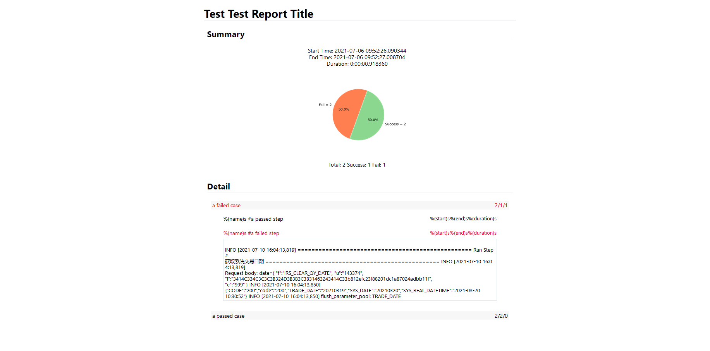

<!-- no toc -->
# An API Autotest Tool Part2: Generate Test Report from Scratch

*Posted on 2021.07.19 by [Pengwei Zhang](http://pwz.wiki) under [CC BY-SA 4.0](https://creativecommons.org/licenses/by-sa/4.0/)* 

*Inspired by the [HTMLTestRunner](http://tungwaiyip.info/software/HTMLTestRunner.html)*

- [An API Autotest Tool Part2: Generate Test Report from Scratch](#an-api-autotest-tool-part2-generate-test-report-from-scratch)
  - [How it looks](#how-it-looks)
  - [Code Summary](#code-summary)
  - [Html Templates](#html-templates)
    - [Report Template](#report-template)
    - [Summary Template](#summary-template)
    - [Case Template](#case-template)
    - [Step Template](#step-template)
    - [CSS Template](#css-template)
  - [The JS Function](#the-js-function)
  - [Generate Report](#generate-report)
    - [Paratemeters (test_summary_dict & case_detail_list) from run_test.py](#paratemeters-test_summary_dict--case_detail_list-from-run_testpy)
    - [Main Method: generate_report(test_summary_dict, case_detail_list)](#main-method-generate_reporttest_summary_dict-case_detail_list)
    - [Sub Method 1: generate_html_body(test_summary_dict, case_detail_list)](#sub-method-1-generate_html_bodytest_summary_dict-case_detail_list)
    - [Sub Method 2: generate_html_summary(test_summary_dict)](#sub-method-2-generate_html_summarytest_summary_dict)

The basic idea of ​​generating a test report is：
1. Make some templates and set variables there
2. Collect relevant information during the test
3. Replace the variables with information from step 2
4. Put all the templates together to get the final test report

Additional works includes:
1. css code
2. js code to control the view
3. draw a pie chat in summary part of the report

## How it looks



An example page --> [test-report-template.html](./2021071902-test-report-template.html)

## Code Summary

```python
REPORT_TEMPLATE = """
    template
"""
SUMMARY_TEMPLATE = """
    template
"""
CASE_TEMPLATE = """
    template
"""
STEP_TEMPLATE = """
    template
"""
CSS_TEMPLATE = """
    template
"""

def generate_html_style():
    return CSS_TEMPLATE

def generate_html_summary(test_summary_dict):
    summary = SUMMARY_TEMPLATE % test_summary_dict
    return summary

def generate_html_body(test_summary_dict, case_detail_list):
    def get_step_list(steps):
        pass_step_list += STEP_TEMPLATE.format(...)
    # get test summary --> generate_html_summary(test_summary_dict)
    # get test detail --> for every case: get_step_list(steps)
    return body_summary, body_detail

def generate_report(test_summary_dict, case_detail_list):
    # get title
    # get css --> generate_html_style()
    # get html body --> generate_html_body(test_summary_dict, case_detail_list)
    html_dict = dict(
        title=title,
        style=css,
        body_summary=body_summary,
        body_detail=body_detail
    )
    report_html = REPORT_TEMPLATE % html_dict
    print report_html

```

## Html Templates

### Report Template

```html
<!DOCTYPE html>
<html>

<head>
<meta charset="utf-8"> 
<title>%(title)s</title>
<style>
    %(style)s
</style>
</head>

<body>
    <div class="report_body">
        <h1 class="report_title">%(title)s</h1>
        %(body_summary)s
        <div class="report_detail">
            <h2>Detail</h2>
            %(body_detail)s
        </div>
    </div>

    <!--script----------------------------------------------------------------------->
    <script>

    </script>
    <!--script---------------------------------------------------------------end----->

</body>
</html>
```

### Summary Template

```html
<div class="report_summary">
        <h2>Summary</h2>
        <div class="summary_text">
            <p>
                <span>Start: %(test_start_time)s</span><br/>
                <span>End:  %(test_end_time)s</span><br/>
                <span>Duration: %(test_duration)s</span><br/>
            </p>
            
            <div class="summary_chart">
                
            </div>
            
            <p>
                <span>Total: %(count_all_cases)s</span>
                <span>Success: %(count_success_cases)s</span>
                <span>Fail: %(count_fail_cases)s</span>
            </p>
        </div>
</div>
```

### Case Template

```html
<!-- 
{0} = run_result (pass_case, fail_case)
{1} = case_name
{2} = count_all_steps
{3} = count_success_steps
{4} = count_fail_steps
{5} = step_detail 
-->
<div class="{0}">
    <div class="case_info" onclick="show_or_close_case_detail(this)">
        <span class="name">{1}</span>
        <span class="status">{2}/{3}/{4}</span>
    </div>
    <div class="step_list" style="display: none;">
    {5}
    </div>
</div>
```

### Step Template

```html
<!-- 
{0} = run_result
{1} = %(name)s
{2} = %(start)s
{3} = %(end)s
{4} = %(duration)s
{5} = step run log
-->
<div class="{0}">
    <div class="step_info" onclick="show_or_close_step_detail(this)">
        <span class="step_name">{1}</span>
        <span class="step_duration">Dur: {4}</span>
        <span class="step_end_time">End: {3}</span>
        <span class="step_start_time">Start: {2}</span>
    </div>
    <div class="step_detail">
    {5}
    </div>
</div>
```

### CSS Template

```css
/* --------------------------- basic setting --------------------------- */
.report_body {
    max-width: 900px;
    margin-right: auto;
    margin-left: auto;
    font-family: -apple-system, BlinkMacSystemFont, "Segoe UI", Helvetica, Arial, sans-serif, "Apple Color Emoji", "Segoe UI Emoji", "Segoe UI Symbol";
    font-size: 16px;
    line-height: 1.2;
}
h1 {
    padding-bottom: 2px;
    border-bottom: 3px solid #eaecef;
    background-color: #ffffff;
}
h2 {
    padding-bottom: 3px;
    border-bottom: 1px solid #f5f3f3;
    background-color: #ffffff;
}
/* --------------------------- basic setting --------------------------- */

/* --------------------------- report summary -------------------------- */
.report_summary {
    width: 98%;
    margin: 20px auto;
    height: 400px;
}

.summary_text {
    width: 98%;
    text-align: center;
    height: 100%;
}

.summary_chart {
    height: 60%;
}

#pie_chart {
    max-width: 100%;
    max-height: 100%;
    display: block;
    margin: auto;
}
/* --------------------------- report summary -------------------------- */


/* --------------------------- report detail --------------------------- */
.report_detail {
    width: 98%;
    margin: 40px auto;
}

.case_info,
.step_info{
    padding: 3px;
    border: 2px solid #ffffff;
}
.case_info:hover,
.step_info:hover{
    border-bottom: 1px solid #6d6d6d;
    cursor: pointer;
}
.case_info .status {
    float: right;
}

.pass_case,
.fail_case,
.error_case {
    border: 2px;
    padding: 3px;
    margin: 8px;
}

.pass_case .case_info { background-color: #f7f7f7; }
.fail_case .case_info { background-color: #f7f7f7; color: red;}
.error_case .case_info { background-color: #d55858; }

.step_list {
    display: none;
    width: 95%;
    margin: auto;
}

.pass_step,
.fail_step,
.error_step {
    padding: 3px;
    margin: 8px;
    font-size: 16px;
}

.fail_step .step_info {
     color: #ff0032;
}

.error_step .step_info {
    color: #cc0000;
}

.step_start_time,
.step_end_time,
.step_duration{
    float: right;
    margin:auto;
    font-size: 14px;
}

.step_detail {
    font-size: 14px;
    line-height: 1.2;
    width: 98%;
    margin: 4px auto;
    padding: 4px;
    border: 1px solid rgba(138, 176, 187, 0.25);
    white-space: pre-line;
    word-wrap: break-word;
    word-break: break-all;
}
/* --------------------------- report detail --------------------------- */
```

## The JS Function

Considering all we have in the detail part of the report are cases, steps with a bunch of running logs, there are only two things to do, show or hide the steps of a case when click it, show or hide the log details of a step when click it. In addition, the logs should be hidden if the step is hidden.

Here is the js code. 

```javascript
function show_or_close_case_detail(that) {
    var current_display_mode = that.parentNode.lastElementChild.style.display;
    var div_step_detail = that.parentNode.lastElementChild.getElementsByClassName('step_detail');
    if (current_display_mode != 'none') {
        that.parentNode.lastElementChild.style.display = 'none';
        for (let index = 0; index < div_step_detail.length; index++) {
            div_step_detail[index].style.display = 'none';
        }
    } else {
        that.parentNode.lastElementChild.style.display = 'block';
        for (let index = 0; index < div_step_detail.length; index++) {
            div_step_detail[index].style.display = 'none';
        }
    }
}
function show_or_close_step_detail(that) {
    var current_display_mode = that.parentNode.lastElementChild.style.display;
    if (current_display_mode != 'none') {
        that.parentNode.lastElementChild.style.display = 'None';
    } else {
        that.parentNode.lastElementChild.style.display = 'block';
    }
}
```

These functions will be called when you click on the `case_info` or `step_info` div element.

```html
<div class="case_info" onclick="show_or_close_case_detail(this)">
<div class="step_info" onclick="show_or_close_step_detail(this)">
```

I wanted to change the css code directly, not every `display` attribute in div elements, however I'm not familiar with javascript, no proper solution. This works anyway.

## Generate Report

### Paratemeters (test_summary_dict & case_detail_list) from run_test.py

The `run_test.py` collected all stuff we need and sent parameters to the `report_helper.py`. The report has two parts, the summary and the detail, so does the parameters.

The `test_summary_dict` is a dictionary, includes timestamps of the test and counts info about case running result, passed, failed, etc. The `case_detail_list` is a list of course, includes every case running result and its steps running results in detail.

```python
# test_summary_dict & case_detail_list examples

test_summary_dict = {
    count_all_cases = count_all_cases,
    count_success_cases = count_success_cases,
    count_fail_cases = count_fail_cases,
    test_start_time = datetime.datetime,
    test_end_time = datetime.datetime,
    test_duration = test_end_time - test_start_time
    test_report_title = para.get_parameter('test_report_title')
}

case_detail_list = [
    {
        'case_name': case['CaseName'],
        'start_time': case_start_time,
        'end_time': case_end_time,
        'duration': case_duration,
        'run_result': case_run_result,
        'count_all_steps': count_all_steps,
        'count_success_steps': count_success_steps,
        'count_fail_steps': count_fail_steps,
        'step_detail': steps_run_detail
    },
    {
        'case_name': case['CaseName'],
        'start_time': case_start_time,
        'end_time': case_end_time,
        'duration': case_duration,
        'run_result': case_run_result,
        'count_all_steps': count_all_steps,
        'count_success_steps': count_success_steps,
        'count_fail_steps': count_fail_steps,
        'step_detail': [
                {
                    'step_name': step['CaseStep'],
                    'start_time': step_start_time,
                    'end_time': step_end_time,
                    'duration': step_duration,
                    'run_result': step_run_result,
                    'run_log': step_run_log
                },
                {
                    'step_name': step['CaseStep'],
                    'start_time': step_start_time,
                    'end_time': step_end_time,
                    'duration': step_duration,
                    'run_result': step_run_result,
                    'run_log': step_run_log
                }
            ]
    }
]
```

### Main Method: generate_report(test_summary_dict, case_detail_list)

As you see in the `Report Template`, basicaly, the `report_html = title + css + test_summary + case_detail`, the `title` will be filled with a default value in format `API AutoTest Report $Year.$month.$day` if you didn't set it in `config.ini`, and css part is just the `CSS_TEMPLATE` we wrote before. `test_summary` and `case_detail` will be handled by another method `generate_html_body(test_summary_dict, case_detail_list)`, check it in next section.

```python
def generate_report(test_summary_dict, case_detail_list):
    logger.info("=" * 100)
    logger.info("=" * 39 + " Generate Test Report " + "=" * 39)
    logger.info("=" * 100)

    # logger.debug("test_summary_dict is: \n\n" + test_summary_dict + "\n\n")
    # logger.debug("case_detail_list is: \n\n" + case_detail_list + "\n\n")

    title = test_summary_dict['test_report_title']
    if title == '':
        title = 'API AutoTest Report ' + time.strftime('%Y.%m.%d')
    else:
        title = title + ' ' + time.strftime('%Y.%m.%d')
    style = generate_html_style()  # this method just return `CSS_TEMPLATE`
    body_summary, body_detail = generate_html_body(test_summary_dict, case_detail_list)

    html_dict = dict(
        title=title,
        style=style,
        body_summary=body_summary,
        body_detail=body_detail
    )

    date = time.strftime('%Y%m%d-%H%M%S')
    report_name = 'report/TestReport-{0}.html'.format(date)
    with open(report_name, 'w', encoding='utf8') as f:
        report_html = REPORT_TEMPLATE % html_dict
        f.write(report_html)

    logger.info('The test is done, please check the report --> ' + report_name)

def generate_html_style():
    return CSS_TEMPLATE
```

### Sub Method 1: generate_html_body(test_summary_dict, case_detail_list)

```python

def generate_html_body(test_summary_dict, case_detail_list):

    def get_step_list(steps):
        """
        'steps': [
            {
                'step_name': step['CaseStep'],
                'start_time': step_start_time,
                'end_time': step_end_time,
                'duration': step_duration,
                'run_result': step_run_result,
                'run_log': step_run_log
            },
            {
                'step_name': step['CaseStep'],
                'start_time': step_start_time,
                'end_time': step_end_time,
                'duration': step_duration,
                'run_result': step_run_result,
                'run_log': step_run_log
            }
        ]
        """
        _step_list = ''
        for step in steps:
            if step['run_result']:  # pass step
                _step_list += STEP_TEMPLATE.format('pass_step', step['step_name'], step['start_time'], step['end_time'], step['duration'], step['run_log'])
            else:  # fail step
                _step_list += STEP_TEMPLATE.format('fail_step', step['step_name'], step['start_time'], step['end_time'], step['duration'], step['run_log'])
        return _step_list

    body_summary = generate_html_summary(test_summary_dict)

    body_detail = ''
    for case_detail in case_detail_list:
        # print(case_detail)
        step_list = get_step_list(case_detail['step_detail'])
        if case_detail['run_result'] is True:
            body_detail += CASE_TEMPLATE.format('pass_case', case_detail['case_name'],
                                                case_detail['count_all_steps'],
                                                case_detail['count_success_steps'],
                                                case_detail['count_fail_steps'],
                                                step_list)
        else:
            body_detail += CASE_TEMPLATE.format('fail_case', case_detail['case_name'],
                                                case_detail['count_all_steps'],
                                                case_detail['count_success_steps'],
                                                case_detail['count_fail_steps'],
                                                step_list)
    return body_summary, body_detail

```


### Sub Method 2: generate_html_summary(test_summary_dict)

Using JS code to draw pie chart is fine, which is much more time-saving then using `matplotlib.pyplot`(isn't it?), however, I would like to try pyplot here.

An all-in-one report includes html, css, js but with an extra picture is unacceptable. `BytesIO` and `base64` help us save the pie chart image into html tag directly.

```python
def generate_html_summary(test_summary_dict):
    import matplotlib.pyplot as plt
    from io import BytesIO
    import base64

    # total = test_summary_dict['count_all_cases']
    success = test_summary_dict['count_success_cases']
    fail = test_summary_dict['count_fail_cases']
    x = [success, fail]
    labels = ['Success = {0}'.format(success), 'Fail = {0}'.format(fail)]
    explode = [0.01, 0]
    colors = ['#8CD790', 'coral']

    plt.axes(aspect='equal')
    plt.xlim(0, 4)
    plt.ylim(0, 4)
    plt.pie(x,
            explode=explode,
            autopct='%1.1f%%',
            startangle=70,
            radius=1,
            counterclock=False,
            textprops={'fontsize': 14, 'color': 'k'},
            labels=labels,
            colors=colors
            )
    plt.xticks(())
    plt.yticks(())
    png_buffer = BytesIO()
    plt.savefig(png_buffer, transparent=True, format='png')
    png_base64 = base64.b64encode(png_buffer.getvalue())
    png_base64_str_utf8 = str(png_base64, 'utf-8')
    test_summary_dict['pie_chart'] = png_base64_str_utf8

    summary = BODY_SUMMARY_TEMPLATE % test_summary_dict
    return summary
```


