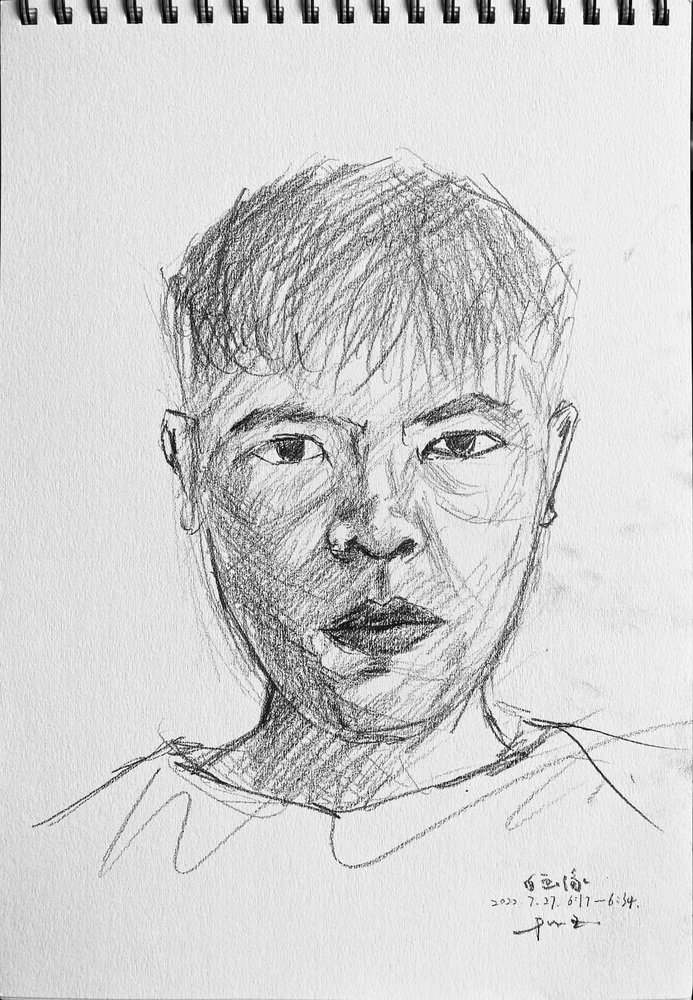
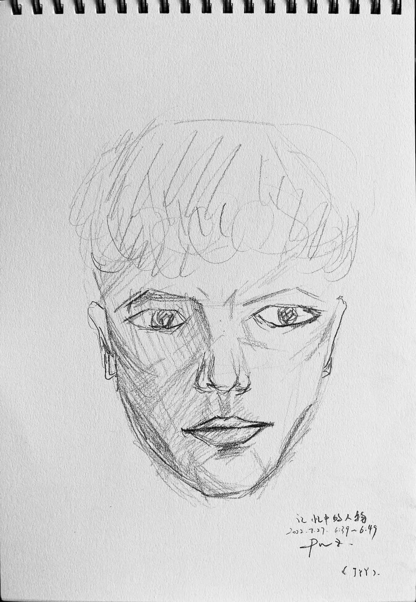
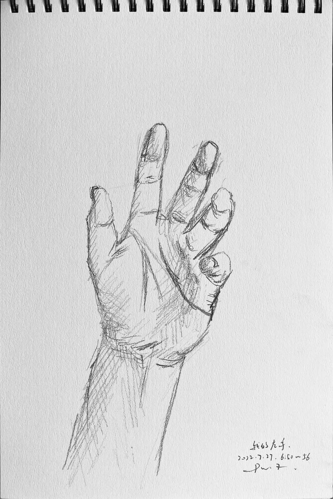
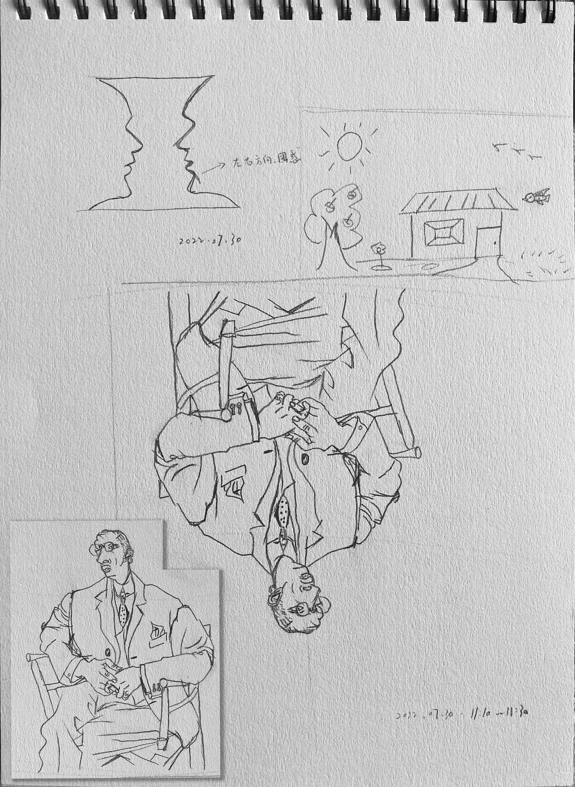
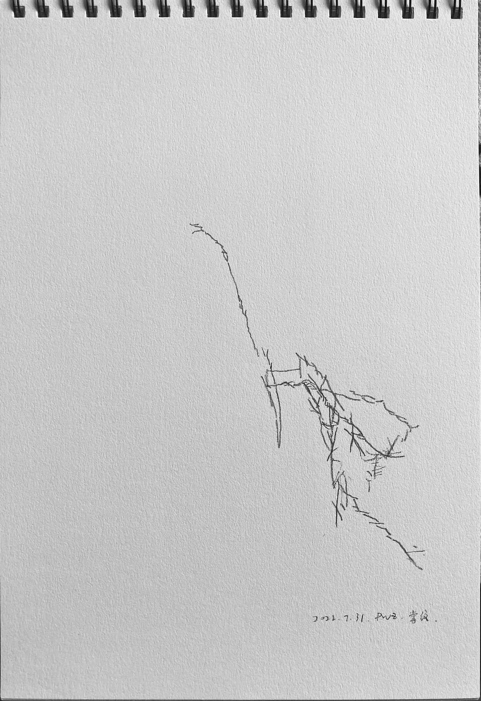
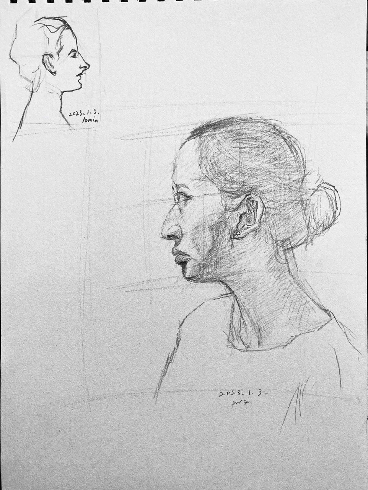
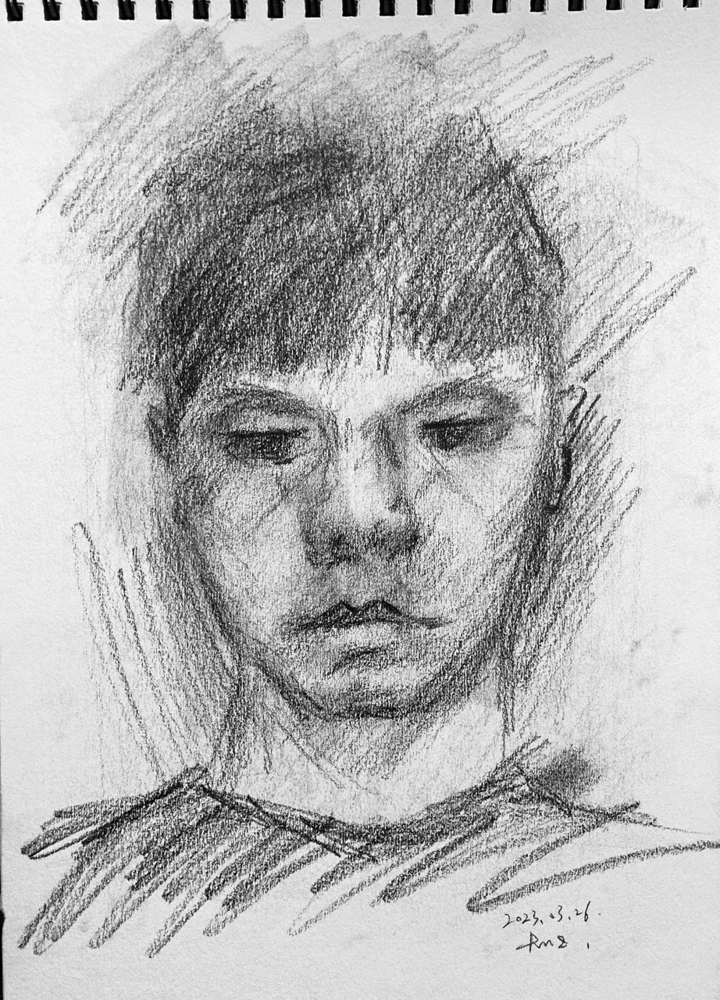

# 理解素描::五::歇一歇读读书会有长进吗
*Posted on 2022.07.10 by [Pengwei](http://pwz.wiki) under [CC BY-NC-ND 4.0](https://creativecommons.org/licenses/by-nc-nd/4.0/)*  
*Last updated on 2023.03.27*

- [理解素描::五::歇一歇读读书会有长进吗](#理解素描五歇一歇读读书会有长进吗)
  - [Drawing on the Right Side of the Brain (《像艺术家一样思考》) by Betty Edwards](#drawing-on-the-right-side-of-the-brain-像艺术家一样思考-by-betty-edwards)
    - [01. 绘画和骑单车的艺术](#01-绘画和骑单车的艺术)
    - [02. 素描训练基础说明](#02-素描训练基础说明)
    - [03. 左脑与右脑](#03-左脑与右脑)
    - [04-06. 右脑模式体验\&儿时符号系统\&绕开符号系统](#04-06-右脑模式体验儿时符号系统绕开符号系统)
    - [07-08. 感知空间的形状（阴形）\&透视基础](#07-08-感知空间的形状阴形透视基础)
    - [09. 画头像](#09-画头像)
    - [10. 光线与阴影的逻辑](#10-光线与阴影的逻辑)
    - [99. 读后小结#20230327](#99-读后小结20230327)
  - [The Eye of the Painter and the Elements of Beauty (《画家之眼》) by Andrew Loomis](#the-eye-of-the-painter-and-the-elements-of-beauty-画家之眼-by-andrew-loomis)

## Drawing on the Right Side of the Brain (《像艺术家一样思考》) by Betty Edwards

### 01. 绘画和骑单车的艺术

可以从某种角度将知识分类为思考类知识和运动类知识[*(Refer~YJango-大脑运作模式视角下的知识分类)*](https://zhuanlan.zhihu.com/p/50793837)，关于学习绘画的相当一部分内容属于构建运动类知识这个过程，所以我们不能简单通过听课、阅读来掌握绘画。

>大多数美术教师和美术教科书的作者们忠告初学者“改变你们看事物的方法”以及“学习如何看事物”。
>问题是这种看事物的不同方法很难解释，就像如何在单车上平衡一样。
>大多数人永远也没学会更好地看事物，以至于不能绘画。

>每个有一般视力和一般眼手协调能力的普通人都能学会绘画

>神秘的绘画能力似乎就是一种将大脑的状态转换到不同的视觉／感知模式的能力。
>当你能够掌握画家们看事物的特殊方法时，你就能画画了。
>学习绘画的关键是把大脑转换到不同的信息处理模式，即一种意识模式的轻微转换，为你能够更好地看事物建立条件。

### 02. 素描训练基础说明

这一章介绍（本书中）关于素描训练的基本信息，需要用到的工具，布置了三项“学前练习”，分别是“自画像”、“某位记忆中的人物”和“自己的手”。

### 03. 左脑与右脑

大多数人左右脑具有偏侧性，左右脑擅长的东西不一样。相比于擅长逻辑分析的总在进行概括归类的词汇性的左脑，右脑更擅长处理绘画这项任务。

>就我们所知，在这个星球的所有生物中，人类是惟一一个能够画出自己所在环境中人和事物形象的物种

>左脑控制身体的右侧，右脑控制身体的左侧

>在使用右脑模式处理信息时，我们拥有直觉和卓越的洞察力——这时我们不用按照逻辑顺序解决问题。
>这就是右脑模式：一个直觉性的、主观的、相关的、整体的、没有时间概念的模式

>今天，教育家们越来越关心直觉和创意的重要性。然而，学校系统通常仍然构建在左脑模式的基础上。
>我们的文化太倾向于奖励左脑的技能，以至于我们的孩子们丧失了一大部分右脑的潜力。科学家洁儿·乐伟曾经幽默地说——经历过美式科学培训的研究生们有可能完全摧毁自己的右脑

| |左脑模式	|	|右脑模式|
|---|---|---|---|
|词汇性	|使用词汇进行命名，描述和定义。|	非词汇性|	使用非词汇性认识来处理感知。
|分析性	|有步骤地解决问题，一部分一部分地来。	|综合性	|把事物整合成为一个整体。
|象征性	|使用符号来象征某些事物。比如说，象形图画代表笑脸，＋代表加法。	|真实性|	涉及事物当时的原样。
|抽象性	|取出很少的一点信息代表整个事物。	|类似性	|看到事物相同的地方，理解事物象征性的含义。
|时间性	|有时间概念，将事物排序；首先做什么，然后做什么，等等。	|非时间性	|没有时间概念。
|理性	|根据理由和事实得出结论。	|非理性	|不需要以理由和事实为基础；自动自发地不做出判断。
|数字性	|使用数字进行计算。	|空间立体性	|看到事物与其他事物之间的联系以及怎样由各个部分组合成为一个整体。
|逻辑性	|根据逻辑得出结论；把事物按照逻辑顺序排列，比如说一个数学定律或一个理由充分的论据。|	直觉性|	根据不完整的规律，感觉或视觉图像洞察出事物的真相。
|线性	|进行连贯性思维，一个想法紧接着一个想法，往往引出一个集合性的结论。	|整体性	|一下子看到整个事物；感知整体规律和结构，往往引出分散性的结论。

*上表来自原书*

### 04-06. 右脑模式体验&儿时符号系统&绕开符号系统

对应原书4~6章。通过一些设计好的绘画任务，感受左脑的符号系统对绘画的（不利）影响以及纯粹的右脑模式对绘画的帮助。右脑模式实际对应以前总结过的，“如实的观察”。

>左脑对这种详细的感知毫无耐性，实际上它会说：“我告诉你，那就是把椅子。知道这些就够了

>这些符号从哪来呢？在画儿童画的那些年里，每个人都发展了一套符号系统。这个符号系统根植于你的记忆中，符号们随时准备被提取出来，就像画你的儿童风景画时那样。

>总的来说，成年学生在绘画的初级阶段并没有真正看到他们眼前的东西，也就是说，他们没有按照绘画所必需的特殊方法感知事物。他们记下需要画的是什么，然后根据自己小时侯发明的符号系统和对眼前事物的认识，快速地把感知翻译成词汇和符号。

>重复一遍，关键是如何完成从左脑模式到右脑模式的认知转换。像我在第四章说的那样，最有效的方法是向大脑提交一项左脑不能或不想处理的任务。

>向十岁以上的人教授写实画的中心问题是，当那些绘画符号不再适用于这个任务时，它们挥之不去。

>双目视觉使我们看到的世界是三维的。这个能力有时也被称作“深度透视”。当你闭上一只眼睛，看到的图像是两维的，也就是说，图像看起来是平的，像一张照片。我们绘画时用的纸也是平的或两维的。

>到目前为止，我们已经发现了左脑在能力上的一些缺陷。它不喜欢对称的图像（如酒杯／人脸画）。它不能应付颠倒过来的感知信息（如在颠倒的斯特拉文斯基的画像中那样）。它拒绝处理缓慢、复杂的感知（如纯的和改良轮廓画）。我们通过利用这些缺陷来帮助右脑模式有机会在没有左脑模式干扰的情况下处理视觉信息。

### 07-08. 感知空间的形状（阴形）&透视基础

构图的定义：阳形（目标物体/人物）+阴形（空白区域）+框架（平面外围边线）

阴形的作用
* 阴形让“困难”的绘画任务变得简单
* 对阴形的强调可以统一你的画面，并加强画面的构图，甚至更重要的是，改善了你的感知能力

--

比率是相互关系的基础

丢勒的装置～"正式透视"～ 过于左脑化、显得呆板僵硬

观察&耐心观察&相信自己对角度和比例关系的观察

>如果画中任何部分似乎有点“变形”或“画得不精确”，用你的透明塑料显像板把有问题的区域检查一遍

>“如果在你的画中，你习惯性地漠视比例关系，你将会习惯失真的视野，并失去鉴定的能力。生活于贫困的人最终将习惯于此。”
>    ——《艺术的精神》，1923。

### 09. 画头像
人像画要求非常精确的感知，比例关系至关重要，右脑善于识别人脸，像与不像立刻就能知道

除了复杂程度，某种类型的画（比如人像）不会比另一种类型的画更难，进行任何类型的绘画时所做的工作都是相同的，每一幅画都要求你学习这些基本感知技巧

大脑总是强制刚刚接收到的视觉信息去适应已有的观念和信仰，这减少引入信息的复杂性，但对绘画是干扰，要试着用逻辑方法证明某些比例关系是怎样就是怎样的

从"被削掉的头骨之谜"引出若干关键比例  
* 眼睛到下巴的距离与眼睛到头顶的距离相等
* 眼睛水平线到下巴的长度与眼外角到耳朵背后的距离相等

正侧面肖像练习：

### 10. 光线与阴影的逻辑

如左脑对阴形与颠倒的画面的不感兴趣一样，左脑对光与影也不重视，需要调动意识客观地观察光影

人像画三个基本角度：正面、侧面、四分之三侧面

运用光线逻辑画一幅完全相似、带有色调、充满立体感的自画像：

### 99. 读后小结#20230327

<video src="./sketch/Drawing-on-the-Right-Side-of-the-Brain/20230327-video.mp4" controls="controls" width="960px"> </video>

最后一张自画像，傍晚坐窗前开始画，没多会儿天完全黑掉懒得开灯摸黑涂鸦，开灯后真是“惊喜”。对比开始读这本书时第一张自画像，绘画能力没啥进展（归咎于若干练习敷衍了事），认知方面书中关于左脑右脑模式的论述最有趣，理解并运用这种差异可以更好地进行绘画。有一种观念在读这本书时又不断被强化，即不带抽象总结的客观的观察与落笔，是描绘准确的关键，对于这本书而言，就是进入右脑模式感知现实情况，借助左脑模式评估修正，屏蔽左脑的符号系统。

## The Eye of the Painter and the Elements of Beauty (《画家之眼》) by Andrew Loomis

