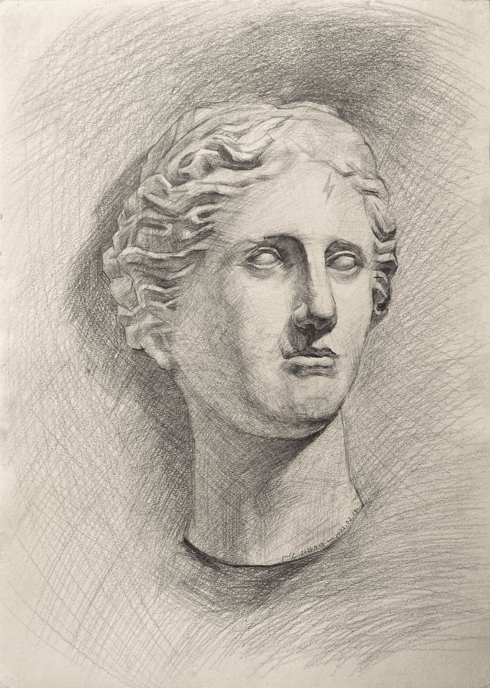
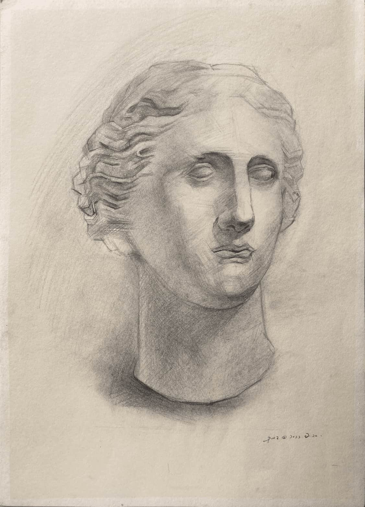
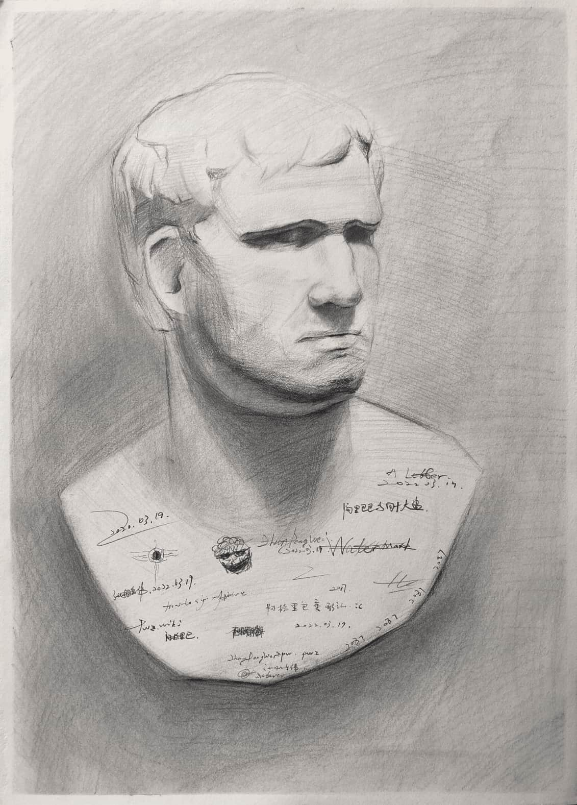
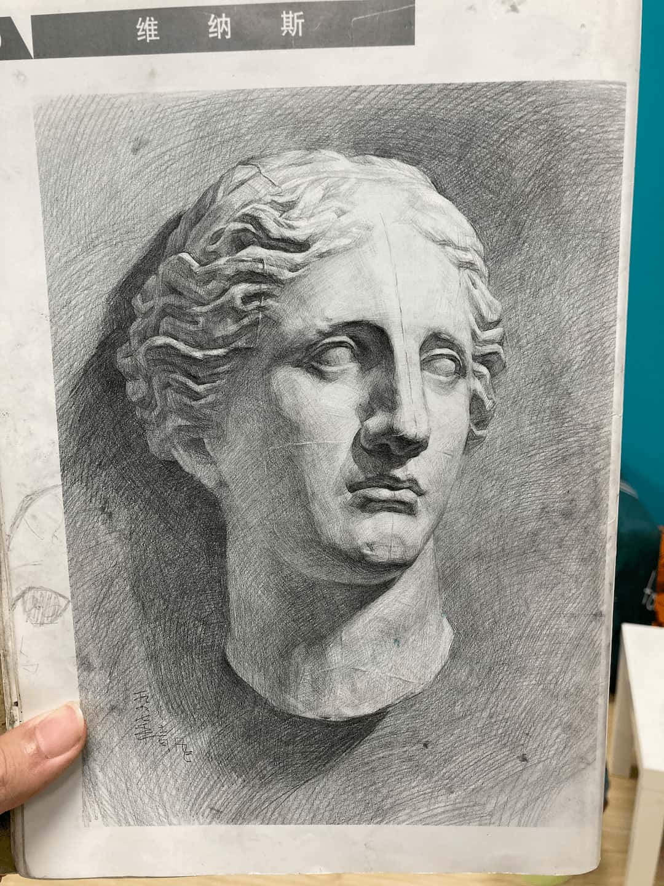
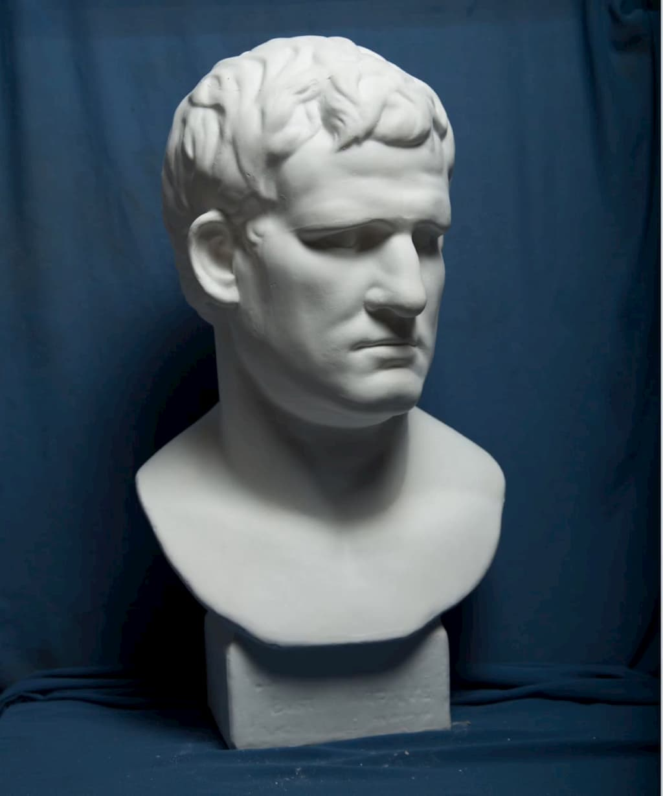

# 理解素描::阶段三::绘画练习停滞的几个月
*Posted on 2022.06.05 by [Pengwei](http://pwz.wiki) under [CC BY-NC-ND 4.0](https://creativecommons.org/licenses/by-nc-nd/4.0/)*

2021.11.15~2022.04.04，这期间因为各种事情，素描练习基本停滞。

维纳斯头像是第二期课程的作业，没想到一拖拖了三个月才完成，起形有很多问题，重复画的第二遍还是一样偏差很大（更大）。阿格里巴是另外找的练习，没画完就开始涂鸦，草草结束掉了。这个阶段没什么有效练习，倒是因为没好好画/想好好画但没能画好，打击了自信心，消极反馈拉满，更不愿意练习了。时间跨度很长，也算是素描学习的一个阶段（摆烂期），单独记录下。

- [2021.11.15~2022.02.15 维纳斯石膏头像 4K ~4h](#2021111520220215-维纳斯石膏头像-4k-4h)
- [2022.02.20 维纳斯石膏头像 4K ~2h](#20220220-维纳斯石膏头像-4k-2h)
- [2022.03.19 阿格里巴石膏头像 4K ~2h](#20220319-阿格里巴石膏头像-4k-2h)
- [2022.04.04 不便展示的一张人像练习 4K ~4h](#20220404-不便展示的一张人像练习-4k-4h)
- \-\-\-
- [原图参考](#原图参考)

## 2021.11.15~2022.02.15 维纳斯石膏头像 4K ~4h

## 2022.02.20 维纳斯石膏头像 4K ~2h

## 2022.03.19 阿格里巴石膏头像 4K ~2h

## 2022.04.04 不便展示的一张人像练习 4K ~4h
// 假装有图

 
 
 

\-\-\-

## 原图参考

