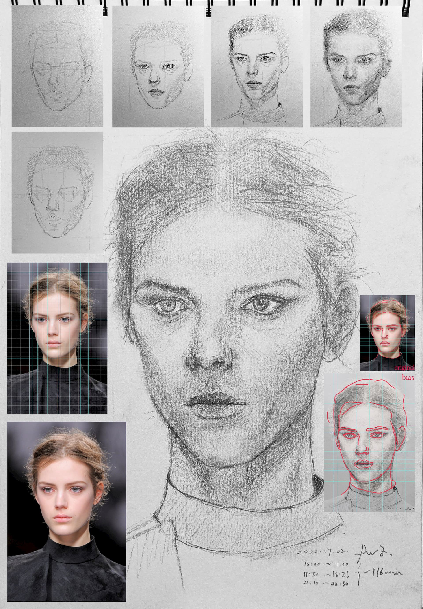

# 理解素描::阶段四::尝试画人像
*Posted on 2022.06.05 by [Pengwei](http://pwz.wiki) under [CC BY-NC-ND 4.0](https://creativecommons.org/licenses/by-nc-nd/4.0/)*

2022年05月13日至今，因为上海疫情没能继续上第三期课程，同时短时间内也不想继续上课，想独自练习练习。之前的石膏像没心情继续画，于是直接尝试画真实的人像，这又是在大跃进，但可以试试看。

## 0513-0622 *8

  
*越画偏差越大，想的不是修正而是放弃，胡乱涂鸦，草草结束*  
 

  
*完成度极低，但似乎做到了兼顾“整体进度”？*  
*“作画的任一阶段，都应该是完整的，而不是画了某个局部”，大概是这样说的，某种指导思想。*  
 

  
*企图用涂抹提高画面完成度，行不通，基础的刻画不到位，涂抹（揉擦）没有意义*  
 

  
*纸上记的：透视上需要改进，右眼的朝向以及下巴的朝向、长度；控制笔试，刻画上干净些*  
 

  
*最直观的偏差是头的长度太长了*  
 

  
*找了几个视频了解头骨结构，找了个3D模型网站，照着模型熟悉了下*  
*从观察的角度讲，没必要了解从外部看不到的骨骼结构，看到什么画什么就是*
*但从经验作画（默画）的角度讲，结构是作画的底线规则，可以帮忙确认画面关键特征点（每张脸都应该有那样几个明显的转折）*  
 

  
*花费精力在一个错误的大比例形状基础上刻画*  
 

  
*抱歉*  
 

## 0625-07xx *x

  
*不使用揉擦，花费大部分时间观察块面形状、比例、角度*  
*大形状相比之前有进展*  
*面部的角度没有表现出来，并且是快画完才意识到，另外线条凌乱*  

  
*参照着网格确定大的比例关系，最终大的比例确实还说得过去*  
*细微的比例关系、角度关系，如右眼的角度、脖子的左侧边界、额头边界，导致整体神态垮掉*  
*光影刻画暂时不多关注，先解决基本的形状、透视问题*  
 

  
*继续练习大形状，下巴与脖子偏差比较大，其它及格*  
*《素描的诀窍》里开篇先讲批判性对话（这个下巴不对劲）&实用性对话（下巴的长度比实际长了一些）*  
*要适应用实用性对话进行总结（画完）&促进画面发展（作画中）*   
*保持对大关系的观察与落实程度，后续花更多精力关注细小形状的刻画*  
*~~anyway, sorry for the hair :P~~*
 