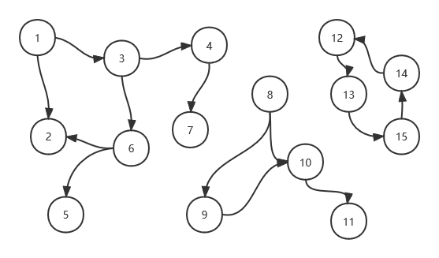

# 图论基础知识总结及相关应用实践

*Posted on 2022.03.27 by [Zhang Pengwei](http://pwz.wiki) under [CC BY-SA 4.0](https://creativecommons.org/licenses/by-sa/4.0/)* 


  


...SUMMARY  AND TOC HERE

---


## 图的存储结构及实现

邻接矩阵、邻接表是图的两种基本存储结构。

邻接矩阵直接用二维数组实现即可，在N*N的二维数组中，用Array[I][J]存储I点与J点的关系，可以用01表示有无关系，或用数字表示权值等。无向图的邻接矩阵是一个对称矩阵。

邻接矩阵存储稀疏图太浪费空间，由此引入邻接表。邻接表逻辑上由顶点表与边表构成，顶点表存储所有顶点，每个顶点对应一张边表，存储依附于该顶点的边。

以下基于邻接表实现一个基本的图结构：
```python
class Vertex:
    """
    顶点表元素，其中直接用self.edge存储对应边表
    """

    def __init__(self, key: str):
        self.key = key
        self.edge = {}  # 边表字典，key=所指向的节点id，value=权重

    def addNeighbor(self, key, cost):
        self.edge[key] = cost

    def __str__(self):
        desc = ''
        if len(self.edge) > 0:
            for edge in self.edge.items():
                desc += f'({self.key}, {edge[0]}, {edge[1]})\n'
            desc = desc[:-1]  # 去除多余的换行
        else:
            desc = f'({self.key}, -, -)'
        return desc


class Graph:

    def __init__(self):
        self.vertexList = {}

    def insert_vertex(self, ver_id: str):
        """插入顶点"""
        self.vertexList[ver_id] = Vertex(ver_id)

    def add_edge(self, a, b, cost=0):
        """在a、b两节点之间添加一条边，默认无权重"""
        a, b = str(a), str(b)
        if a not in self.vertexList:
            print(f'{a} not found, add vertex first please')
            return
        if b not in self.vertexList:
            print(f'{b} not found, add vertex first please')
            return
        ver = self.vertexList.get(a)
        ver.addNeighbor(b, cost)

    def delete_vertex(self, v_id: int):
        """根据id号删除顶点"""
        pass

    def remove_edge(self, a, b):
        """移除a、b两节点之间的边"""
        pass

    def print_graph(self):
        """打印所有节点及节点间关系"""
        for ver in self.vertexList.values():
            print(ver)


if __name__ == '__main__':
    g = Graph()
    for i in range(5):
        g.insert_vertex(str(i))
    g.add_edge(1, 2, 99)
    g.add_edge(1, 3, 88)
    g.add_edge(1, 4, 77)
    g.add_edge(2, 4, 66)
    g.print_graph()
    """output
    (0, -, -)
    (1, 2, 99 )
    (1, 3, 88 )
    (1, 4, 77 )
    (2, 4, 66 )
    (3, -, -)
    (4, -, -)
    """
```


## 图的遍历

图的遍历即【从某顶点出发不重复地访问图中所有顶点】，是各种相关算法的基础，主要有两种：
* 广度优先搜索（breadth first search，简称BFS）
* 深度优先搜索（depth first search，简称DFS）

### BFS

BFS类似二叉树的层序遍历，需要一个队列存储本层所访问的节点，方便进行下一层的处理。

```python
from graph import Graph
from graph import Vertex


def bfs(g: Graph):
    """breadth first search 图的广度优先搜索"""
    is_visited = {}  # 标记顶点是否被访问过，key=顶点id，value=1为被访问过
    ver_queue = []
    all_vertex = g.get_all_vertex()  # 顶点表 list[Vertex,Vertex,Vertex,,,]
    if len(all_vertex) == 0:
        return

    for vertex in all_vertex:  # 对每一个联通分量进行处理
        print('try new component' + '_'*20)
        if vertex.key not in is_visited.keys():
            ver_queue.append(vertex)  # 将该联通分量的第一个顶点入队
            print('visit ' + vertex.key)  # 访问顶点
            is_visited[vertex.key] = 1  # 标记顶点被访问过

            while len(ver_queue) > 0:
                cur = ver_queue.pop(0)  # 当前处理的顶点
                for vertex_ in cur.get_all_edge():
                    if is_visited.get(vertex_) is None:
                        print('visit ' + vertex_)
                        is_visited[vertex_] = 1
                        # 访问过后将该顶点入队列，等待后续访问其相邻节点
                        # 由于此处vertex_是字符串，队列里需要存入Vertex类
                        # 前面构造Vertex类的时候图省事，此处只好再从g中取下
                        v = g.get_vertex(key=vertex_)
                        ver_queue.append(v)
```


### DFS


### 调用测试


## 图的经典应用

## 热点习题及实践

