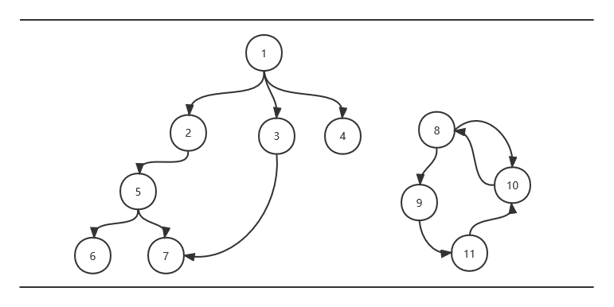

# 图论基础知识总结及相关应用实践

*Posted on 2022.03.27 by [Zhang Pengwei](http://pwz.wiki) under [CC BY-SA 4.0](https://creativecommons.org/licenses/by-sa/4.0/)* 


  


`图`结构基础知识的学习&复习范围（路径）如下：
1. 基本概念：
   * 图（graph）、子图（subgraph）、顶点（vertex）、边或弧（edge / arc）、权（weight）
   * 有向无向（directed / undirected）、环（cycle）
   * 联通非联通（connect / disconnected）、连通分量（connected component）
   * etc.
2. 存储结构及基本操作：
   * 邻接矩阵（二维数组）、邻接表（adjacency list）
   * 十字链表（orthogonal list）、邻接多重表（adjacency multilist）
3. 遍历算法：
   * 深度优先搜索
   * 广度优先搜索
4. 图的应用：
   * 连通性问题 \~最小生成树
     * Prim算法、Kruskal算法
   * 有向无环图 \~拓扑排序 \~关键路径
   * 最短路径问题
     * Dijkstra算法、Floyd算法


- [图的存储结构及实现](#图的存储结构及实现)
- [图的遍历](#图的遍历)
  - [BFS](#bfs)
  - [DFS](#dfs)
- [图的经典应用](#图的经典应用)
  - [连通性问题与最小生成树（Minimum Cost Spanning Tree）](#连通性问题与最小生成树minimum-cost-spanning-tree)
  - [有向无环图的拓扑排序与关键路径](#有向无环图的拓扑排序与关键路径)
  - [最短路径问题](#最短路径问题)


## 图的存储结构及实现

`邻接矩阵`、`邻接表`是图的两种基本存储结构。

邻接矩阵直接用二维数组实现即可，在N*N的二维数组中，用Array[I][J]存储I点与J点的关系，可以用01表示有无关系，或用数字表示权值等。无向图的邻接矩阵是一个对称矩阵。

邻接矩阵存储稀疏图    浪费空间，由此引入邻接表。邻接表逻辑上由顶点表与边表构成，顶点表存储所有顶点，每个顶点对应一张边表，存储依附于该顶点的边。

以下基于邻接表实现一个基本的图结构：
```python
class Vertex:
    """
    顶点表元素，其中直接用self.edge存储对应边表
    """

    def __init__(self, key: str):
        self.key = key
        self.edge = {}  # 边表字典，key=所指向的节点id，value=权重

    def addNeighbor(self, key, cost):
        self.edge[key] = cost

    def __str__(self):
        desc = ''
        if len(self.edge) > 0:
            for edge in self.edge.items():
                desc += f'({self.key}, {edge[0]}, {edge[1]})\n'
            desc = desc[:-1]  # 去除多余的换行
        else:
            desc = f'({self.key}, -, -)'
        return desc


class Graph:

    def __init__(self):
        self.vertexList = {}

    def insert_vertex(self, ver_id: str):
        """插入顶点"""
        self.vertexList[ver_id] = Vertex(ver_id)

    def add_edge(self, a, b, cost=0):
        """在a、b两节点之间添加一条边，默认无权重"""
        a, b = str(a), str(b)
        if a not in self.vertexList:
            print(f'{a} not found, add vertex first please')
            return
        if b not in self.vertexList:
            print(f'{b} not found, add vertex first please')
            return
        ver = self.vertexList.get(a)
        ver.addNeighbor(b, cost)

    def delete_vertex(self, v_id: int):
        """根据id号删除顶点"""
        pass

    def remove_edge(self, a, b):
        """移除a、b两节点之间的边"""
        pass

    def print_graph(self):
        """打印所有节点及节点间关系"""
        for ver in self.vertexList.values():
            print(ver)


if __name__ == '__main__':
    g = Graph()
    for i in range(5):
        g.insert_vertex(str(i))
    g.add_edge(1, 2, 99)
    g.add_edge(1, 3, 88)
    g.add_edge(1, 4, 77)
    g.add_edge(2, 4, 66)
    g.print_graph()
    """output
    (0, -, -)
    (1, 2, 99 )
    (1, 3, 88 )
    (1, 4, 77 )
    (2, 4, 66 )
    (3, -, -)
    (4, -, -)
    """
```

除了上述两种存储结构，按照严版数据结构，还有`邻接多重表`、`十字链表`等，都是在上述基础上的优化变种，看具体应用场景灵活实现就好。


## 图的遍历

图的遍历即【从某顶点出发不重复地访问图中所有顶点】，是各种相关算法的基础，主要有两种基本方法：
* 广度优先搜索（breadth first search，简称BFS）
* 深度优先搜索（depth first search，简称DFS）

### BFS
BFS可类比二叉树的`层序遍历`，需要一个队列存储本层所访问的节点，方便进行下一层的处理。注意图不像二叉树按序遍历就可以实现每个节点的唯一访问，图中不同节点相互关联，访问时需要标记每个节点是否被访问过。

算法思路：
1. 对每个连通分量分别处理
   1. 访问顶点，入队列
   2. 从队列取出一个顶点，访问其所有邻接顶点
   3. 将每个访问过的顶点依次入队列
2. 重复上述过程，直到队空

代码实现：
```python
from graph import Graph
from graph import Vertex


def bfs(g: Graph):
    """breadth first search 图的广度优先搜索"""
    all_vertex = g.get_all_vertex()  # 顶点表 list[Vertex,Vertex,Vertex,,,]
    is_visited = {}  # 标记顶点是否被访问过，key=顶点id，value=1为被访问过
    ver_queue = []

    print('BFS -> ', end='')
    for vertex in all_vertex:  # 外层循环：遍历所有联通分量
        # print('try new component' + '_' * 20)
        if vertex.key not in is_visited.keys():

            # 处理联通分量第一个顶点，初始化队列
            print(vertex.key + ' -> ', end='')
            is_visited[vertex.key] = 1
            ver_queue.append(vertex)

            # 中层循环：遍历该联通分量
            while len(ver_queue) > 0:
                cur = ver_queue.pop(0)  # 当前处理的顶点
                # 内层循环：遍历某顶点所有邻接顶点
                for vertex_ in cur.get_all_neighbor():
                    if is_visited.get(vertex_) is None:
                        # 访问过后将该顶点入队列，等待后续访问其相邻节点
                        # 由于此处vertex_是字符串，队列里需要存入Vertex类
                        # 前面构造Vertex类的时候图省事，此处只好再从g中取下
                        print(vertex_ + ' -> ', end='')
                        is_visited[vertex_] = 1
                        ver_queue.append(g.get_vertex(key=vertex_))
    print('END')


if __name__ == '__main__':
    """对题图进行测试，后续构造过程与此相同不再重复"""
    g = Graph()
    for i in range(1, 12):
        g.insert_vertex(str(i))

    g.add_edge(1, 2)
    g.add_edge(1, 3)
    g.add_edge(1, 4)
    g.add_edge(2, 5)
    g.add_edge(5, 6)
    g.add_edge(5, 7)
    g.add_edge(3, 7)

    g.add_edge(8, 9)
    g.add_edge(8, 10)
    g.add_edge(9, 11)
    g.add_edge(11, 10)
    g.add_edge(10, 8)

    bfs(g)

# BFS -> 1 -> 2 -> 3 -> 4 -> 5 -> 7 -> 6 -> 8 -> 9 -> 10 -> 11 -> END
```

### DFS
DFS可类比二叉树的`先根序遍历`， 沿着一条路径向下访问，直到走到“叶子”节点（不再有未访问的邻接顶点），向上回溯，重复这个过程直到所有顶点都被遍历。

算法思路：
1. 对每个连通分量分别处理
   1. 有未访问的邻接顶点，则取一个向下探索
   2. 走到叶子节点了，向上回溯，重复步骤1
2. 重复上述过程直到所有节点遍历完毕


代码实现（递归）：
```python
from graph import Graph
from graph import Vertex

def dfs(g: Graph):
    """depth first search 图的深度优先搜索"""

    all_vertex = g.get_all_vertex()
    # 换个写法记录是否被访问过，列表坐标作为key标记对应顶点
    # 这样做的前提是，顶点的key是int类型的（或可兼容的）
    is_visited = [False for _ in range(len(all_vertex) + 1)]

    def dfs_recursive(v: Vertex):
        print(v.key + ' -> ', end='')  # 访问
        is_visited[int(v.key)] = True  # 标记
        for vertex_ in v.get_all_neighbor():
            if not is_visited[int(vertex_)]:
                dfs_recursive(g.get_vertex(vertex_))  # 递归向下遍历

    print('DFS_Recur -> ', end='')
    for vertex in all_vertex:
        if not is_visited[int(vertex.key)]:
            dfs_recursive(vertex)
    print('END')

# DFS_Recur -> 1 -> 2 -> 5 -> 6 -> 7 -> 3 -> 4 -> 8 -> 9 -> 11 -> 10 -> END
```

递归转非递归，人工建栈模拟系统的自动压栈出栈。


代码实现（非递归）：
```python
from graph import Graph
from graph import Vertex

def dfs_unrecursive(g: Graph):
    """depth first search 图的深度优先搜索 非递归实现"""
    # 注意对比以下非递归实现与BFS的细微区别（queue vs stack）

    all_vertex = g.get_all_vertex()
    is_instack = [False for _ in range(len(all_vertex) + 1)]
    ver_stack = []

    print('DFS_unRecur -> ', end='')
    for vertex in all_vertex:
        if not is_instack[int(vertex.key)]:

            is_instack[int(vertex.key)] = True  # 标记
            ver_stack.append(vertex)
            while len(ver_stack) > 0:
                vertex_ = ver_stack.pop()
                # pop不传参则默认处理最后一个元素 （index = -1）
                # print('visit ' + vertex_.key)
                print(vertex_.key + ' -> ', end='')
                for v_str in vertex_.get_all_neighbor():
                    if not is_instack[int(v_str)]:
                        ver_stack.append(g.get_vertex(v_str))
                        is_instack[int(v_str)] = True  # 标记
    print('END')

# DFS_unRecur -> 1 -> 4 -> 3 -> 7 -> 2 -> 5 -> 6 -> 8 -> 10 -> 9 -> 11 -> END
```

## 图的经典应用

### 连通性问题与最小生成树（Minimum Cost Spanning Tree）

### 有向无环图的拓扑排序与关键路径

### 最短路径问题
