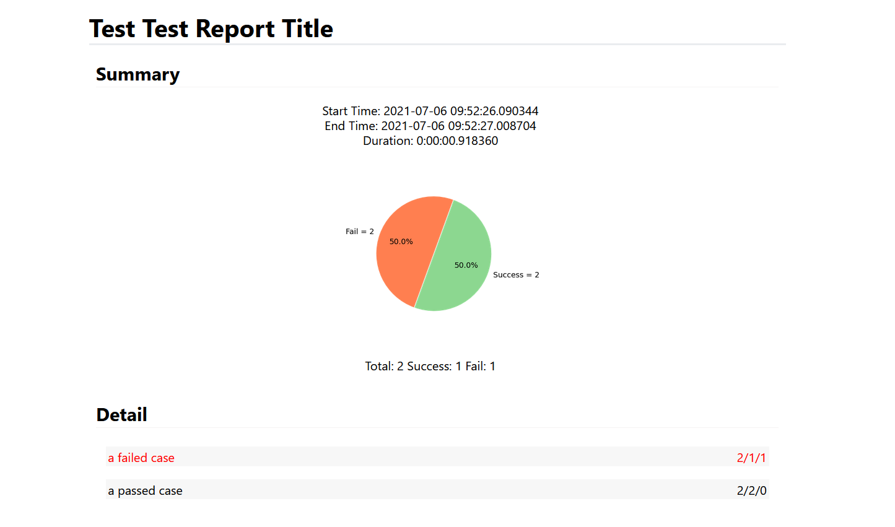

- [An API Autotest Tool Part1: Basic Functions Implementation](#an-api-autotest-tool-part1-basic-functions-implementation)
  - [1 Introduction](#1-introduction)
  - [2 Code Review](#2-code-review)
    - [2.1 Handle Test Cases with Excel](#21-handle-test-cases-with-excel)
      - [2.1.1 Case Template](#211-case-template)
      - [2.1.2 Read Cases from Excel](#212-read-cases-from-excel)
    - [2.2 Handle Log with Logging](#22-handle-log-with-logging)
    - [2.3 Handle Basic Parameters with Configparser](#23-handle-basic-parameters-with-configparser)
      - [2.3.1 Config File Template](#231-config-file-template)
      - [2.3.2 Read Conifg File](#232-read-conifg-file)
    - [2.4 Handle Shell Commands with Paramiko](#24-handle-shell-commands-with-paramiko)
    - [2.5 Handle Post Request with Requests](#25-handle-post-request-with-requests)
    - [2.6 Handle SQL with cx\_Oracle](#26-handle-sql-with-cx_oracle)
    - [2.7 The Main Script](#27-the-main-script)
    - [2.8 \*Generate Test Report](#28-generate-test-report)
  - [3 Todo List](#3-todo-list)
- [An API Autotest Tool Part2: Generate Test Report from Scratch](#an-api-autotest-tool-part2-generate-test-report-from-scratch)
  - [1 How it looks](#1-how-it-looks)
  - [2 Code Summary](#2-code-summary)
  - [3 Html Templates](#3-html-templates)
    - [3.1 Report Template](#31-report-template)
    - [3.2 Summary Template](#32-summary-template)
    - [3.3 Case Template](#33-case-template)
    - [3.4 Step Template](#34-step-template)
    - [3.5 CSS Template](#35-css-template)
  - [4 The JS Function](#4-the-js-function)
  - [5 Generate Report](#5-generate-report)
    - [5.1 Paratemeters (test\_summary\_dict \& case\_detail\_list) from run\_test.py](#51-paratemeters-test_summary_dict--case_detail_list-from-run_testpy)
    - [5.2 Main Method: generate\_report(test\_summary\_dict, case\_detail\_list)](#52-main-method-generate_reporttest_summary_dict-case_detail_list)
    - [5.3 Sub Method 1: generate\_html\_body(test\_summary\_dict, case\_detail\_list)](#53-sub-method-1-generate_html_bodytest_summary_dict-case_detail_list)
    - [5.4 Sub Method 2: generate\_html\_summary(test\_summary\_dict)](#54-sub-method-2-generate_html_summarytest_summary_dict)


# An API Autotest Tool Part1: Basic Functions Implementation

*Posted on 2021.07.19 by [pwz](http://pwz.wiki) under [CC BY-SA 4.0](https://creativecommons.org/licenses/by-sa/4.0/)* 

- [An API Autotest Tool Part1: Basic Functions Implementation](#an-api-autotest-tool-part1-basic-functions-implementation)
  - [1 Introduction](#1-introduction)
  - [2 Code Review](#2-code-review)
    - [2.1 Handle Test Cases with Excel](#21-handle-test-cases-with-excel)
      - [2.1.1 Case Template](#211-case-template)
      - [2.1.2 Read Cases from Excel](#212-read-cases-from-excel)
    - [2.2 Handle Log with Logging](#22-handle-log-with-logging)
    - [2.3 Handle Basic Parameters with Configparser](#23-handle-basic-parameters-with-configparser)
      - [2.3.1 Config File Template](#231-config-file-template)
      - [2.3.2 Read Conifg File](#232-read-conifg-file)
    - [2.4 Handle Shell Commands with Paramiko](#24-handle-shell-commands-with-paramiko)
    - [2.5 Handle Post Request with Requests](#25-handle-post-request-with-requests)
    - [2.6 Handle SQL with cx\_Oracle](#26-handle-sql-with-cx_oracle)
    - [2.7 The Main Script](#27-the-main-script)
    - [2.8 \*Generate Test Report](#28-generate-test-report)
  - [3 Todo List](#3-todo-list)
- [An API Autotest Tool Part2: Generate Test Report from Scratch](#an-api-autotest-tool-part2-generate-test-report-from-scratch)
  - [1 How it looks](#1-how-it-looks)
  - [2 Code Summary](#2-code-summary)
  - [3 Html Templates](#3-html-templates)
    - [3.1 Report Template](#31-report-template)
    - [3.2 Summary Template](#32-summary-template)
    - [3.3 Case Template](#33-case-template)
    - [3.4 Step Template](#34-step-template)
    - [3.5 CSS Template](#35-css-template)
  - [4 The JS Function](#4-the-js-function)
  - [5 Generate Report](#5-generate-report)
    - [5.1 Paratemeters (test\_summary\_dict \& case\_detail\_list) from run\_test.py](#51-paratemeters-test_summary_dict--case_detail_list-from-run_testpy)
    - [5.2 Main Method: generate\_report(test\_summary\_dict, case\_detail\_list)](#52-main-method-generate_reporttest_summary_dict-case_detail_list)
    - [5.3 Sub Method 1: generate\_html\_body(test\_summary\_dict, case\_detail\_list)](#53-sub-method-1-generate_html_bodytest_summary_dict-case_detail_list)
    - [5.4 Sub Method 2: generate\_html\_summary(test\_summary\_dict)](#54-sub-method-2-generate_html_summarytest_summary_dict)

## 1 Introduction

This is a simlpe data-driven api autotest tool(or so-called testing framework), implemented **without** using `unittest` or `pytest`. The main procedure for a complete api test using this tool is:

1. write test cases in a `.xlsx` file, every case mainly includes the following contents: 
   * api address like `http://127.0.0.1:8089/test`
   * request body for the `post` method of http protocol and expected results (`key:value`) in response
   * shell commands you want to run before sending request
   * SQL you want to run after getting response and expected SQL results (`key:value`)
2. set the default config info in `config.ini` such as path_to_excel or default_content_type.
3. run the test by running `run_test.py`, which will handle every case in the excel:
   * execute shell commands and print the result
   * post the request and verify the response
   * execute the SQL and verify the result
   * generate an all-in-one(html, js, css) test report

Every function is implemented for specific requirements, it can not handle the `get` method because it's unnecessary for now, as I said, this is a simple tool, there is a long-todo-list.

All code in this blog will be archived in `./my_site_root/code/some_sub_path/api-autotest-tool`, the code may have changed a lot if I am still working on it, that won't be updated here.

## 2 Code Review

```powershell
PS C:\pw-z.github.io\code\api-autotest-tool> tree /F
Folder PATH listing for volume Pomelo
Volume serial number is 96AE-B4C9
C:.
│  readme.md
│
└─src
    │  config.ini
    │  run_test.py
    │
    ├─case
    │    case.xlsx
    │
    ├─handler
    │    case_handler.py
    │    parameter_handler.py
    │    shell_handler.py
    │    sql_handler.py
    │  
    │
    ├─helper
    │    case_helper.py
    │    log_helper.py
    │    report_helper.py
    │  
    │
    ├─report
    │  ├─archived
    │  │      TestReport-20210705-190943.html
    │  │      TestReport-20210715-180623.html
    │  │
    │  └─template
    │        template.css
    │        template.html
    │  
    └─test
```

### 2.1 Handle Test Cases with Excel

#### 2.1.1 Case Template

|CaseName|CaseStep|Run?|Method|URI|Port|Address|ContentType|ShellScript|Body|ExpectedData|ResponseParameter|DQL|ExpectedDQLData|
|:-:|:-:|:-:|:-:|:-:|:-:|:-:|:-:|:-:|:-:|:-:|:-:|:-:|:-:|
|case1|step1|y|post||||||
||step2|n|post||||||
||step3|y|post||||||
|case2|step1|y|post||||||
||step2|y|post||||||

The Excel template has a certain header in ft row, from the second row, each line will be treated as a step in a case, each case should contain one step at least. You can also consider cases as test suites and steps as cases, no difference.

Only those steps whose `Run?` flag is 'y' will be run. If all steps in a case are skipped, this case will be marked as a skiped one and will not be displayed in the test report.

The `Method` should always be 'post', in fact this can be removed from the template, whatever its value is, every step will be send through the `post` method, as I said, this is just what I need for now. The meaning of this column, just in case, some day we need a `get`.

The `URI`, `Port` and `ContentType` can be config in `config.ini` and the value in config file will be used when these are empty.

The `ShellScript` will be executed before sending the `Body`, which help us getting the test environment ready, for example:

```shell
cd ~/test_project/input

echo '
test data1
test data2
test data3
' > test_data.txt

cat test_data.txt

date -s 20210101
```
This script will put our test data in the proper location and set the system date to what we want. Note that if the command has no output such as `echo 'something' > somewhere`, we don't know the result in test_log of the test tool, write a `cat` after that is fine.

The `Address` is necessary, it will be attached to the `URI` and the `Port`, if you set the `URI='http://yourhost.com', Port=8089, Address='/login'`, then the final api address will be `http://yourhost.com/8089/login`. 

The `Body`, `ExpectedData` and `ResponseParameter` are a group. Ft the `Body` will be sent, after we got a response, the `parameter_handler` will check every `key:value` in `ExpectedData`, return a pass flag if it's indeed in the response or a fail if not, in the meantime, the `parameter_handler` will collect the value of the key in `ResponseParameter`, so you can use it with `${key}` after then(only in `Body`). By the way, in `ResponseParameter`, you can rename a parameter using `key:renamed_key`, this is helpful in the situation that we want to store many parameters with the same name.

Here is an instance:

Ft step:
```
Body:
  data={
      "userId":"user1",
      "PASSWORD":"pw1",
      "f":"Login"
  }

ResponseParameter:
  token:token1
```

After the ft step, we got a parameter `token1` that can be used in the next step, just assume that `token1=ALSKDJFLASKDJFLKLSKDJFlkjdlskafjLKDHLGKASHD`, write next step `Body` like this:

```
data={
  "f":"some function",
  "token":"${token1}"
}
```
then the request body will be flushed before being sent:
```
data={
  "f":"some function",
  "token":"ALSKDJFLASKDJFLKLSKDJFlkjdlskafjLKDHLGKASHD"
}
```

The last two column `DQL` and `ExpectedDQLData` work in the same way as the `Body` and `ExpectedData`.


#### 2.1.2 Read Cases from Excel

This code is developed from [Import Testcases From Excel to Testlink](https://www.pwz.wiki/blog/2021/06/20210623-import-testcases-from-excel-to-testlink), it read the excel file and init a list contains all the cases(in dict format).

`xlrd` is a tool which can handle `.xlsx` file, for some reason, the latest version of `xlrd` supports `.xls` format only, here you need to `pip install xlrd==1.2.0`, then it works. This is a little ..., I am considering replace it with `pandas`.

```python
# ./helper/case_helper.py

import xlrd
from helper.log_helper import *

logger = init_logger(__name__)


def get_column_index(sheet, column_name):
    column_index = None
    for i in range(sheet.ncols):
        if sheet.cell_value(0, i) == column_name:
            column_index = i
            break
    return column_index


def get_case_step(sheet_object, row_number):
    case_step = {
        'CaseStep': sheet_object.row_values(row_number)[get_column_index(sheet_object, 'CaseStep')],
        'Method': sheet_object.row_values(row_number)[get_column_index(sheet_object, 'Method')],
        'URI': sheet_object.row_values(row_number)[get_column_index(sheet_object, 'URI')],
        'Port': sheet_object.row_values(row_number)[get_column_index(sheet_object, 'Port')],  # 8089.0
        'Address': sheet_object.row_values(row_number)[get_column_index(sheet_object, 'Address')],
        'Body': sheet_object.row_values(row_number)[get_column_index(sheet_object, 'Body')],
        'ContentType': sheet_object.row_values(row_number)[get_column_index(sheet_object, 'ContentType')],
        'ResponseParameter': sheet_object.row_values(row_number)[get_column_index(sheet_object, 'ResponseParameter')],
        'ExpectedData': sheet_object.row_values(row_number)[get_column_index(sheet_object, 'ExpectedData')],
        'ShellScript': sheet_object.row_values(row_number)[get_column_index(sheet_object, 'ShellScript')],
        # 'Run?': str(sheet_object.row_values(row_number)[get_column_index(sheet_object, 'Run?')])[:-2],   # 111.0
        'Run?': str(sheet_object.row_values(row_number)[get_column_index(sheet_object, 'Run?')]),  # '111
        'DQL': sheet_object.row_values(row_number)[get_column_index(sheet_object, 'DQL')],
        'ExpectedDQLData': str(
            sheet_object.row_values(row_number)[get_column_index(sheet_object, 'ExpectedDQLData')]).upper().splitlines()
    }
    case_step['ResponseParameter'] = str(case_step['ResponseParameter']).splitlines()

    wanted_paras = {}
    lines = str(case_step['ExpectedData']).splitlines()
    for line in lines:
        i = line.find(':')
        wanted_paras[line[:i]] = line[i + 1:]
    case_step['ExpectedData'] = wanted_paras

    return case_step


def read_excel(file_path, sheet_name):
    case_list_dic = []
    case_step_list = []
    try:
        book = xlrd.open_workbook(file_path)
    except Exception as error:
        logger.error(r'can not open the excel file  ' + str(error))
        return error
    else:
        sheet = book.sheet_by_name(sheet_name)
        rows = sheet.nrows
        case_name = sheet.row_values(1)[get_column_index(sheet, 'CaseName')]  # when i==1, case name must exists
        case_step = get_case_step(sheet, 1)
        case_step_list.append(case_step)
        last_case_name = case_name
        for i in range(2, rows):  # ignore table header
            case_name = sheet.row_values(i)[get_column_index(sheet, 'CaseName')]
            if case_name == '':  # the same case
                case_step = get_case_step(sheet, i)
                case_step_list.append(case_step)
            else:  # new case
                case_dict = {
                    'CaseName': last_case_name,
                    'CaseSteps': case_step_list
                }
                case_list_dic.append(case_dict)

                case_step_list = []
                last_case_name = case_name

                case_step = get_case_step(sheet, i)
                case_step_list.append(case_step)
            if i == rows - 1:
                case_dict = {
                    'CaseName': last_case_name,
                    'CaseSteps': case_step_list
                }
                case_list_dic.append(case_dict)
    return case_list_dic
```

A `case_list_dic` sample:

```python
case_list_dic = [
  case1,
  case2,
  case3 = {
    'CaseName':case_name,
    'CaseSteps':[
      step1,
      step2,
      step3 = {
        'CaseStep':step_name,
        'Method':'post',
        'Body':...,
        'Run?':'y',
        'Key':'Value',
        ...and so on
      }
    ]
  }
]
```

### 2.2 Handle Log with [Logging][Logging]

The `log_helper.py` creates three handlers:
* fh = logging.FileHandler(log_path)
* ch = logging.StreamHandler()
* sh = logging.StreamHandler(__sio)

`fh` and `ch` are easy to understand, one prints logs to the log file and the other to the console.

`sh` is a `StreamHandler` initialized with an `io.StringIO`, it's used to record step running logs. The logs in `sh` will be cleared before running a new step and stored in `step_run_log` after the step is completed.

```python
# helper/log_helper.py
import logging
import time
import io

__sio = io.StringIO()


def init_sio():
    __sio.truncate(0)
    __sio.seek(0)


def get_sio():
    return __sio


def init_logger(__name__):

    logger = logging.getLogger(__name__)
    logger.setLevel(logging.DEBUG)

    today = time.strftime('%Y-%m-%d')
    log_name = today + '.log'
    log_path = 'log/' + log_name
    # log_path = log_name

    formatter = logging.Formatter('%(levelname)s [%(asctime)s] %(message)s')

    fh = logging.FileHandler(log_path, encoding='utf-8')
    ch = logging.StreamHandler()

    sh = logging.StreamHandler(__sio)

    fh.setFormatter(formatter)
    ch.setFormatter(formatter)
    sh.setFormatter(formatter)

    fh.setLevel(logging.DEBUG)
    ch.setLevel(logging.INFO)
    sh.setLevel(logging.INFO)

    logger.addHandler(fh)
    logger.addHandler(ch)
    logger.addHandler(sh)
    return logger
```

A log sample:

```log
DEBUG [2021-07-15 08:45:52,192] parameter handler initialize success # {'uri': 'http://127.0.0.1', 'port': '8089', 'content_type': 'application/x-www-form-urlencoded;charset=UTF-8', 'ssh_hostname': '127.0.0.1', 'ssh_username': 'testfx', 'ssh_password': 'testfx', 'excel_path': './case/case.xlsx', 'sheet_list': ['test'], 'db_uri': '127.0.0.1:1517/test2', 'db_username': 'test', 'db_password': 'test', 'db_oracle_lib_dir': 'C:\\oracle\\instantclient_19_11', 'test_report_title': 'TEST API AUTOTEST'}
DEBUG [2021-07-15 08:45:53,641] connect to Oracle success: 15.3.0.0.0
INFO [2021-07-15 08:45:53,674] 
====================================================================================================
 Run Case # 参数获取1
====================================================================================================
INFO [2021-07-15 08:45:53,676] 
**********************************************************************
 Run Step # 登录获取token1
**********************************************************************
INFO [2021-07-15 08:45:53,705] Request url: http://127.0.0.1:8089/login
INFO [2021-07-15 08:45:53,706] Content type: application/x-www-form-urlencoded;charset=UTF-8
INFO [2021-07-15 08:45:53,706] Request body:
data={
    "userId":"userid1",
    "PASSWORD":"pw1234",
    "f":"Login"
}
INFO [2021-07-15 08:45:56,781] Response:
{
    "CODE":"200",
    "code":"200",
    "u":{
        "PHONENUM":"",
        "STATUS":"1",
        "USERNOTE":"",
        "ENTITY_ID":"999",
        "PASSWORD":"143434C378479718",
        "ACCTION":"0",
        "PWD_EXPIRY":"",
        "USERID":"userid",
        "USERNAME":"管理员",
        "CREATE_TIME":"",
        "EMAIL":"",
        "CREATE_ID":"auto"
    },
    "permission":[
        {
            "MID":"PublicModule",
            "MPARENTCODE":"",
            "TEXT":"公共模块",
            "LV_ORDER":"7",
            "MLEVEL":"1",
            "MURL":"",
            "ICON":"",
            "VISIBLE":"",
            "children":[
                {
                    "MID":"UserManagement",
                    "MPARENTCODE":"PublicModule",
                    "TEXT":"用户管理",
                    "LV_ORDER":"7-1",
                    "MLEVEL":"2",
                    "MURL":"",
                    "ICON":"",
                    "VISIBLE":""
                }
            ]
        }
    ],
    "token":"43C353C334C334D314D3B3B3C3B31463243414C3b01596bf03b15298ead03dc23515c1fc"
}
INFO [2021-07-15 08:45:56,781] Flush parameter: token
INFO [2021-07-15 08:45:56,782]   token-->43C353C334C334D314D3B3B3C3B31463243414C3b01596bf03b15298ead03dc23515c1fc
INFO [2021-07-15 08:45:56,782] Verify parameters in response...
INFO [2021-07-15 08:45:56,782]  does "TYPE_DESC" == "机构类型" ?
DEBUG [2021-07-15 08:45:56,782] find "TYPE_DESC":"机构类型", in response
INFO [2021-07-15 08:45:56,782] Correct! Expected value of "TYPE_DESC" is "机构类型", found "机构类型".
INFO [2021-07-15 08:45:56,782]  does "TEXT" == "公共模块" ?
DEBUG [2021-07-15 08:45:56,783] find "TEXT":"用户管理", in response
ERROR [2021-07-15 08:45:56,783] Bad Value! Expected value of "TEXT" is "公共模块" but found "用户管理"
INFO [2021-07-15 08:45:56,904] Execute SQL: SELECT * FROM BASE_PARAM
INFO [2021-07-15 08:45:56,905] SQL results: 
INFO [2021-07-15 08:45:56,905] [('CNY_INTEREST_RATE', '利率', '0.1', '0', '', '垫款利率', None, None, None, None),('TRADE_DATE', '交易日期', '20210401', '1', '', '交易日期', None, None, None, datetime.datetime(2021, 7, 14, 21, 24, 38, 769081))]
INFO [2021-07-15 08:45:56,912] Verify parameters in sql result... 
ERROR [2021-07-15 08:45:56,912] Bad Parameter! No column named --> COUNT(*)
INFO [2021-07-15 08:45:56,912] 
**********************************************************************
 Run Step # 登录获取token2
**********************************************************************
INFO [2021-07-15 08:45:56,912] Execute command:
ls
INFO [2021-07-15 08:45:56,943] Command result:
checklog.sh
k_show-many-logs.sh
LOG
mock_path
share
showlog.sh
timerlog.sh
tomcat9

INFO [2021-07-15 08:45:56,944] Request url: http://127.0.0.1:8089/login
INFO [2021-07-15 08:45:56,944] Content type: application/x-www-form-urlencoded;charset=UTF-8
INFO [2021-07-15 08:45:56,944] Request body:
data={
    "userId":"userid2",
    "PASSWORD":"pw1234",
    "f":"Login"
}
INFO [2021-07-15 08:45:56,984] Response:
{"code":"200","token":"43C353C334C334D314D3B3B3C3B31463243414C3b01596bf03b15298ead03dc23515c1fc"}
INFO [2021-07-15 08:45:56,984] Flush parameter: token
INFO [2021-07-15 08:45:56,985]   token-->43C353C334C334D314D3B3B3C3B31463243414C3b01596bf03b15298ead03dc23515c1fc
INFO [2021-07-15 08:45:57,010] Execute SQL: SELECT count(*) FROM BASE_PARAM
INFO [2021-07-15 08:45:57,010] SQL results: 
INFO [2021-07-15 08:45:57,010] [(32,)]
INFO [2021-07-15 08:45:57,010] Verify parameters in sql result... 
INFO [2021-07-15 08:45:57,010] Correct! Expected value of COUNT(*) is 32, found 32.
```


### 2.3 Handle Basic Parameters with [Configparser][Configparser]

With the help of `configparser`, it's easy to handle a `config.ini` out of the code. Pay attention to the comments in `[database]` section, about 'oracle instant client'.

#### 2.3.1 Config File Template

```
[http]
# Default interface URI, if `URI` in case.xlsx was empty, this will be used
URI = http://
# Port information, if `Port` in case.xlsx was empty, this will be used
Port = 
#Content-Type information
content_type = application/x-www-form-urlencoded;charset=UTF-8

[shell]
#ssh info
ssh_hostname=
ssh_username=
ssh_password=

[case]
#TestCase file path
excel_path=./case/case.xlsx
#TestCase sheet names
sheet_list=import_customer
;sheet_list=test

[database]
#SUPPORT ORACLE ONLY
#read https://cx-oracle.readthedocs.io/en/latest/user_guide/installation.html#wininstall
#if you don't know what is 'oracle instant client'
db_oracle_lib_dir=C:\oracle\instantclient_19_11
db_uri=
db_username=
db_password=

[other]
test_report_title= TEST API AUTOTEST
```

#### 2.3.2 Read Conifg File

Basically there is no differences between common parameters and the configs in `config.ini`, so all config info will be set into a parameter pool in class `Parameter` at the init time.

```python
# handler/parameter_handler.py
import configparser
from helper.log_helper import *

logger = init_logger(__name__)


class Parameter:
    __global_configs = {}
    __parameter_pool = {}

    def __init__(self, configpath):
        cnf = configparser.ConfigParser()
        cnf.read(configpath)

        uri = cnf.get('http', 'URI')
        port = cnf.get('http', 'Port')
        content_type = cnf.get('http', 'content_type')

        ssh_hostname = cnf.get('shell', 'ssh_hostname')
        ssh_username = cnf.get('shell', 'ssh_username')
        ssh_password = cnf.get('shell', 'ssh_password')

        excel_path = cnf.get('case', 'excel_path')
        sheet_list = cnf.get('case', 'sheet_list')

        db_uri = cnf.get('database', 'db_uri')
        db_username = cnf.get('database', 'db_username')
        db_password = cnf.get('database', 'db_password')
        db_oracle_lib_dir = cnf.get('database', 'db_oracle_lib_dir')

        self.__global_configs['uri'] = uri
        self.__global_configs['port'] = port
        self.__global_configs['content_type'] = content_type

        self.__global_configs['ssh_hostname'] = ssh_hostname
        self.__global_configs['ssh_username'] = ssh_username
        self.__global_configs['ssh_password'] = ssh_password

        self.__global_configs['excel_path'] = excel_path
        self.__global_configs['sheet_list'] = sheet_list.split(',')

        self.__global_configs['db_uri'] = db_uri
        self.__global_configs['db_username'] = db_username
        self.__global_configs['db_password'] = db_password
        self.__global_configs['db_oracle_lib_dir'] = db_oracle_lib_dir

        test_report_title = cnf.get('other', 'test_report_title')
        self.__global_configs['test_report_title'] = test_report_title

        logger.debug("parameter handler initialize success # " + str(self.__global_configs))

```

Of couse, there will be a setter and a getter in `Parameter`:

```python
# handler/parameter_handler.py
class Parameter:
    def get_parameter(self, p_name):
        if p_name in self.__global_configs:
            return self.__global_configs[p_name]
        elif p_name in self.__parameter_pool:
            return self.__parameter_pool[p_name]
        else:
            return False

    def add_parameter(self, p_name, p_value):
        self.__parameter_pool[p_name] = p_value
        return True
```

There are four more methods in `Parameter` class:

```python

def flush_parameter_pool(self, parameters, response):
  pass

def flush_body_parameter(self, body):
  pass

def verify_parameter_in_response(self, paras_dict, response):
  pass

def verify_parameter_in_sql_result(self, paras, results, db_col):
  pass
```

The method name is clear enough, let's review it in detail later.


### 2.4 Handle Shell Commands with [Paramiko][Paramiko]

```python
# handler/shell_handler.py
import paramiko  # ShellHandler
from helper.log_helper import *
logger = init_logger(__name__)


class ShellHandler:

    def __init__(self, parameter_handler):
        self.ssh_hostname = parameter_handler.get_parameter('ssh_hostname')
        self.ssh_username = parameter_handler.get_parameter('ssh_username')
        self.ssh_password = parameter_handler.get_parameter('ssh_password')
        self.ssh = paramiko.SSHClient()
        self.ssh.set_missing_host_key_policy(paramiko.AutoAddPolicy())
        self.ssh.connect(hostname=self.ssh_hostname, port=22, username=self.ssh_username, password=self.ssh_password)

    def run(self, case):

        sh = case['ShellScript']
        logger.info("Execute command:\n" + sh)
        stdin, stdout, stderr = self.ssh.exec_command(sh)
        res, err = stdout.read(), stderr.read()
        result = res if res else err
        logger.info("Command result:\n " + result.decode())

        return True

    def close(self):
        self.ssh.close()
```

### 2.5 Handle Post Request with [Requests][Requests]

```python
# handler/case_handler.py
import requests
from helper.log_helper import *
logger = init_logger(__name__)


class CaseHandler:

    def __init__(self, parameter_handler):
        self.para = parameter_handler

    def __before_run(self, body):
        new_body = self.para.flush_body_parameter(body)
        return new_body

    def __after_run(self, case, response):
        # 1. flush the parameter pool
        self.para.flush_parameter_pool(case['ResponseParameter'], response.text)
        # 2. verify the expected response values
        flag = self.para.verify_parameter_in_response(case['ExpectedData'], response.text)
        return flag

    def run(self, case):
        # __uri = (case['URI']!='') ? case['URI'] : para.get_parameter('uri')
        __uri = case['URI'] if case['URI'] != '' else self.para.get_parameter('uri')
        __port = str(case['Port'])[:4] if str(case['Port'])[:4] != '' else self.para.get_parameter('port')
        __header = case['ContentType'] if case['ContentType'] != '' else self.para.get_parameter('content_type')

        if __uri != '' and __port != '' and case['Address'] != '' and __header != '':
            url = __uri + ":" + __port + case['Address']
            header = {'content-type': __header}
            logger.info('Request url: ' + url)
            logger.info('Content type: ' + __header)
        else:
            return False

        # TODO: PARAMETER REPLACE ..done.
        body = case['Body']
        body = self.__before_run(body)
        logger.info('Request body:\n' + body)

        try:
            res = requests.post(url, headers=header, data=body.encode('utf-8'))
            # print(res.json())
            logger.info('Response:\n' + res.text)
        except Exception as e:
            logger.error(e)
            return False
        else:
            return self.__after_run(case, res)
```

Here we meet `para.flush_body_parameter(body)`, `para.flush_parameter_pool(case['ResponseParameter'], response.text)` and `para.verify_parameter_in_response(case['ExpectedData'], response.text)`.

See the code first.

```python
# handler/parameter_handler.py
import re
from helper.log_helper import *

logger = init_logger(__name__)


class Parameter:
    def flush_parameter_pool(self, parameters, response):
        fail_count = 0
        # print(parameters)
        # print(response)
        if len(parameters) == 0:
            return True
        else:
            for p in parameters:
                if ':' not in p:
                    logger.info('Flush parameter: ' + p)
                    if p in response:
                        re_string = r'("{0}" *: *.*?)'.format(p) + '[,|)|}]'
                        finds = re.finditer(re_string, response)
                        for find in finds:
                            s = find.group(1).split(':')
                            find_value = s[1]
                            if '"' in find_value:
                                # self.__parameter_pool[p] = find_value[1:-1]
                                logger.info('  ' + p + '-->' + find_value[1:-1])
                                self.add_parameter(p, find_value[1:-1])  # deal with "key":"value"
                            else:
                                # self.__parameter_pool[p] = find_value  # deal with "key":value
                                logger.info('  ' + p + '-->' + find_value)
                                self.add_parameter(p, find_value)
                    else:
                        fail_count += 1
                        logger.warning("No parameter in response -> {0}".format(p))
                else:
                    # rename parameter with string after ':'
                    p_origin = p[:p.find(':')]
                    p_rename = p[p.find(':') + 1:]
                    logger.info('Flush parameter: ' + p_origin)
                    if p_origin in response:
                        re_string = r'("{0}" *: *.*?)'.format(p_origin) + '[,|)|}]'
                        finds = re.finditer(re_string, response)
                        for _p in finds:
                            s = _p.group(1).split(':')
                            find_value = s[1]
                            if '"' in find_value:
                                # self.__parameter_pool[p_rename] = find_value[1:-1]  # deal with "key":"value"
                                logger.info('  ' + p + '-->' + find_value[1:-1])
                                self.add_parameter(p_rename, find_value[1:-1])  # deal with "key":"value"
                            else:
                                # self.__parameter_pool[p_rename] = find_value  # deal with "key":value
                                logger.info('  ' + p + '-->' + find_value)
                                self.add_parameter(p_rename, find_value)
                    else:
                        fail_count += 1
                        logger.error("No parameter in response -> {0}".format(p_origin))
            return True if fail_count == 0 else False

    def flush_body_parameter(self, body):
        """
        replace '${A}' with 'A' in __parameter_pool
        :param body:
        :return: 
        """
        paras = re.finditer(r'\$\{\w*\}', body)
        fail_count = 0
        for p in paras:
            # re.sub(r'\$\{\w*\}', self.get_parameter(p.group()[2:-1]), request_body)
            # print(p.group())
            _p = self.get_parameter(p.group()[2:-1])
            if _p:
                body = body.replace(p.group(), _p)
                logger.info('Replace parameter: {0} --> {1}'.format(p.group(), _p))
            else:
                fail_count += 1
                logger.error("Fail to replace parameter -> {0}".format(p.group()[2:-1]))
                pass

        # if fail_count:
        #     self.logger.error("fail to replace parameter * {0}".format(fail_count))
        return body

    def verify_parameter_in_response(self, paras_dict, response):
        # paras_dict = { 'expected_name1': 'expected_value1', 'expected_name2': 'expected_value2', ... }
        flag = True
        if len(paras_dict) == 0:
            pass
        else:
            logger.info('Verify parameters in response...')
            for key in paras_dict:
                logger.info(" does " + key + " == " + paras_dict[key] + " ?")
                if key in response:
                    # re_string = r'{0} *: *\".*?\"'.format(key)  # outdated
                    re_string = '({0} *: *.*?)'.format(key) + '[,|)|}]'
                    finds = re.finditer(re_string, response)
                    for _p in finds:
                        logger.debug("find {} in response".format(_p.group()))
                        s = _p.group(1).split(':')
                        _p_name = s[0]
                        _p_value = s[1]
                        # print(s)
                        # print(s[1:-1])
                        if paras_dict[key] == _p_value:
                            logger.info("Correct! Expected value of {0} is {1}, found {2}.".format(key, paras_dict[key], _p_value))
                        else:
                            logger.error(
                                "Bad Value! Expected value of {0} is {1} but found {2}".format(key, paras_dict[key], _p_value))
                            flag = False
                else:
                    logger.error("Bad Parameter! No parameter named --> {0}".format(key))
                    flag = False
        return flag
```

As a digression, I'd like to talk about why this is a tool without using `pytest` or `utittest`. That's because, I didn't know them when I was writing this tool. I am still learning :). The code like `re_string = '({0} *: *.*?)'.format(key) + '[,|)|}]'` or `paras = re.finditer(r'\$\{\w*\}', body)` is awful, can not handle all the situations. As the `response` is in `json` format. Maybe all re stuff can be replaced with `import some_json_package` and some more clean code. Nevermind, I'll put that in the long-todo-list.


### 2.6 Handle SQL with [cx_Oracle][cx_Oracle]

Basically the same as `CaseHandler`. 

```python
# handler/sql_handler.py
import cx_Oracle as oracle  # SQLHandler
from helper.log_helper import *
logger = init_logger(__name__)


class SQLHandler:

    def __init__(self, parameter_handler):
        self.para = parameter_handler
        oracle.init_oracle_client(parameter_handler.get_parameter('db_oracle_lib_dir'))
        self.db_uri = parameter_handler.get_parameter('db_uri')
        self.db_username = parameter_handler.get_parameter('db_username')
        self.db_password = parameter_handler.get_parameter('db_password')
        self.db_conn = oracle.connect(self.db_username, self.db_password, self.db_uri)
        self.db_cur = self.db_conn.cursor()
        logger.debug("connect to Oracle success: " + self.db_conn.version)

    def __after_run(self, case, results, db_col):
        flag = self.para.verify_parameter_in_sql_result(case['ExpectedDQLData'], results, db_col)
        return flag

    def run(self, case):
        db_cur = self.db_cur
        sql = case['DQL']
        # sql = "SELECT PARAM_VALUE FROM BASE_PARAM WHERE ID='TRADE_DATE'"
        db_cur.execute(sql)
        db_col = db_cur.description
        results = db_cur.fetchall()
        logger.info("Execute SQL: " + case['DQL'])
        logger.info("SQL results: ")  # here may return too much stuff, take care of your SQL conditions
        logger.info(results)
        # TODO handle multiple SQL results  ...done.
        return self.__after_run(case, results, db_col)

    def close(self):
        self.db_cur.close()
        self.db_conn.close()
```

This handler can only handle the query statements, `DML` or even `DDL` is not required for now.

As far as all SQL statements are executed by the `db_cur.execute(sql)`, a `delete from ...` statement may be executed successfully, but the `__after_run()` method will definitely fail.

```python
# handler/parameter_handler.py
import configparser
from helper.log_helper import *

logger = init_logger(__name__)


class Parameter:
    def verify_parameter_in_sql_result(self, paras, results, db_col):
        logger.info("Verify parameters in sql result... ")

        def verify_method1():
            if para == str(results):
                # TODO maybe we should consider more when para=='32' but result==32,
                # TODO not just str(result) then conclude that para==result
                logger.info("Correct! Expected SQL result is {1}".format(paras, results))
                return True
            else:
                logger.warning("Bad Value! Expected SQL result is {0} but found {1}".format(paras, results))
                return False

        def verify_method2():
            colon_index = para.index(':')
            para_name = para[:colon_index]
            para_value = para[colon_index + 1:]
            para_col_number = -1
            for col in db_col:
                col_description = list(col)
                if para_name in col_description:
                    # print(db_col.index(col))
                    para_col_number = db_col.index(col)
                    break
            if para_col_number != -1:
                for row in results:
                    # if results contains more then one row, every row needs to meet the para_name:para_value
                    row_list = list(row)
                    _found_value = str(row_list[para_col_number])
                    if para_value == _found_value:
                        # TODO maybe we should consider more when para=='32' but result==32,
                        # TODO not just str(result) then conclude that para==result
                        logger.info('Correct! Expected value of {0} is {1}, found {2}.'.format(para_name, para_value, _found_value))
                        return True
                    else:
                        logger.warning('Bad Value! Expected value of {0} is {1} BUT found {2}!'.format(para_name, para_value, _found_value))
                        return False
            else:
                logger.error('Bad Parameter! No column named --> {0}'.format(para_name))
                return False

        flag = True
        for para in paras:  # paras = ['only_one_string_without_colon'] or ['expected_name:expected_value', 'n2:v2',...]
            if ':' in para:
                r = verify_method2()
            else:
                r = verify_method1()
            if not r:
                flag = False
        return flag
```

### 2.7 The Main Script

The `run_test.py` script offers a main method, handles the whole test (cases, steps) and collects some useful information for generating test report.

```python
# ./run_test.py

from handler.parameter_handler import Parameter
from handler.case_handler import CaseHandler
from handler.shell_handler import ShellHandler
from handler.sql_handler import SQLHandler
from helper.case_helper import *
from helper.log_helper import *
import datetime
import helper.report_helper as r

if __name__ == '__main__':

    configpath = './config.ini'
    para = Parameter(configpath)

    # print(para.get_parameter('excel_path'))
    # print(para.get_parameter('sheet_list'))
    excel_path = para.get_parameter('excel_path')
    # print(excel_path)
    sheets = para.get_parameter('sheet_list')

    logger = init_logger(__name__)
    # print(logger.level)

    casehandler = CaseHandler(para)
    shellhandler = ShellHandler(para)
    sqlhandler = SQLHandler(para)

    test_result_detail = []
    test_result_summary = dict(
        count_all_cases=0,
        count_success_cases=0,
        count_fail_cases=0,
        test_start_time=datetime.datetime.now(),
        test_end_time='',
        test_report_title=para.get_parameter('test_report_title')
    )

    count_all_cases = 0
    count_success_cases = 0
    count_fail_cases = 0

    for sheet in sheets:
        cases = read_excel(excel_path, sheet)
        # print(cases)

        for case in cases:
            case_start_time = datetime.datetime.now()
            logger.info('\n' + '='*100 + '\n Run Case # ' + case['CaseName'] + '\n' + '='*100)

            case_run_result = True
            steps_run_detail = []
            count_all_steps = 0
            count_success_steps = 0
            count_fail_steps = 0
            for step in case['CaseSteps']:
                if step['Run?'] != 'y':
                    # logger.info('SKIP CASE')
                    continue
                else:
                    init_sio()  # clear the string io cache, start recording step run info
                    step_start_time = datetime.datetime.now()
                    logger.info('\n' + '-' * 70 + '\n Run Step # ' + step['CaseStep'] + '\n' + '-' * 70)
                    r1 = True
                    r2 = True
                    r3 = True

                    if step['ShellScript'] != '':
                        r1 = shellhandler.run(step)
                    if step['Body'] != '':
                        r2 = casehandler.run(step)
                    if step['DQL'] != '':
                        r3 = sqlhandler.run(step)
                    step_run_result = r1 and r2 and r3
                    if step_run_result is False:
                        case_run_result = False

                    step_run_log = get_sio().getvalue()
                    step_end_time = datetime.datetime.now()
                    step_duration = step_end_time - step_start_time
                    temp_dict = {'step_name': step['CaseStep'],
                                 'start_time': step_start_time,
                                 'end_time': step_end_time,
                                 'duration': step_duration,
                                 'run_result': step_run_result,
                                 'run_log': step_run_log}
                    steps_run_detail.append(temp_dict)
                    if step_run_result:
                        count_success_steps += 1
                    else:
                        count_fail_steps += 1
                    count_all_steps += 1

            if count_all_steps == 0:  # no step run in this case
                logger.info('SKIP\n')
                continue

            case_end_time = datetime.datetime.now()
            case_duration = case_start_time - case_end_time
            case_temp_dict = {
                'case_name': case['CaseName'],
                'start_time': case_start_time,
                'end_time': case_end_time,
                'duration': case_duration,
                'run_result': case_run_result,
                'count_all_steps': count_all_steps,
                'count_success_steps': count_success_steps,
                'count_fail_steps': count_fail_steps,
                'step_detail': steps_run_detail
            }
            test_result_detail.append(case_temp_dict)

            if case_run_result:
                count_success_cases += 1
            else:
                count_fail_cases += 1
            count_all_cases += 1

    test_result_summary['test_end_time'] = datetime.datetime.now()
    test_result_summary['test_duration'] = test_result_summary['test_end_time'] - test_result_summary['test_start_time']
    test_result_summary['count_all_cases'] = count_all_cases
    test_result_summary['count_success_cases'] = count_success_cases
    test_result_summary['count_fail_cases'] = count_fail_cases

    shellhandler.close()
    sqlhandler.close()

    r.generate_report(test_result_summary, test_result_detail)
```

### 2.8 *Generate Test Report

Generate test report from scratch is not that easy, took almost half of my time on this project. See next part for more info --> [An API Autotest Tool Part2: Generate Test Report from Scratch][part2]

## 3 Todo List

*updated on 2022.05.21*

* [x] add readme file
* [x] support `get` method
* [x] support `DML`
* [x] add more code annotation
* [x] format testing log
* [x] refactor the code in `case_helper.py`
* [x] ! try `pytest` or `unittest`
* [ ] ! generate test report with [Allure][Allure]
* [ ] ! another mode: manage cases in `.py` or `.yaml`


[Configparser]:https://docs.python.org/3.8/library/configparser.html "https://docs.python.org/3.8/library/configparser.html"
[Paramiko]:http://www.paramiko.org/ "http://www.paramiko.org/"
[Requests]:https://docs.python-requests.org/en/master/ "https://docs.python-requests.org/en/master/"
[cx_Oracle]:https://oracle.github.io/python-cx_Oracle/ "https://oracle.github.io/python-cx_Oracle/"
[Logging]:https://docs.python.org/3.8/library/logging.html "https://docs.python.org/3.8/library/logging.html"
[Allure]:http://allure.qatools.ru/ "http://allure.qatools.ru/"

[part2]:#an-api-autotest-tool-part2-generate-test-report-from-scratch "2021071902 An API Autotest Tool Part2: Generate Test Report from Scratch"


# An API Autotest Tool Part2: Generate Test Report from Scratch

*Posted on 2021.07.19 by [pwz](http://pwz.wiki) under [CC BY-SA 4.0](https://creativecommons.org/licenses/by-sa/4.0/)* 

*Inspired by the [HTMLTestRunner](http://tungwaiyip.info/software/HTMLTestRunner.html)*

- [An API Autotest Tool Part1: Basic Functions Implementation](#an-api-autotest-tool-part1-basic-functions-implementation)
  - [1 Introduction](#1-introduction)
  - [2 Code Review](#2-code-review)
    - [2.1 Handle Test Cases with Excel](#21-handle-test-cases-with-excel)
      - [2.1.1 Case Template](#211-case-template)
      - [2.1.2 Read Cases from Excel](#212-read-cases-from-excel)
    - [2.2 Handle Log with Logging](#22-handle-log-with-logging)
    - [2.3 Handle Basic Parameters with Configparser](#23-handle-basic-parameters-with-configparser)
      - [2.3.1 Config File Template](#231-config-file-template)
      - [2.3.2 Read Conifg File](#232-read-conifg-file)
    - [2.4 Handle Shell Commands with Paramiko](#24-handle-shell-commands-with-paramiko)
    - [2.5 Handle Post Request with Requests](#25-handle-post-request-with-requests)
    - [2.6 Handle SQL with cx\_Oracle](#26-handle-sql-with-cx_oracle)
    - [2.7 The Main Script](#27-the-main-script)
    - [2.8 \*Generate Test Report](#28-generate-test-report)
  - [3 Todo List](#3-todo-list)
- [An API Autotest Tool Part2: Generate Test Report from Scratch](#an-api-autotest-tool-part2-generate-test-report-from-scratch)
  - [1 How it looks](#1-how-it-looks)
  - [2 Code Summary](#2-code-summary)
  - [3 Html Templates](#3-html-templates)
    - [3.1 Report Template](#31-report-template)
    - [3.2 Summary Template](#32-summary-template)
    - [3.3 Case Template](#33-case-template)
    - [3.4 Step Template](#34-step-template)
    - [3.5 CSS Template](#35-css-template)
  - [4 The JS Function](#4-the-js-function)
  - [5 Generate Report](#5-generate-report)
    - [5.1 Paratemeters (test\_summary\_dict \& case\_detail\_list) from run\_test.py](#51-paratemeters-test_summary_dict--case_detail_list-from-run_testpy)
    - [5.2 Main Method: generate\_report(test\_summary\_dict, case\_detail\_list)](#52-main-method-generate_reporttest_summary_dict-case_detail_list)
    - [5.3 Sub Method 1: generate\_html\_body(test\_summary\_dict, case\_detail\_list)](#53-sub-method-1-generate_html_bodytest_summary_dict-case_detail_list)
    - [5.4 Sub Method 2: generate\_html\_summary(test\_summary\_dict)](#54-sub-method-2-generate_html_summarytest_summary_dict)

The basic idea of ​​generating a test report is：
1. Make some templates and set variables there
2. Collect relevant information during the test
3. Replace the variables with information from step 2
4. Put all the templates together to get the final test report

Additional works includes:
1. css code
2. js code to control the view
3. draw a pie chat in summary part of the report

## 1 How it looks



An example page --> [test-report-template.html](./20210719-test-report-template.html)

## 2 Code Summary

```python
REPORT_TEMPLATE = """
    template
"""
SUMMARY_TEMPLATE = """
    template
"""
CASE_TEMPLATE = """
    template
"""
STEP_TEMPLATE = """
    template
"""
CSS_TEMPLATE = """
    template
"""

def generate_html_style():
    return CSS_TEMPLATE

def generate_html_summary(test_summary_dict):
    summary = SUMMARY_TEMPLATE % test_summary_dict
    return summary

def generate_html_body(test_summary_dict, case_detail_list):
    def get_step_list(steps):
        pass_step_list += STEP_TEMPLATE.format(...)
    # get test summary --> generate_html_summary(test_summary_dict)
    # get test detail --> for every case: get_step_list(steps)
    return body_summary, body_detail

def generate_report(test_summary_dict, case_detail_list):
    # get title
    # get css --> generate_html_style()
    # get html body --> generate_html_body(test_summary_dict, case_detail_list)
    html_dict = dict(
        title=title,
        style=css,
        body_summary=body_summary,
        body_detail=body_detail
    )
    report_html = REPORT_TEMPLATE % html_dict
    print report_html

```

## 3 Html Templates

### 3.1 Report Template

```html
<!DOCTYPE html>
<html>

<head>
<meta charset="utf-8"> 
<title>%(title)s</title>
<style>
    %(style)s
</style>
</head>

<body>
    <div class="report_body">
        <h1 class="report_title">%(title)s</h1>
        %(body_summary)s
        <div class="report_detail">
            <h2>Detail</h2>
            %(body_detail)s
        </div>
    </div>

    <!--script----------------------------------------------------------------------->
    <script>

    </script>
    <!--script---------------------------------------------------------------end----->

</body>
</html>
```

### 3.2 Summary Template

```html
<div class="report_summary">
        <h2>Summary</h2>
        <div class="summary_text">
            <p>
                <span>Start: %(test_start_time)s</span><br/>
                <span>End:  %(test_end_time)s</span><br/>
                <span>Duration: %(test_duration)s</span><br/>
            </p>
            
            <div class="summary_chart">
                
            </div>
            
            <p>
                <span>Total: %(count_all_cases)s</span>
                <span>Success: %(count_success_cases)s</span>
                <span>Fail: %(count_fail_cases)s</span>
            </p>
        </div>
</div>
```

### 3.3 Case Template

```html
<!-- 
{0} = run_result (pass_case, fail_case)
{1} = case_name
{2} = count_all_steps
{3} = count_success_steps
{4} = count_fail_steps
{5} = step_detail 
-->
<div class="{0}">
    <div class="case_info" onclick="show_or_close_case_detail(this)">
        <span class="name">{1}</span>
        <span class="status">{2}/{3}/{4}</span>
    </div>
    <div class="step_list" style="display: none;">
    {5}
    </div>
</div>
```

### 3.4 Step Template

```html
<!-- 
{0} = run_result
{1} = %(name)s
{2} = %(start)s
{3} = %(end)s
{4} = %(duration)s
{5} = step run log
-->
<div class="{0}">
    <div class="step_info" onclick="show_or_close_step_detail(this)">
        <span class="step_name">{1}</span>
        <span class="step_duration">Dur: {4}</span>
        <span class="step_end_time">End: {3}</span>
        <span class="step_start_time">Start: {2}</span>
    </div>
    <div class="step_detail">
    {5}
    </div>
</div>
```

### 3.5 CSS Template

```css
/* --------------------------- basic setting --------------------------- */
.report_body {
    max-width: 900px;
    margin-right: auto;
    margin-left: auto;
    font-family: -apple-system, BlinkMacSystemFont, "Segoe UI", Helvetica, Arial, sans-serif, "Apple Color Emoji", "Segoe UI Emoji", "Segoe UI Symbol";
    font-size: 16px;
    line-height: 1.2;
}
h1 {
    padding-bottom: 2px;
    border-bottom: 3px solid #eaecef;
    background-color: #ffffff;
}
h2 {
    padding-bottom: 3px;
    border-bottom: 1px solid #f5f3f3;
    background-color: #ffffff;
}
/* --------------------------- basic setting --------------------------- */

/* --------------------------- report summary -------------------------- */
.report_summary {
    width: 98%;
    margin: 20px auto;
    height: 400px;
}

.summary_text {
    width: 98%;
    text-align: center;
    height: 100%;
}

.summary_chart {
    height: 60%;
}

#pie_chart {
    max-width: 100%;
    max-height: 100%;
    display: block;
    margin: auto;
}
/* --------------------------- report summary -------------------------- */


/* --------------------------- report detail --------------------------- */
.report_detail {
    width: 98%;
    margin: 40px auto;
}

.case_info,
.step_info{
    padding: 3px;
    border: 2px solid #ffffff;
}
.case_info:hover,
.step_info:hover{
    border-bottom: 1px solid #6d6d6d;
    cursor: pointer;
}
.case_info .status {
    float: right;
}

.pass_case,
.fail_case,
.error_case {
    border: 2px;
    padding: 3px;
    margin: 8px;
}

.pass_case .case_info { background-color: #f7f7f7; }
.fail_case .case_info { background-color: #f7f7f7; color: red;}
.error_case .case_info { background-color: #d55858; }

.step_list {
    display: none;
    width: 95%;
    margin: auto;
}

.pass_step,
.fail_step,
.error_step {
    padding: 3px;
    margin: 8px;
    font-size: 16px;
}

.fail_step .step_info {
     color: #ff0032;
}

.error_step .step_info {
    color: #cc0000;
}

.step_start_time,
.step_end_time,
.step_duration{
    float: right;
    margin:auto;
    font-size: 14px;
}

.step_detail {
    font-size: 14px;
    line-height: 1.2;
    width: 98%;
    margin: 4px auto;
    padding: 4px;
    border: 1px solid rgba(138, 176, 187, 0.25);
    white-space: pre-line;
    word-wrap: break-word;
    word-break: break-all;
}
/* --------------------------- report detail --------------------------- */
```

## 4 The JS Function

Considering all we have in the detail part of the report are cases, steps with a bunch of running logs, there are only two things to do, show or hide the steps of a case when click it, show or hide the log details of a step when click it. In addition, the logs should be hidden if the step is hidden.

Here is the js code. 

```javascript
function show_or_close_case_detail(that) {
    var current_display_mode = that.parentNode.lastElementChild.style.display;
    var div_step_detail = that.parentNode.lastElementChild.getElementsByClassName('step_detail');
    if (current_display_mode != 'none') {
        that.parentNode.lastElementChild.style.display = 'none';
        for (let index = 0; index < div_step_detail.length; index++) {
            div_step_detail[index].style.display = 'none';
        }
    } else {
        that.parentNode.lastElementChild.style.display = 'block';
        for (let index = 0; index < div_step_detail.length; index++) {
            div_step_detail[index].style.display = 'none';
        }
    }
}
function show_or_close_step_detail(that) {
    var current_display_mode = that.parentNode.lastElementChild.style.display;
    if (current_display_mode != 'none') {
        that.parentNode.lastElementChild.style.display = 'None';
    } else {
        that.parentNode.lastElementChild.style.display = 'block';
    }
}
```

These functions will be called when you click on the `case_info` or `step_info` div element.

```html
<div class="case_info" onclick="show_or_close_case_detail(this)">
<div class="step_info" onclick="show_or_close_step_detail(this)">
```

I wanted to change the css code directly, not every `display` attribute in div elements, however I'm not familiar with javascript, no proper solution. This works anyway.

## 5 Generate Report

### 5.1 Paratemeters (test_summary_dict & case_detail_list) from run_test.py

The `run_test.py` collected all stuff we need and sent parameters to the `report_helper.py`. The report has two parts, the summary and the detail, so does the parameters.

The `test_summary_dict` is a dictionary, includes timestamps of the test and counts info about case running result, passed, failed, etc. The `case_detail_list` is a list of course, includes every case running result and its steps running results in detail.

```python
# test_summary_dict & case_detail_list examples

test_summary_dict = {
    count_all_cases = count_all_cases,
    count_success_cases = count_success_cases,
    count_fail_cases = count_fail_cases,
    test_start_time = datetime.datetime,
    test_end_time = datetime.datetime,
    test_duration = test_end_time - test_start_time
    test_report_title = para.get_parameter('test_report_title')
}

case_detail_list = [
    {
        'case_name': case['CaseName'],
        'start_time': case_start_time,
        'end_time': case_end_time,
        'duration': case_duration,
        'run_result': case_run_result,
        'count_all_steps': count_all_steps,
        'count_success_steps': count_success_steps,
        'count_fail_steps': count_fail_steps,
        'step_detail': steps_run_detail
    },
    {
        'case_name': case['CaseName'],
        'start_time': case_start_time,
        'end_time': case_end_time,
        'duration': case_duration,
        'run_result': case_run_result,
        'count_all_steps': count_all_steps,
        'count_success_steps': count_success_steps,
        'count_fail_steps': count_fail_steps,
        'step_detail': [
                {
                    'step_name': step['CaseStep'],
                    'start_time': step_start_time,
                    'end_time': step_end_time,
                    'duration': step_duration,
                    'run_result': step_run_result,
                    'run_log': step_run_log
                },
                {
                    'step_name': step['CaseStep'],
                    'start_time': step_start_time,
                    'end_time': step_end_time,
                    'duration': step_duration,
                    'run_result': step_run_result,
                    'run_log': step_run_log
                }
            ]
    }
]
```

### 5.2 Main Method: generate_report(test_summary_dict, case_detail_list)

As you see in the `Report Template`, basicaly, the `report_html = title + css + test_summary + case_detail`, the `title` will be filled with a default value in format `API AutoTest Report $Year.$month.$day` if you didn't set it in `config.ini`, and css part is just the `CSS_TEMPLATE` we wrote before. `test_summary` and `case_detail` will be handled by another method `generate_html_body(test_summary_dict, case_detail_list)`, check it in next section.

```python
def generate_report(test_summary_dict, case_detail_list):
    logger.info("=" * 100)
    logger.info("=" * 39 + " Generate Test Report " + "=" * 39)
    logger.info("=" * 100)

    # logger.debug("test_summary_dict is: \n\n" + test_summary_dict + "\n\n")
    # logger.debug("case_detail_list is: \n\n" + case_detail_list + "\n\n")

    title = test_summary_dict['test_report_title']
    if title == '':
        title = 'API AutoTest Report ' + time.strftime('%Y.%m.%d')
    else:
        title = title + ' ' + time.strftime('%Y.%m.%d')
    style = generate_html_style()  # this method just return `CSS_TEMPLATE`
    body_summary, body_detail = generate_html_body(test_summary_dict, case_detail_list)

    html_dict = dict(
        title=title,
        style=style,
        body_summary=body_summary,
        body_detail=body_detail
    )

    date = time.strftime('%Y%m%d-%H%M%S')
    report_name = 'report/TestReport-{0}.html'.format(date)
    with open(report_name, 'w', encoding='utf8') as f:
        report_html = REPORT_TEMPLATE % html_dict
        f.write(report_html)

    logger.info('The test is done, please check the report --> ' + report_name)

def generate_html_style():
    return CSS_TEMPLATE
```

### 5.3 Sub Method 1: generate_html_body(test_summary_dict, case_detail_list)

```python

def generate_html_body(test_summary_dict, case_detail_list):

    def get_step_list(steps):
        """
        'steps': [
            {
                'step_name': step['CaseStep'],
                'start_time': step_start_time,
                'end_time': step_end_time,
                'duration': step_duration,
                'run_result': step_run_result,
                'run_log': step_run_log
            },
            {
                'step_name': step['CaseStep'],
                'start_time': step_start_time,
                'end_time': step_end_time,
                'duration': step_duration,
                'run_result': step_run_result,
                'run_log': step_run_log
            }
        ]
        """
        _step_list = ''
        for step in steps:
            if step['run_result']:  # pass step
                _step_list += STEP_TEMPLATE.format('pass_step', step['step_name'], step['start_time'], step['end_time'], step['duration'], step['run_log'])
            else:  # fail step
                _step_list += STEP_TEMPLATE.format('fail_step', step['step_name'], step['start_time'], step['end_time'], step['duration'], step['run_log'])
        return _step_list

    body_summary = generate_html_summary(test_summary_dict)

    body_detail = ''
    for case_detail in case_detail_list:
        # print(case_detail)
        step_list = get_step_list(case_detail['step_detail'])
        if case_detail['run_result'] is True:
            body_detail += CASE_TEMPLATE.format('pass_case', case_detail['case_name'],
                                                case_detail['count_all_steps'],
                                                case_detail['count_success_steps'],
                                                case_detail['count_fail_steps'],
                                                step_list)
        else:
            body_detail += CASE_TEMPLATE.format('fail_case', case_detail['case_name'],
                                                case_detail['count_all_steps'],
                                                case_detail['count_success_steps'],
                                                case_detail['count_fail_steps'],
                                                step_list)
    return body_summary, body_detail

```


### 5.4 Sub Method 2: generate_html_summary(test_summary_dict)

Using JS code to draw pie chart is fine, which is much more time-saving then using `matplotlib.pyplot`(isn't it?), however, I would like to try pyplot here.

An all-in-one report includes html, css, js but with an extra picture is unacceptable. `BytesIO` and `base64` help us save the pie chart image into html tag directly.

```python
def generate_html_summary(test_summary_dict):
    import matplotlib.pyplot as plt
    from io import BytesIO
    import base64

    # total = test_summary_dict['count_all_cases']
    success = test_summary_dict['count_success_cases']
    fail = test_summary_dict['count_fail_cases']
    x = [success, fail]
    labels = ['Success = {0}'.format(success), 'Fail = {0}'.format(fail)]
    explode = [0.01, 0]
    colors = ['#8CD790', 'coral']

    plt.axes(aspect='equal')
    plt.xlim(0, 4)
    plt.ylim(0, 4)
    plt.pie(x,
            explode=explode,
            autopct='%1.1f%%',
            startangle=70,
            radius=1,
            counterclock=False,
            textprops={'fontsize': 14, 'color': 'k'},
            labels=labels,
            colors=colors
            )
    plt.xticks(())
    plt.yticks(())
    png_buffer = BytesIO()
    plt.savefig(png_buffer, transparent=True, format='png')
    png_base64 = base64.b64encode(png_buffer.getvalue())
    png_base64_str_utf8 = str(png_base64, 'utf-8')
    test_summary_dict['pie_chart'] = png_base64_str_utf8

    summary = BODY_SUMMARY_TEMPLATE % test_summary_dict
    return summary
```
