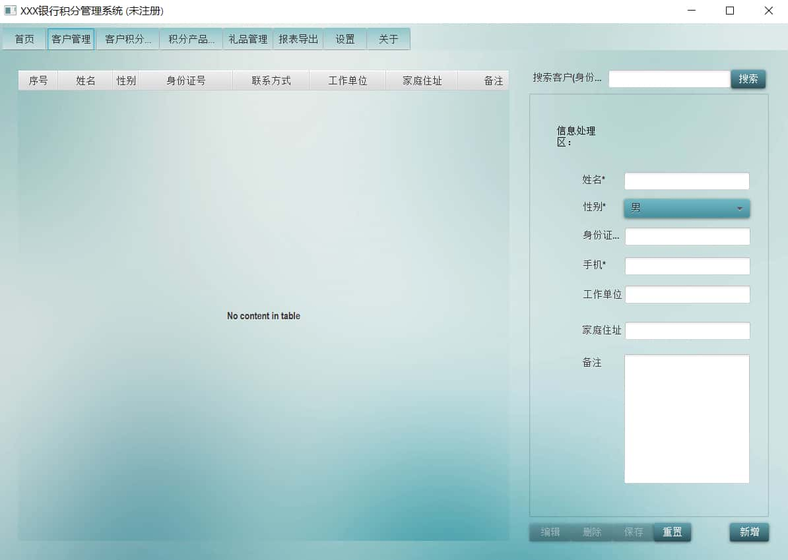
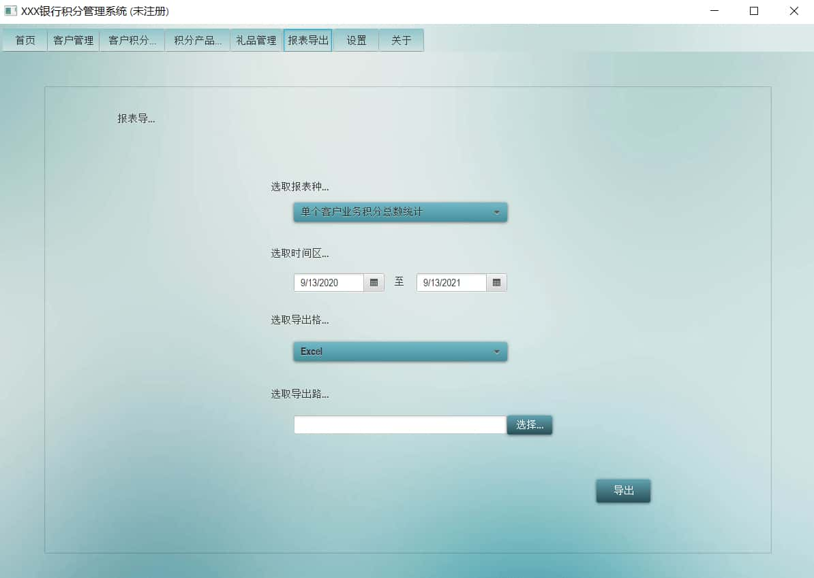
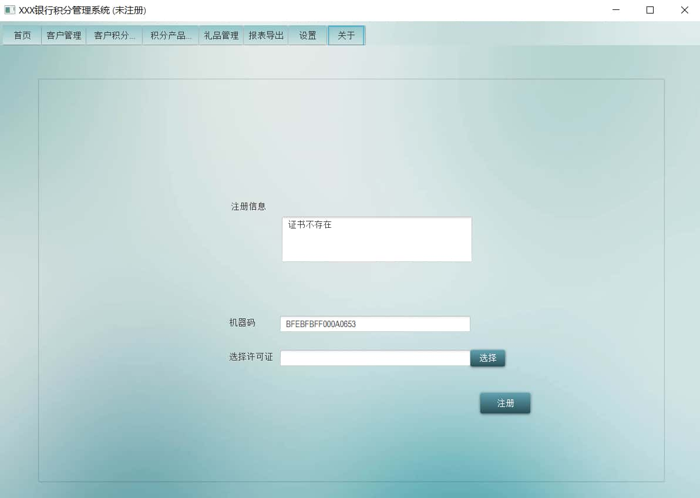
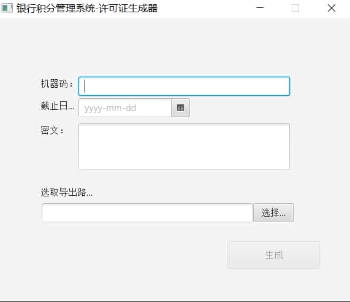

# 银行积分管理系统项目说明

## 介绍

使⽤ `Java + JavaFX + Derby(嵌⼊式数据库)` 构建的⼀套C/S架构的  
信息管理系统，包含了系统本身（`./source/BCMS`*）以及系统外单独构  
建的证书生成小程序（`./source/BCMSLicenseGenerator`）。 

功能方面，除了些许界面涉及到一点稍复杂的业务逻辑，主要是增删改查。  
功能之外，在这个小项目里首次接触了`Java的GUI开发`、`嵌入式数据库`、  
`软件注册机制`等新鲜的东西。


这是2020年初一个练习向的小项目，翻旧硬盘看到，稍作整理归档在这里。  
文件夹里都是当时的内容，归档过程清理了依赖包之类的东西。需求算是  
个大作业说明，只是练习，没有设计文档，表设计写的现在看看有点可爱，  
具体的代码就没必要去复盘了，好久没写Java加上不够规范看起来估计还  
很费时间，此段仅作归档备注用，日后如有需要再来翻翻。  

*Note by pwz on 2021.09.13*

---

## 运行

所需依赖如下
```
JDK1.8

commons-codec-1.11.jar
commons-lang3-3.9.jar
commons-math3-3.6.jar
derby.jar
derbyclient.jar
gson-2.8.1.jar
poi-3.11-20141221.jar
poi-excelant-3.11-20141221.jar
poi-ooxml-3.11-20141221.jar
poi-ooxml-schemas-3.11-20141221.jar
poi-scratchpad-3.11-20141221.jar
```

JDK1.8应该是内置了Javafx的包的，如果没有或者是高版本JDK，那就另  
外把javafx的包下载下来。环境和依赖配置好之后，直接按如下路径找到  
Main函数运行即可启动。

客户端：`/BCMS/src/com/vilaseaka/ui/main/Main.java`  
注册机：`/BCMSLicenseGenerator/src/com/vilaseaka/main/Main.java`


启动后需要输入用户名密码才能进入系统主界面，用户名写死为小写admin，  
首次启动好像需要用超级用户设置一次密码才行，具体参见login目录代码。


## 截图

<br>
<br>
<br>
<br>

