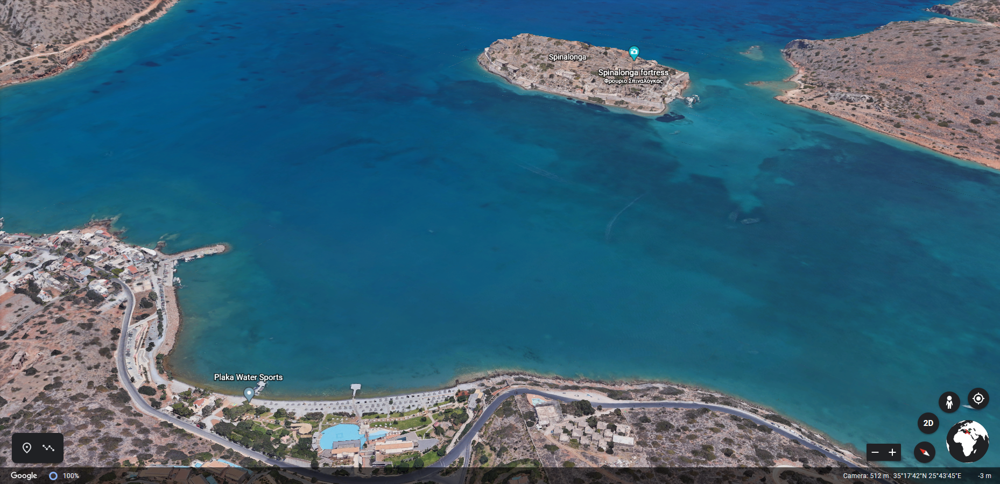
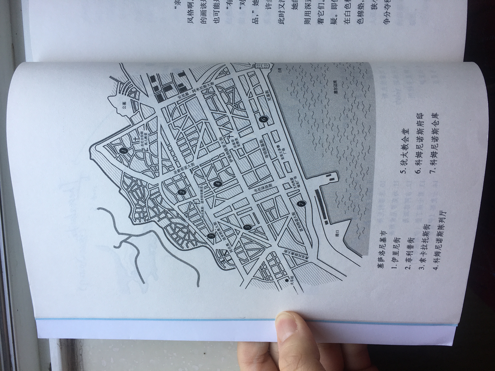

# 维多利亚·希斯洛普的《岛》与《线》
*2020050901-book-notes-of-The-Island-and-The-Thread-by-Victoria-Hislop*  
*Written by [Vilaseaka](https://vilaseaka.github.io) on 2019.12.13 & 2020.01.31*  
*Posted on 2020.05.09 under [CC BY-SA 4.0](https://creativecommons.org/licenses/by-sa/4.0/)*  

## 《岛》随笔

```
书籍信息
书名：岛（The Island）
作者：[英]维多利亚·希斯洛普
译者：陈新宇
ISBN：978-7-5442-4407-7
```

读《岛》的时候，很沉浸于其中的故事，沉浸之余，又借助很多工具，包括【谷歌地球】、【世界地图】、【维基百科】等等，跳脱出来，不只享受于书中的故事，还享受于书本身与其涉及的世界中的事物之间的联系。这不是故事本身带给读者的体验，而是【读故事】这件事情带来的，是需要读者自己去探索的一个过程。

日志中写的比较全，直接摘录过来⬇

>读《岛》用了些全新的方式，至少之前基本没这样玩过。在电脑上下载了一个谷歌地球（还借了本世界地图以及希腊旅游手册），能看到斯皮纳龙格岛的三维立体模型，当然，也能看到克里特岛的全貌，能看到希腊的全貌，能看到伊拉克利翁与布拉卡有多远，布拉卡离小岛有多远，能看到就国家的尺度来看，斯皮纳龙格岛是多么渺小的存在。搜索引擎也随时待命，麻风病到底有多可怕，《维纳斯的诞生》是什么样子……连地图上的名字也带来很大的乐趣，布拉卡不是Blaka，而是Plaka，Crete被译成克里特而不是科瑞特，伊拉克利翁的英文是Heraklion，当然了，这些也全是希腊文或者是什么（那种字母）翻译过来的。所有这些令阅读体验十分愉快，仿佛找到小时候探索未知时的那种乐趣，虽说这些乐趣基于无知（对英文翻译、地理知识、历史知识等相关知识的无知），但乐趣终究是乐趣。

从布拉卡的角度俯瞰斯皮纳龙格岛（Google Earth）：



<br>

## 《线》随笔

```
书籍信息
书名：线（The Thread）
作者：[英]维多利亚·希斯洛普
译者：王爱燕 / 郭莉
ISBN：978-7-5442-7101-1
```

《线》是希斯洛普第三部作品，第一部是《岛》前些日子读过，第二部中文叫《回归》，似乎不大和谐，其实英文很和谐，五部长篇：

* The Island(2005)
* The Return(2008)
* The Thread(2011)
* The Sunrise(2014)
* Cartes Postales form Greece(2016)

希斯洛普1959年出生，地地道道的英国人，不知道为啥对希腊这么情有独钟。

《线》的主线故事始于一战中塞萨洛尼基市的一场大火，整个故事绵延六十多年，结束于卡捷琳娜阅读到迪米特里叔叔的信件，前后各有一段当下视角的描述，孙子问祖母，祖母讲故事，六十年的故事在书中是一段回忆，叙事结构与《岛》如出一辙。

整个大背景是基于史实的。正文开始之前有一张地图，是现实中的塞萨洛尼基市区地图，阅读整个故事之前或许会看着陌生的城市陌生的街道名感到乏味，觉得只是一张小地图而已，等读完整个故事之后再回来看这张地图就不一样了，一切都鲜活起来，故事里那些人物似乎就活在这张小地图里：


<br><br>

“线”这个意象相比于《岛》中的“岛”要更模糊些，毕竟《岛》中只有一座岛，所有的岛都是在讲那座岛（克里特不算），《线》中的线就太多了，女主这个裁缝处处所要用到的线，牵扯着每个人命运的无形中的线，乃至于串联起整个人类历史的“线”，到处都是线。一场火是如何影响一大群人的生活的，犹太人为何招致祸患，战争带来了什么带走了什么，有些书中描写了，有些只是表现出来让人看到，一切皆有联系。

想起以前的一个问题，如何才算到过一个地方（2018年日志），核心答案是“与当地的人创造出故事”，这也是祖母给外孙的答案，不是因为这里的老房子住习惯了或者哪家店铺哪种食物独一无二，而是因为这里发生过的所有点点滴滴所联系在一起形成的那个故事。故事是一种强大的力量，并且只有在其所发生的地方才足够鲜活。

故事蛮好，结合现实地理、历史的这种形式，读完就好像自己在那个地方生活过。关于书的主题，战争、灾难、宗教、人性，小说中有这些主题很好，但严肃的探讨是实用文学的工作，读小说，《如何阅读一本书》里的建议值得参考，一口气读完，享受故事就好了。