# 理解素描::一::基本几何体到简单静物
*Posted on 2022.06.04 by [pwz](http://pwz.wiki) under [CC BY-NC-ND 4.0](https://creativecommons.org/licenses/by-nc-nd/4.0/)*  
*Updated on 2022.06.25 (typo fix, format fix)*


- [理解素描::一::基本几何体到简单静物](#理解素描一基本几何体到简单静物)
  - [背景介绍](#背景介绍)
  - [内容概览](#内容概览)
  - [详细记录](#详细记录)
    - [01@2021.03.01 三棱锥](#0120210301-三棱锥)
    - [02@2021.03.08 正方体](#0220210308-正方体)
    - [\_\_@2021.03.21 正方体](#__20210321-正方体)
    - [03@2021.04.14 六棱柱](#0320210414-六棱柱)
    - [\_\_@2021.04.15 几何体涂鸦](#__20210415-几何体涂鸦)
    - [\_\_@2021.04.16 六棱柱](#__20210416-六棱柱)
    - [04@2021.04.19 长方体\*2穿插](#0420210419-长方体2穿插)
    - [\_\_@2021.04.21 长方体\*2穿插](#__20210421-长方体2穿插)
    - [05@2021.04.23 球体](#0520210423-球体)
    - [\_\_@2021.04.24 球体](#__20210424-球体)
    - [06@2021.04.26 正十二面体](#0620210426-正十二面体)
    - [07@2021.05.05 长方体+正二十面体组合](#0720210505-长方体正二十面体组合)
    - [08@2021.05.10 苹果](#0820210510-苹果)
    - [09@2021.05.17 广口陶罐](#0920210517-广口陶罐)
    - [\_\_@2021.05.24 静物组合@桌面上玻璃杯陶罐及若干水果 4K](#__20210524-静物组合桌面上玻璃杯陶罐及若干水果-4k)
    - [\_\_@2021.05.25 热水壶](#__20210525-热水壶)
    - [\_\_@2021.05.26 苹果](#__20210526-苹果)
    - [10@2021.06.02 细颈陶罐](#1020210602-细颈陶罐)
    - [11@2021.06.07 陶罐+苹果+衬布 简单静物组合](#1120210607-陶罐苹果衬布-简单静物组合)
    - [\_\_@2021.08.02 两个球体](#__20210802-两个球体)
    - [\_\_@2021.08.05 橘子](#__20210805-橘子)
    - [\_\_@2021.08.10 静物组合@桌面上玻璃杯陶罐及若干水果（第二次画） 4K](#__20210810-静物组合桌面上玻璃杯陶罐及若干水果第二次画-4k)
    - [\_\_@2021.08.15 任意角度的头部模型](#__20210815-任意角度的头部模型)

## 背景介绍

2021年3月份报名了一个画室的素描课，一期12堂课，从3月上第一堂课到8月最后一堂课，以下是这期间（2021.03.01~2021.08.15）所有的练习，包括课上老师指定的11幅难度渐进的石膏几何体、简单静物，以及我在课下进行的12幅补充练习。

一些基本的备注：
1. 以数字序号开头的为素描课上在老师指导下的练习，双下划线开头的是我私下的补充练习。
2. 上课频率大体是每周一节，勤快时一周两节，有时也因出差等缘故隔几周才去上一节课，具体见日期标注。

课程与老师的情况：  
1. 素描课的整体安排，似乎是国内画室都差不多的：从基本的几何体画起，过渡到静物、静物组合、石膏像，再到人像等。
2. 画室在上海，费用是1800元12堂课（实际给打了8折=1440元），有更贵或更便宜的，但这价格足够找个靠谱老师。
3. 老师国美毕业，课上并不会讲太多东西，每堂课按照他既往的关于学习进程的经验（参考我达到的水平），安排我该画什么，画之前讲相关的理论基础。

之前考虑过自学最后还是找了老师，说下报班对我的意义：
1. 克服拖延保持一定的进展速度，素描基本功练习对我来说是枯燥的，没有定期的课程限制很容易拖几周不画一张
2. 我在网络上能够搜索到所有画室老师教给我的内容，但搜索信息、甄别信息需要消耗的时间成本，大于报班的费用。
3. **老师能快速指出哪里画的有问题**，找到问题所在才能快速修正、进步，自学很难保证这一点。

## 内容概览

```
这一时期没有详细时间记录，以下标注的时间是粗略且往偏多的估计
除了两幅标了4K的，均为8K尺寸的练习
---
01@2021.03.01 三棱锥 ~1h
02@2021.03.08 正方体 ~1h
__@2021.03.21 正方体 ~15min
03@2021.04.14 六棱柱 ~1h
__@2021.04.15 几何体涂鸦 ~30min
__@2021.04.16 六棱柱 ~30min
04@2021.04.19 长方体*2穿插 ~1h
__@2021.04.21 长方体*2穿插 ~30min
05@2021.04.23 球体 ~1h
__@2021.04.24 球体 ~20min
06@2021.04.26 正十二面体 ~1.5h
07@2021.05.05 长方体+正二十面体组合 ~1.5h
08@2021.05.10 苹果 ~1.5h
09@2021.05.17 广口陶罐 ~1.5h
__@2021.05.24 静物组合@桌面上玻璃杯陶罐及若干水果 4K ~2h
__@2021.05.25 热水壶 ~30min
__@2021.05.26 苹果 ~20min
10@2021.06.02 细颈陶罐 ~1h
11@2021.06.07 陶罐+苹果+衬布 简单静物组合 ~1h
__@2021.08.02 两个球体 ~15min
__@2021.08.05 橘子 ~40min
__@2021.08.10 静物组合@桌面上玻璃杯陶罐及若干水果 4K ~4h
__@2021.08.15 任意角度的头部模型 ~20min
---
累计练习时长约23小时（注意按照一定频率累计的23小时与集中练习23小时是有区别的，此场景下前者效果更好）
除了以上练习，这一时期还观看过大量绘画相关的视频，这带来一定的理论输入，但对实际绘画能力的提升影响甚微。
```

## 详细记录

### 01@2021.03.01 三棱锥
第一堂课。

先讲排线：
1. 长直线用来画大形状（起形），要通过**动手臂**而不是转手腕来画长直线。
2. 短弧线用来画大面积的颜色（铺调子），铺短线时注意两头尖中间粗，排线要均匀，略带弧度，两组线条交叉角度大一些（十字交叉会很生硬），如此铺出来的颜色会相对自然。
3. 没必要专门花很多时间练习排线，在日常的素描练习中好好排，排线能力提升是水到渠成的事情。
  
再讲光影：
1. 了解光线打到物体上产生的基本的受光面（`亮面`）、被光面（`暗面`）、影子（`投影`）以及被光面和影子上都有的些许`反光`即可。
2. 物体底部的边界线要卡的死些（画的清晰且重），这不是什么死规矩，大概只是画几何体时可以用上的一个小技巧，一条深刻的黑线就能显得物体很真实，落在纸上。这在后期会发展成一条更通用的技巧：将那些重要的形状边界刻画一下，卡好几个点，能很高效的将画面主体内容表现出来。

绘画过程：
1. 先确定物体在画面上大致的位置，上下边界、左右边界轻轻标记下（通常下面留空大于上面会显得画面更平衡）
2. 用长直线把大形状画出来，一次没找准可以反复多找两遍
3. 大形状调整、确定好之后，开始排线铺调子

More Notes ~
* 额外还需了解作画工具，整个阶段一期间，只用到2B、6B铅笔及可塑橡皮，起形用2B，上调子铺暗面、阴影时用6B。
* 想到第一堂课练习三棱锥的缘由，大概因为表现正方体要完整的黑白灰三个面，而三棱锥只有黑白两个面，确实是最简单的立体形状了。

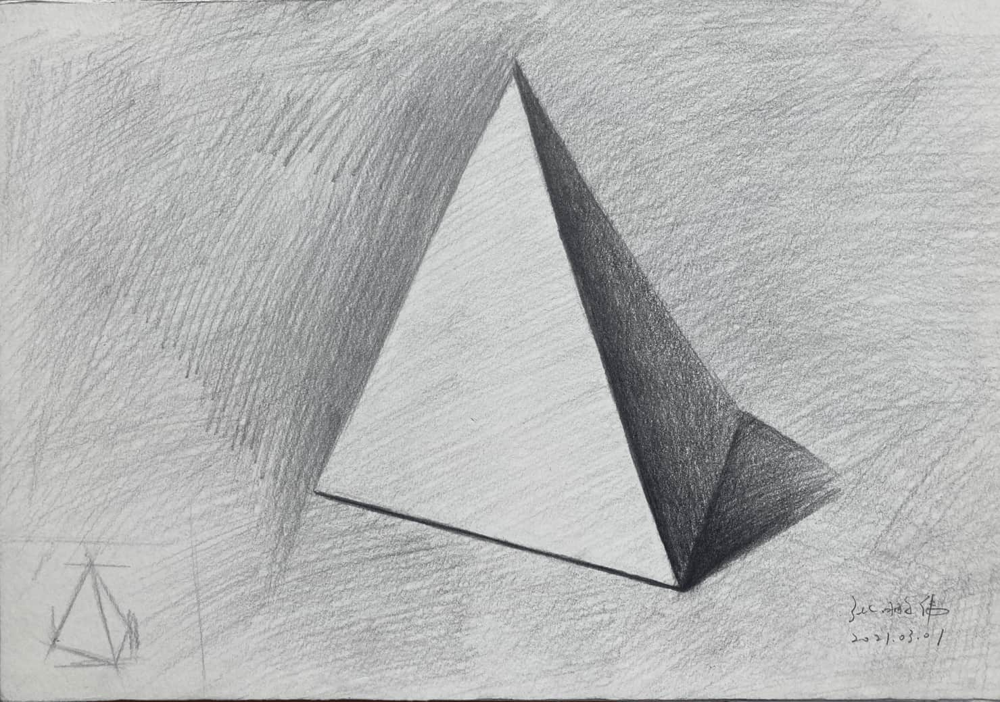


### 02@2021.03.08 正方体

引入透视规律：
* 一条根本的原则在于，近大远小。粗略理解其底层原理：这是凸透镜的成像规律，人眼的结构将这种规律与我们的感受捆绑在一起，所以在平面的纸上表现好近大远小的关系，人眼观察起来就能显得很立体。更严谨的探讨就得去翻论文了。
* 透视规律体现在正方体上就是：现实中平行的线条表现起来，要程一种微微的夹角，使其延长线可以在远端汇成一点，见左下角示范。
* 参考阅读：[绘画中如何表现出人物和空间的透视感？ - 祯固STW的回答 - 知乎](https://www.zhihu.com/question/27292271/answer/110634472)

进一步理解明暗关系。有种习惯的说法叫“三大面、五大调子”，感觉它们的概念有些相互重合，也没找到过严格的定义出处，简单理解下：
* 三大面：黑白灰。下图中光从左上打下来，上面是直接受光面的亮面（白），右边这个面是完全被光的暗面（黑），还剩一个则是受了一点光的灰面。这三个面在绘画过程可以帮助区分大的明暗关系，但不要本末倒置，非要找出个面叫亮面、暗面然后给画到什么深浅程度，设明度为0~255的数值范围，哪两个数可以作为黑白灰的界限呢？现实世界的明暗过度是连续的，从很亮到很暗，给中间范围找个形容词叫“灰”，如此理解这个“三大面”似乎是可以了。
* 五大调子，其实是在三大面的基础上进一步丰富对明暗关系（明暗层次）的描述，具体也分出不同的说法，理解几个特指的词是什么意思就好，他们的定义是相对明确的：
  * 高光：画面中最亮的点（区域）。通常要有强光源+光滑表面结合才有高光，阴天里什么都灰蒙蒙（没有强光源）、有点太阳眼睛里就能出现高光（强光源+光滑表面）、手电筒照进大雾里产生一条明亮通路但难以产生高光（没有光滑表面反射）。
  * 明暗交界线：画好亮面与暗面，自然也就产生一条对比强烈的交界线，但通常是反过来，优先找到这个对比强烈的边界，再从它开始刻画对应结构。
  * 反光：背光部分受到环境光影响产生的暗部中的亮部。，
  * 参考阅读：[素描里的五大调子哪种说法才是正确的？ - 安尼迪的回答 - 知乎](https://www.zhihu.com/question/53095329/answer/133435407)

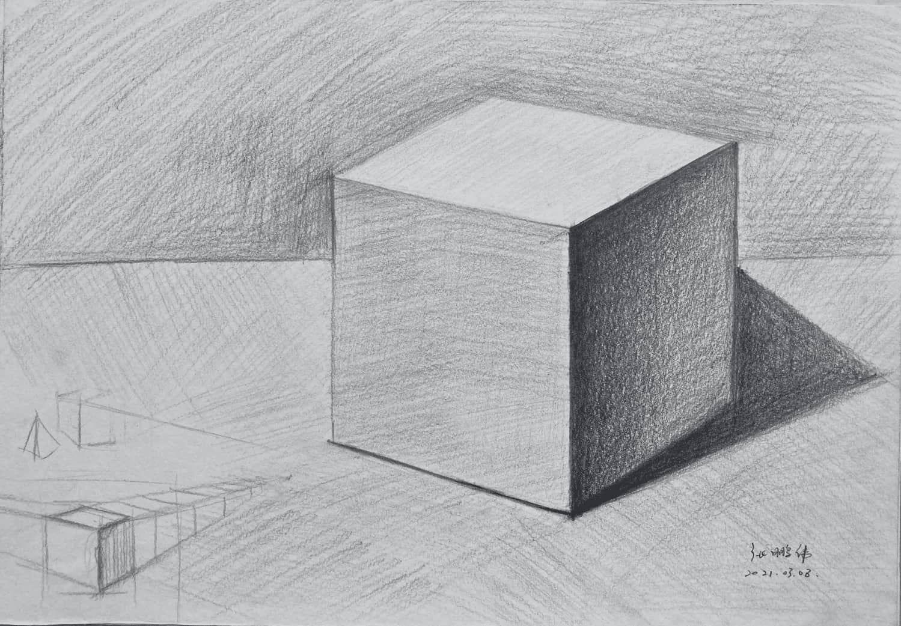


### __@2021.03.21 正方体
敷衍的练习+1。

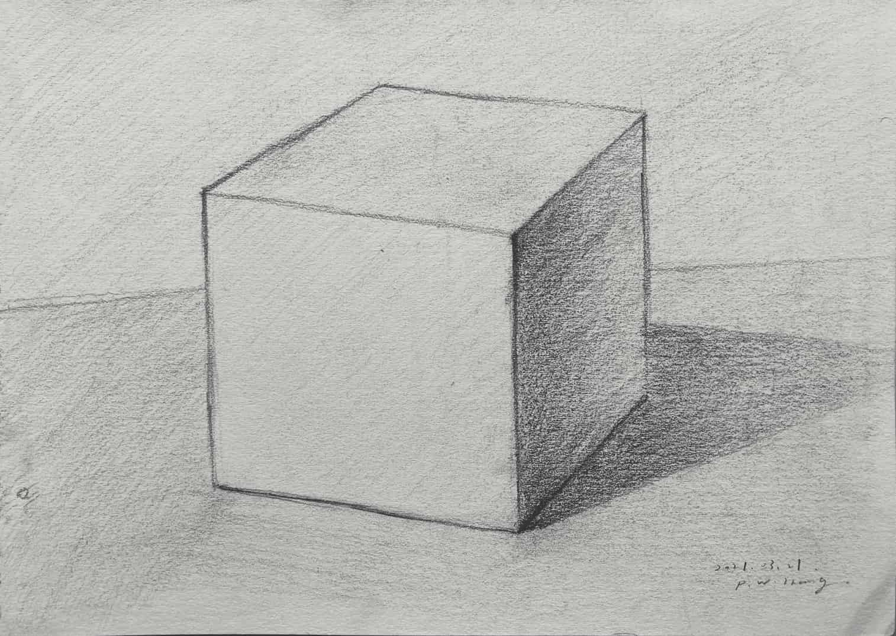


### 03@2021.04.14 六棱柱
没有引入太多新内容，面数增加-->明暗层次增加，训练排线、控调子的能力。
按照正六棱柱来说，这幅图的透视关系有问题，找相关的线条校验是否符合近大远小规律就能发现问题。

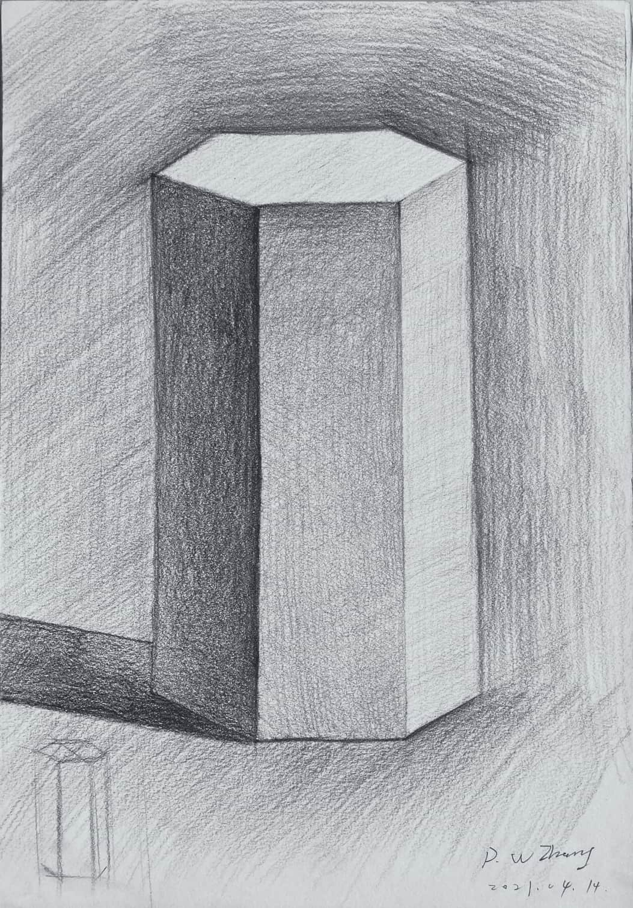


### __@2021.04.15 几何体涂鸦
敷衍的练习+1。

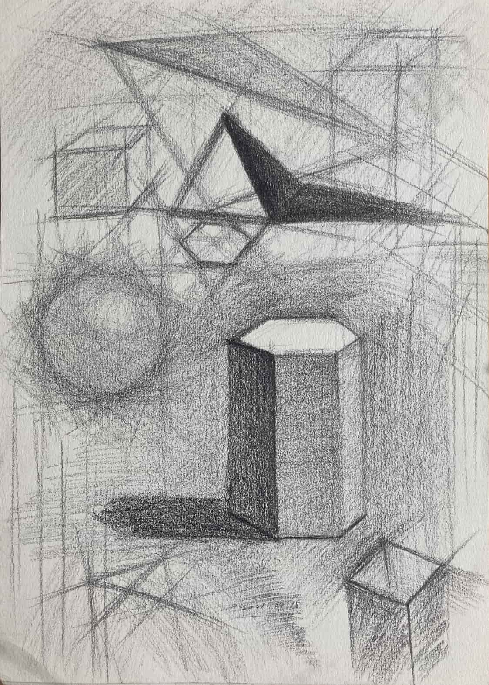


### __@2021.04.16 六棱柱
还是透视关系有问题。

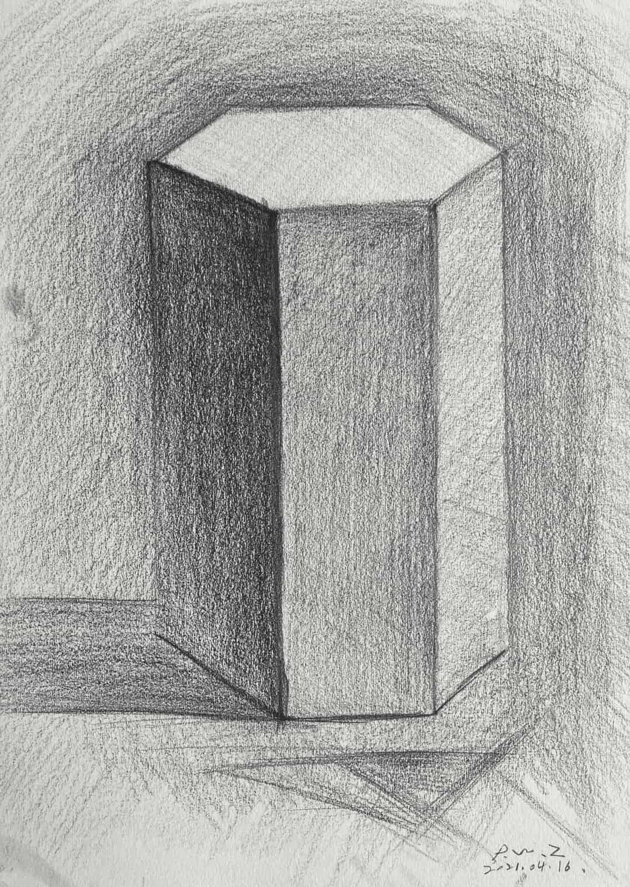


### 04@2021.04.19 长方体*2穿插
穿插体引入了更多的结构关系，光影打在上面也形成了更多的层次
* 注意观察不同线条长短比例，注意线条角度，如此可以画准大形状
* 分析好每个面与光源的关系，另外注意虚实的表现（影子远处逐渐虚掉）  
  
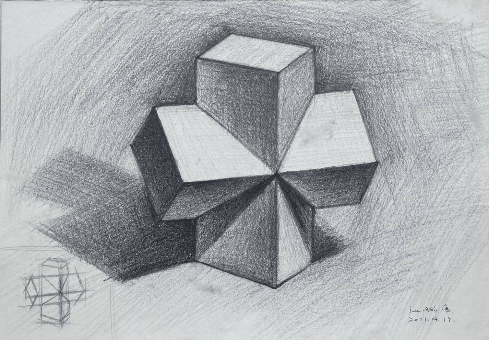


### __@2021.04.21 长方体*2穿插
敷衍的练习+1。

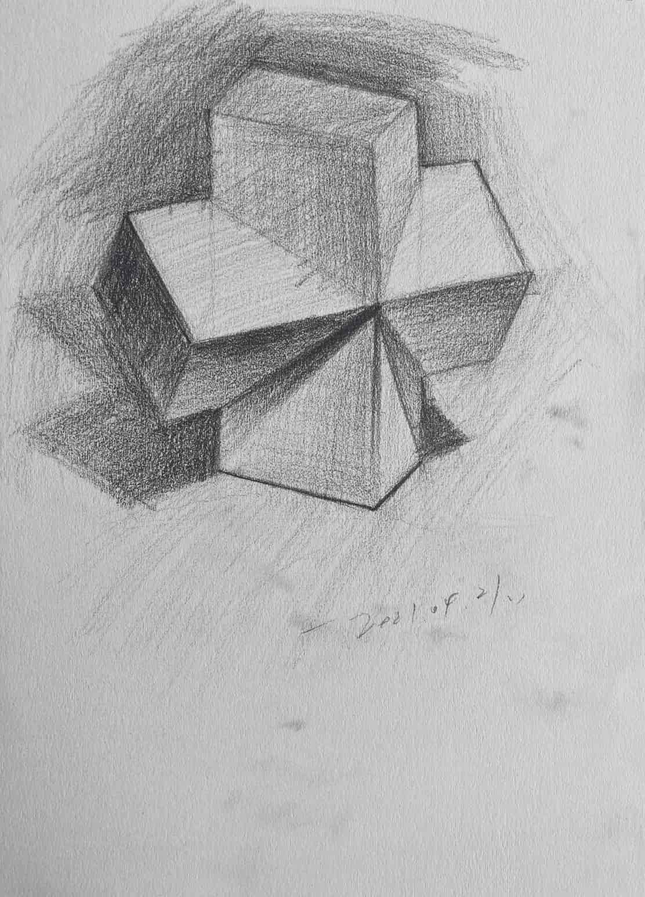


### 05@2021.04.23 球体
球体上没有非常明确的形状边界，画好一个圆，之后的立体感全靠明暗关系的塑造。

某种“标准”的球体绘画过程总结如下：
1. 外轮廓的圆形通过方形逐渐“切”出来，具体见左下角小图示例
2. 外轮廓确定好后，可以优先确定明暗交界线
3. 从明暗交界线开始，向两边扩展，将亮部、暗部的调子拓展式的铺出来
4. 高光留好、暗部反光表现下、球底部加重刻画下，另外阴影铺一铺，整个球的感觉就出来了

这里可以引出一个话题：人是如何体会到立体感（空间感）的？前面说到透视关系，这里说到明暗虚实，常提的还有双目视觉（VR电影）等，感兴趣可以额外了解下。

参考阅读：[为什么人会觉得二维东西是立体的？ - 知乎](https://www.zhihu.com/question/52235368)

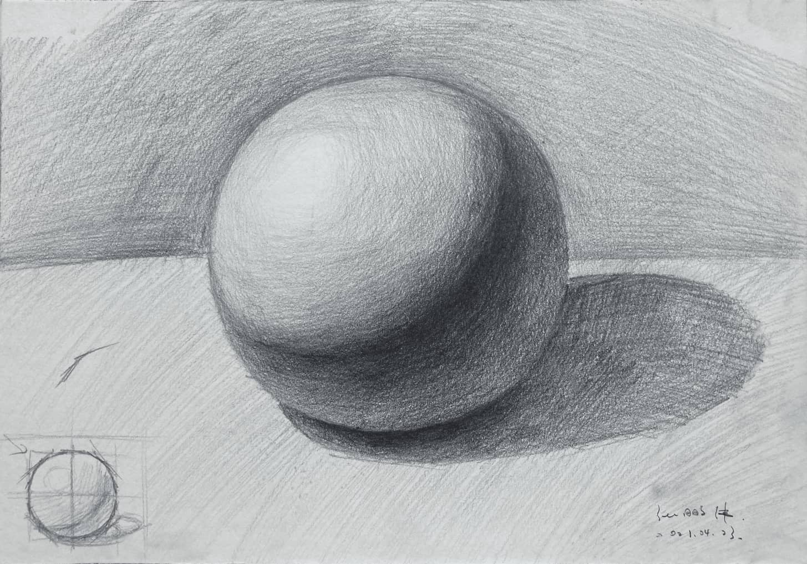


### __@2021.04.24 球体
敷衍的练习+1。

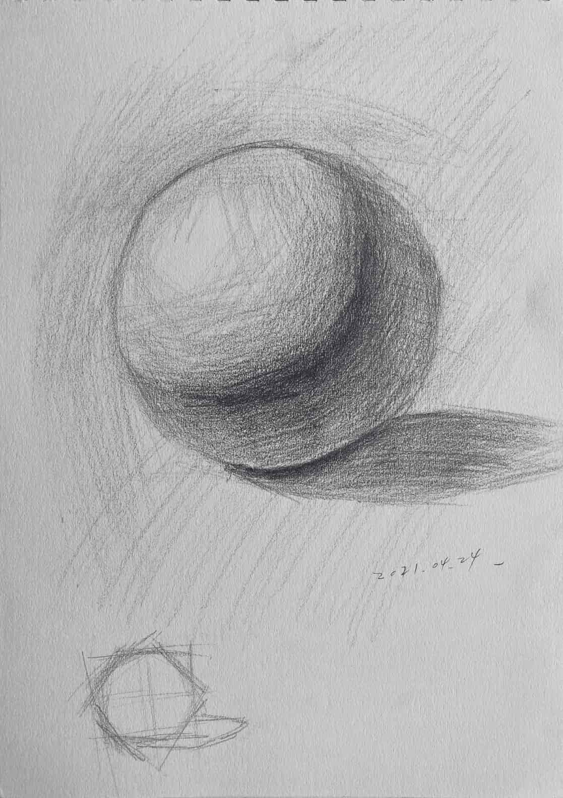


### 06@2021.04.26 正十二面体
更加复杂的物体，各个面的比例关系需要仔细观察分析。

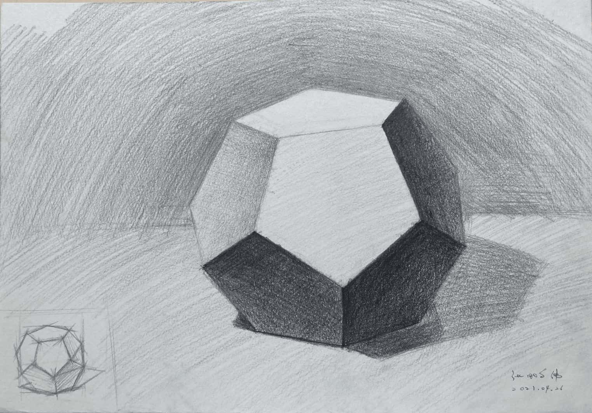


### 07@2021.05.05 长方体+正二十面体组合
继续提高画面复杂程度，练习处理不同物体结合在一起时对光影的影响。

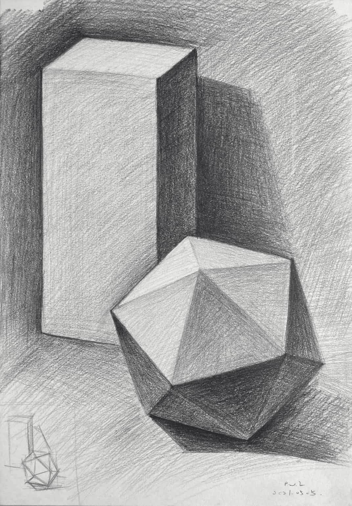


### 08@2021.05.10 苹果
第一个简单静物，在球体的基础上进行塑造，难点在于苹果柄处的凹陷，没啥技巧，好好观察，哪里该暗哪里该亮，如实画出来就好。

这张苹果可以改进的地方：整体上太圆，明暗交界过度比较生硬，暗部没能黑下去反光显得不真实。

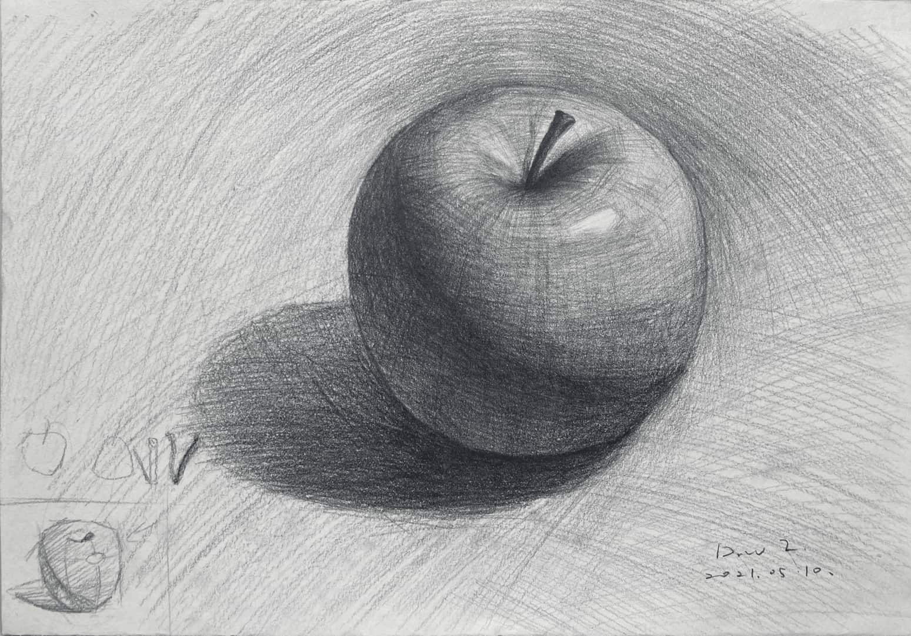


### 09@2021.05.17 广口陶罐
更复杂些的单体静物。

有些套路式的总结，瓶口应该怎么画、瓶身应该怎么画，但说来说去，本质练习的是对形状以及明暗关系的掌控能力。瓶口边缘正对着光是亮的，光照到的内壁是量亮的，背光处的内壁是暗的，瓶口往下的内部难以反射出光线，所以几乎是“死黑”一片，把这些明暗关系观察到位，另外形状尽量画准确些，这个陶罐就画出来了。

形状涉及到透视关系，但这个阶段其实不用考虑那么多，你看到什么画什么就是，然后可以用透视关系反过来验证画的对不对。先入为主不可取，绘画要遵从眼睛观察到的，而不是脑袋里的印象。但“遵从眼睛的观察”不刻意训练其实是很难实现的，脑袋总有自己的想法。

关于遵从眼睛观察的认知最早是从《**素描的诀窍**》这本书中得来，这应该是领域内经典书籍了，我在正式学习素描之前粗略读过，后续的学习过程中没事也会拿出来翻翻，很有启发性，与国内画石膏这种素描教学方案相比完全是另一条路径。

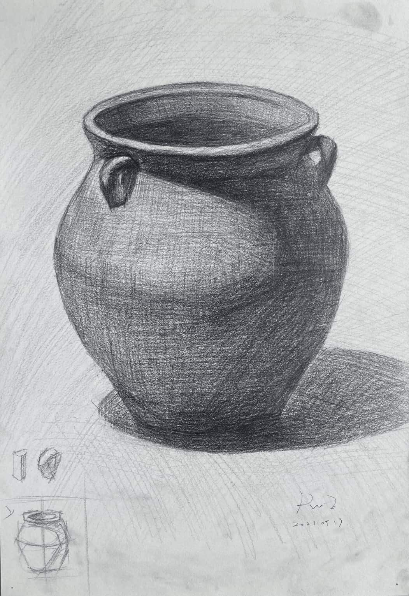


### __@2021.05.24 静物组合@桌面上玻璃杯陶罐及若干水果 4K
一直画基础物件很无聊，自己翻找视频想尝试下静物组合，但没耐住性子画下去，又多出一张敷衍的练习。

这张画是跟着这个如下链接画的，视频似乎是搬运的可能不会存续很久，但推荐这个叫**陈平**的老师，讲课思路很清晰。

参考：[陈平素描静物教学视频带讲解分步骤学习美术联考教程教师培训资料][chenping]

学习到这一阶段，没必要迈大步子尝试这种与水平不匹配的练习，各方面能力不达标，画不下来没有练习效果还容易打击自信心。
基本功练习的枯燥，可以找那种速成教学画上一幅，比如教你按照什么比例一步一步来画好一张人脸、一只猫猫狗狗、一幅雪中小屋之类的，这种浮于表面的绘画过程没有啥练习效果，但可以带来些许正向激励，权当解闷。

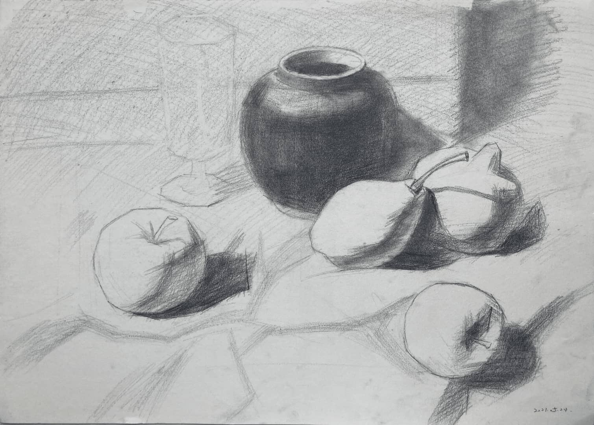


### __@2021.05.25 热水壶
又是一张敷衍的练习，对着桌子上的热水壶描摹几笔，没耐心刻画下去。

这里额外说下，可以看到以上（以及之后）的课下练习，我都没什么耐心画下去，如此看来报班的选择是很正确的。

有点喜欢但没那么喜欢，这种情况就需要一些外力来助推下，才能有进展。所有这种出现在自己愿景中但又懒得付出行动去努力达成的目标，都可以参考这个思路借助外力来实现。扯远了。

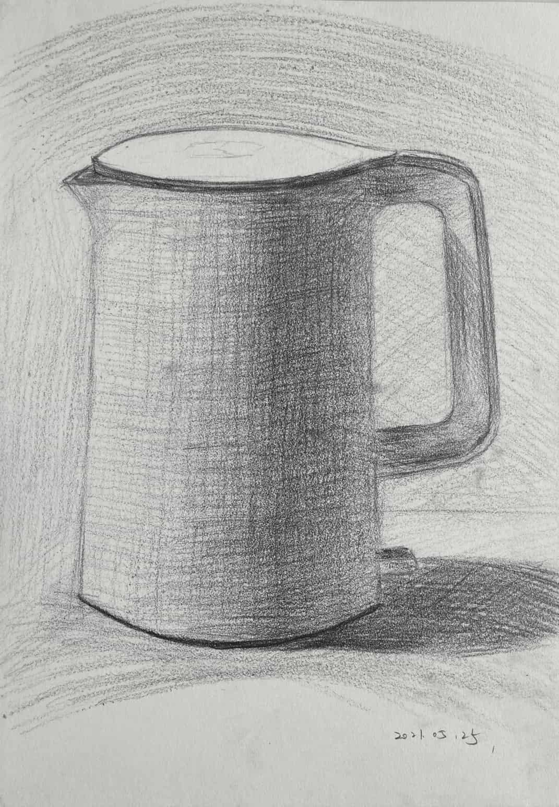


### __@2021.05.26 苹果
愿世界上不再有如此敷衍的苹果。

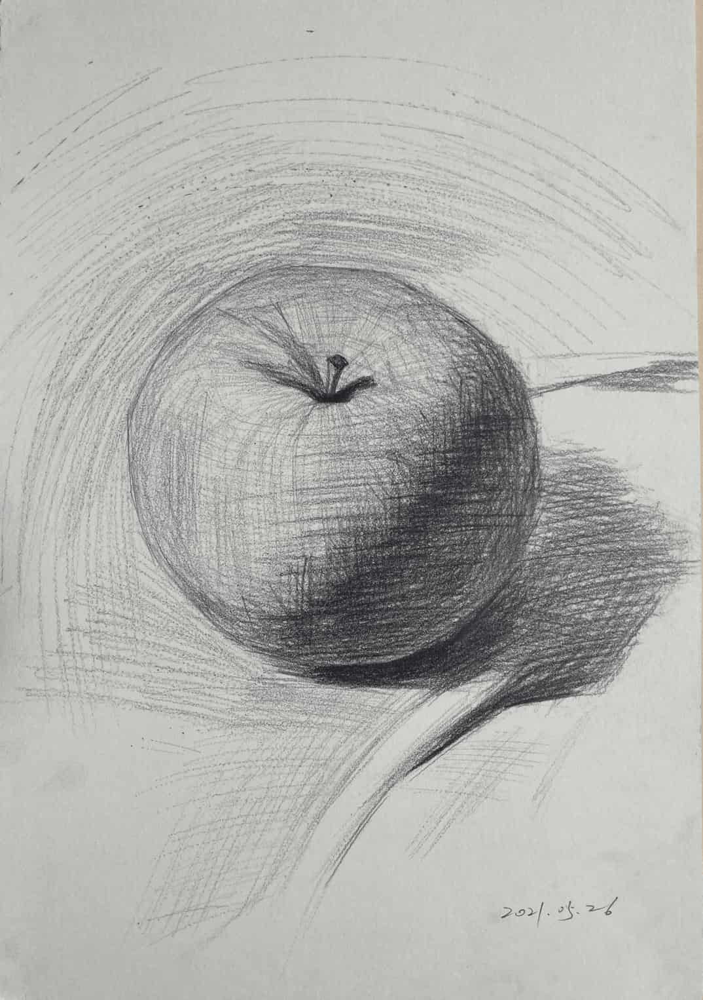


### 10@2021.06.02 细颈陶罐
与上一堂课的广口陶罐类似，属于同主题下的强化练习。

这里涉及到一个**固有色**的概念，从画中能感受到现实里的陶罐下边颜色是浅于上边的，这种物体本身的颜色深浅，而不是因为光照条件造成的明暗关系，表现在素描中，emmmm...，其实还是明暗关系。铅笔只能表现灰度，秉持着同样光线条件下颜色越深画的越重这条原则就好，然后与光影结合起来，表现出的内容自然就符合客观现实。

画到这里，记得老师讲过我的线条有些毛糙，但这不是大问题，形状、光影画对了是关键，是更重要的基本功。
还有一个大的关系老师偶尔会强调，虚实关系，练习中注意体会物体哪里要虚哪里要实。

小总结，学习、练习至此，素描中需要注意塑造的一些关系：
1. 结构关系：形状准不准，比例对不对，透视对不对。结构关系解决是不是的问题
3. 明暗关系：亮暗层次对不对，过度是否自然。明暗关系解决真不真实的问题。
4. 虚实关系：进一步解决“真不真实”的问题，前期明暗还画不明白时虚实关系没显得多重要，后期形状、明暗都刻画很好的情况下，提升画面质感就很依赖虚实关系了。

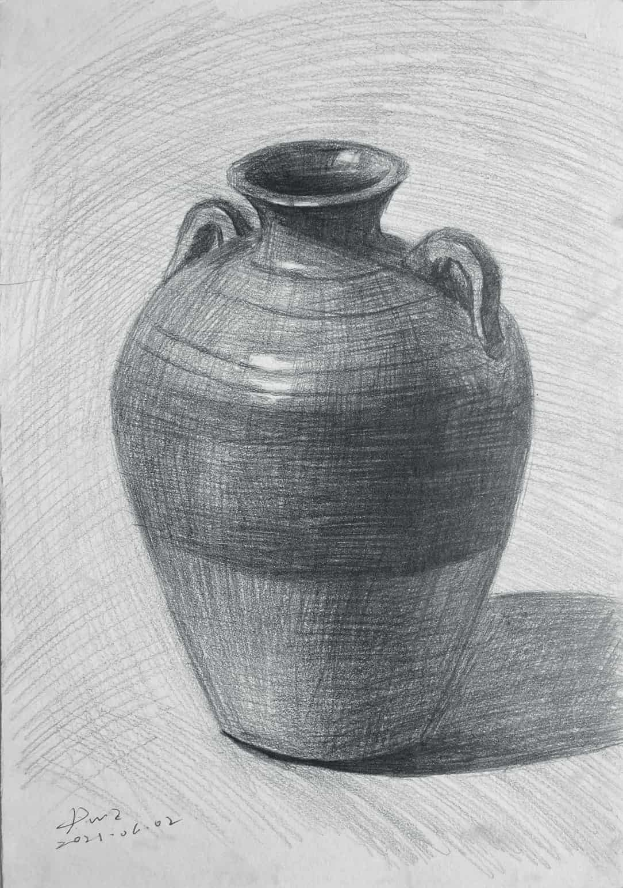


### 11@2021.06.07 陶罐+苹果+衬布 简单静物组合
正式开始静物组合的练习，提高对复杂内容的掌控能力。

一幅画中出现多个物品，稳妥的方案是先定位好各个物品的位置、大小比例后，再逐个刻画。

这张练习，我去画室比较晚，老师又约了朋友去聚餐，草草结束画的很敷衍。

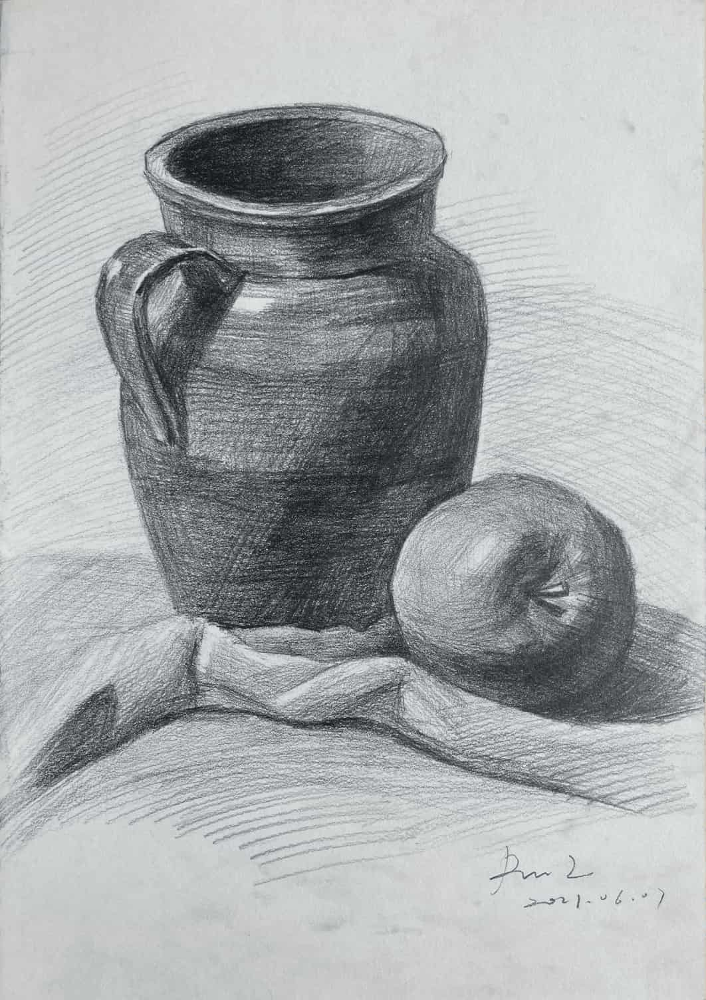


### __@2021.08.02 两个球体
回过头来再画类似内容，已经不太需要花费多少时间。

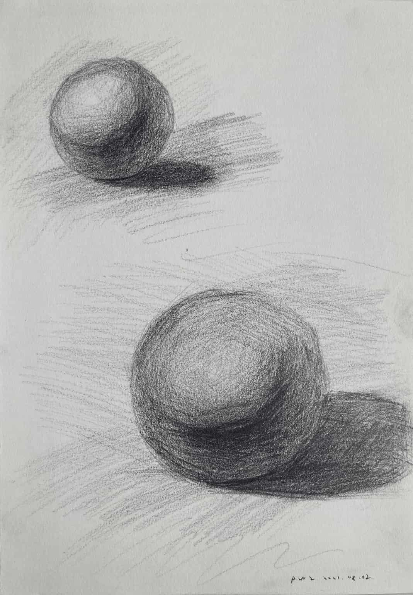


### __@2021.08.05 橘子
这张练习看了网上视频，开始尝试揉擦（之前也简单试过，比如那张4K静物组合），就是把之前画好的线条涂抹一下，再在上面刻画。从非连续的线条式明暗过度，变为揉擦后连续态的明暗过度，后者更符合现实也就更显得真实，但揉擦也有很多讲究或技巧，胡乱揉擦只会毁了之前的线条，这里只简单尝试不展开讨论。

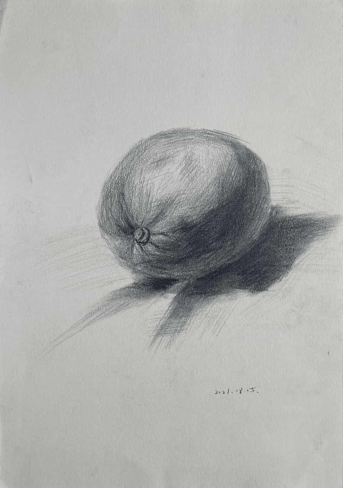


### __@2021.08.10 静物组合@桌面上玻璃杯陶罐及若干水果（第二次画） 4K
这段时间以来用时最久的一幅练习，前面画过一次，这次完成度稍高一些。

对衬布无从下手。一方面衬布没什么具体形状或者说形状过于复杂，对应的观察总结能力不足，另一方面对明暗关系的理解不到位，还不能做到熟练运用明暗关系表现厚度表现体积感。继续练习就好。

再贴一次这幅画对应的教学链接：[陈平素描静物教学视频带讲解分步骤学习美术联考教程教师培训资料][chenping]

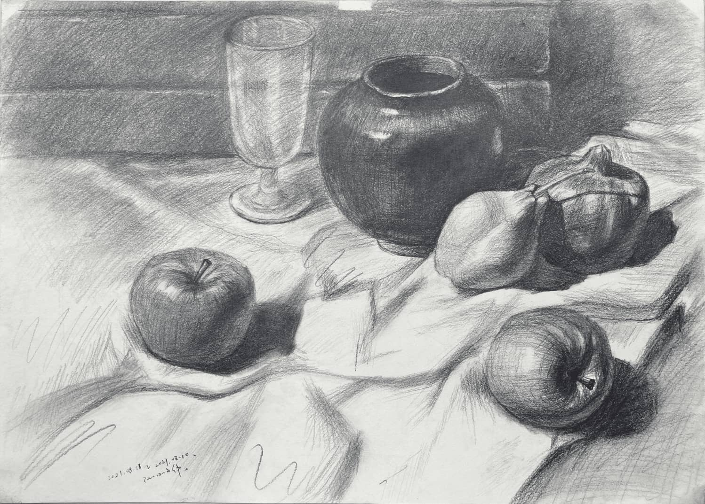


### __@2021.08.15 任意角度的头部模型
日常摸鱼刷绘画相关的视频，看到一份很棒的人像素描教程，原版在这里：
[How to Draw Facial Features | Proko](https://www.youtube.com/playlist?list=PLtG4P3lq8RHHFhiyjXP4UT-yUo7pC13GQ)
B站上有很多搬运，用关键字Proko可以搜索到，跟着涂鸦下找找乐子，这种就是太偏应用，教你画某种具体的东西，对基本功的练习帮助有限。学习素描最终的目标应该是，可以画一切内容，而支撑这个目标需要的基本功，前面提到过的都在此列：
1. 观察能力，要能看到画面特征并如实记录，靠记忆画是不靠谱的也没办法记忆所有物品
2. 造型能力，结构、比例、透视均在造型的范畴内，如前面所说，这些解决是不是的问题，这些画错了东西也就不是那个东西了
3. 刻画能力，主要是指明暗及虚实关系能否刻画准确，解决真实与否的问题，解决质感的问题

这里的个人总结或许较片面有偏差，全文内容均如此，认知是会不断改变丰富的，这一阶段的学习在此告一段落。

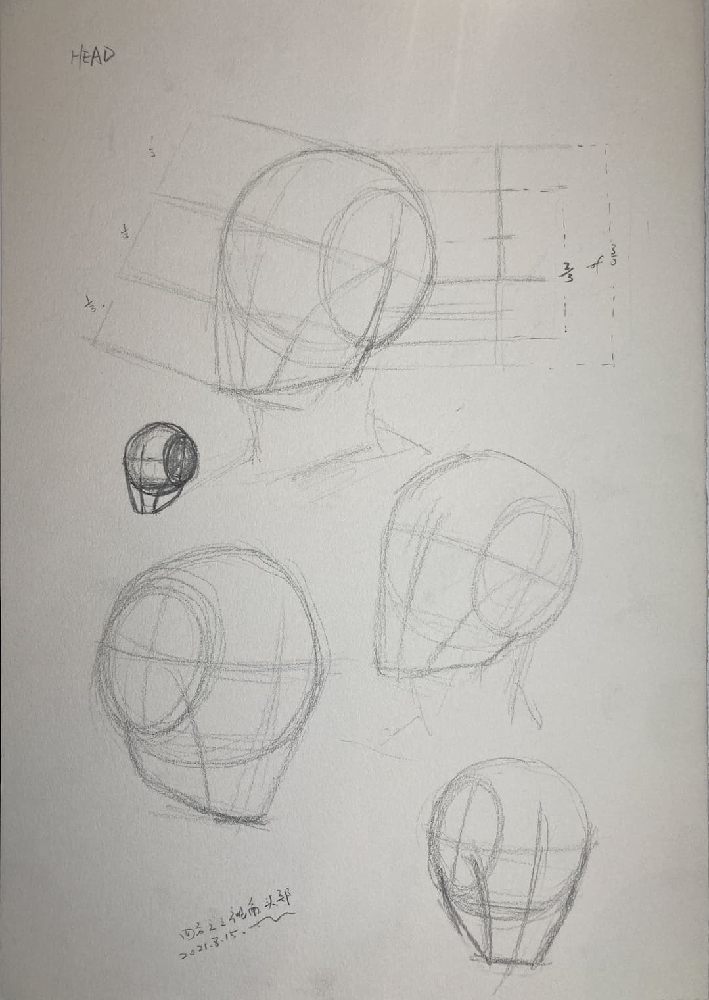


[chenping]:https://www.bilibili.com/video/BV1Ub411a7ZQ