# 理解素描::二::静物组合到简单石膏像
*Posted on 2022.06.05 by [pwz](http://pwz.wiki) under [CC BY-NC-ND 4.0](https://creativecommons.org/licenses/by-nc-nd/4.0/)*  
*Updated on 2022.06.25 (typo fix, format fix)*

在画室的第一期课程结束后，紧接着开始了第二期（2021.08.16~2022.11.15），以下为这一阶段的所有练习。

这一阶段，主要在画复杂的静物组合以及石膏面像、头像，不断巩固、提高素描的基本功，为后续画人像或其他复杂内容做准备。由于画面内容增多，通常一堂课画不完，多为两堂课画完一张4K练习。12堂课总共画了8张，外加3张我的额外练习，这份文档里共11张素描。

备注一个信息，到此阶段结束，所有的练习都是对着书上的素描或照片进行的，没有写生。

内容概览：
```
所有练习按照日期排布如下，标注的时间是粗略且往偏多的估计。
数字开头为老师指导下的练习，双下划线开头为课下自己进行的练习。
---
01@2021.08.16 一坨衬布 ~1.5h
__@2021.08.17 两块儿毛巾（草图+重画） ~2h
02@2021.08.30 静物组合@桌面、衬布、陶罐、水果 PartA ~2h
03@2021.09.01 静物组合@桌面、衬布、陶罐、水果 PartB ~2h
04@2021.09.08 复杂静物组合@桌面上一堆餐具、水果及杂物 ~09.19在家逐步画完  ~6h
__@2021.09.11 静物组合@金属水壶映着桌面上的水果 ~4h
05@2021.09.24 石膏耳朵 ~1.5h
06@2021.09.27 石膏眼睛 ~1.5h
07@2021.10.06 贝多芬石膏面像@块状 ~2h
08@2021.10.08 贝多芬石膏面像@平滑 ~2h
09@2021.10.11 四分之三大卫石膏面像@块状 ~2.5h
10@2021.10.22 四分之三大卫石膏面像@平滑（未完） ~1.5h
__@2021.11.04 四分之三大卫石膏面像@平滑（完毕） ~1.5h
11@2021.11.12 战神石膏头像（50%） ~2h
__@2021.11.14 石膏头像结构练习（哭孩、荷矛者、将军） ~5h
12@2021.11.15 战神石膏头像（100%） ~2h
---
累计练习时长约39小时。
三个月里除了这些练习，就是没事会刷一刷相关视频，除此没有其它输入。
```

快速链接：
- [理解素描::二::静物组合到简单石膏像](#理解素描二静物组合到简单石膏像)
  - [1@20210816 一坨衬布](#120210816-一坨衬布)
  - [\_@20210817 两块儿毛巾（草图+重画）](#_20210817-两块儿毛巾草图重画)
  - [2@20210830 静物组合@桌面、衬布、陶罐、水果](#220210830-静物组合桌面衬布陶罐水果)
  - [3@20210908~19 复杂静物组合@桌面上一堆餐具、水果及杂物](#32021090819-复杂静物组合桌面上一堆餐具水果及杂物)
  - [\_@20210911 静物组合@金属水壶映着桌面上的水果](#_20210911-静物组合金属水壶映着桌面上的水果)
  - [4@20210924 石膏耳朵](#420210924-石膏耳朵)
  - [5@20210927 石膏眼睛](#520210927-石膏眼睛)
  - [6@20211006-08 贝多芬石膏面像](#620211006-08-贝多芬石膏面像)
  - [7@20211011~1104 四分之三大卫石膏面像](#7202110111104-四分之三大卫石膏面像)
  - [8@20211112-15 战神石膏头像](#820211112-15-战神石膏头像)
  - [\_@20211114-15 石膏头像结构练习（哭孩、荷矛者、将军）](#_20211114-15-石膏头像结构练习哭孩荷矛者将军)

## 1@20210816 一坨衬布
上一期课程最后画的静物组合，跟老师讲不会画衬布，单独安排一节课练习衬布。这张还是没有找到感觉。

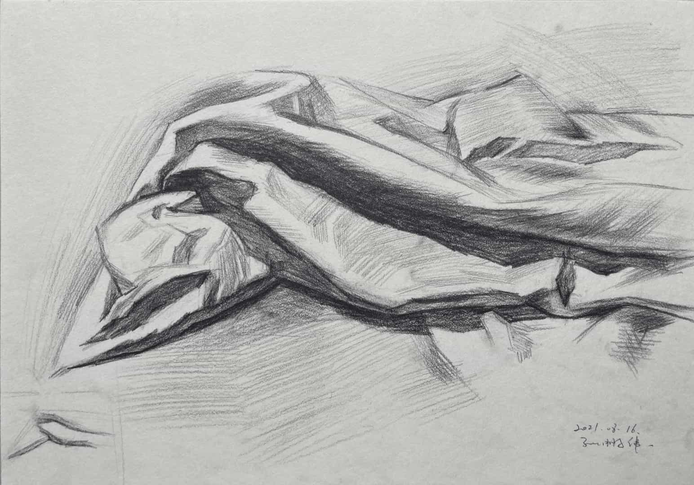


## _@20210817 两块儿毛巾（草图+重画）
针对衬布无从下手的问题，网上翻了翻教学视频，跟着强化练习下，画的过程逐渐有些开悟。

衬布不好处理的地方在于其转折与厚度，要理清楚厚度怎么体现出来的，再仔细刻画。

参考视频：[素描衬布画法教程](https://www.bilibili.com/video/BV1cK411T7ty)

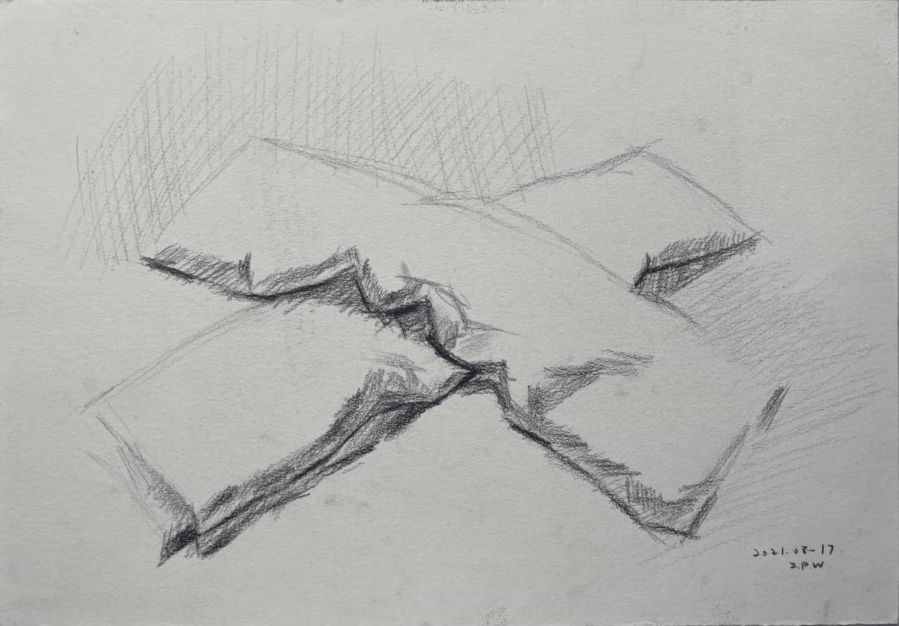
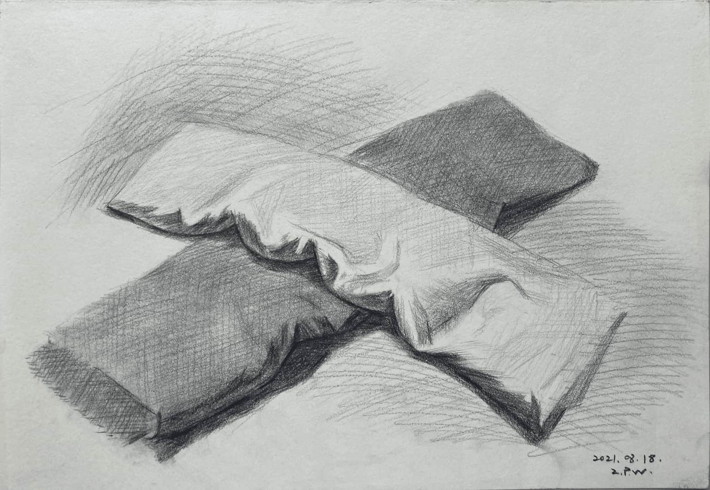


## 2@20210830 静物组合@桌面、衬布、陶罐、水果
一张普通的静物组合，练习基本功的同时也在练习耐心，这样一幅素描在现阶段要画上两堂课4个小时左右。

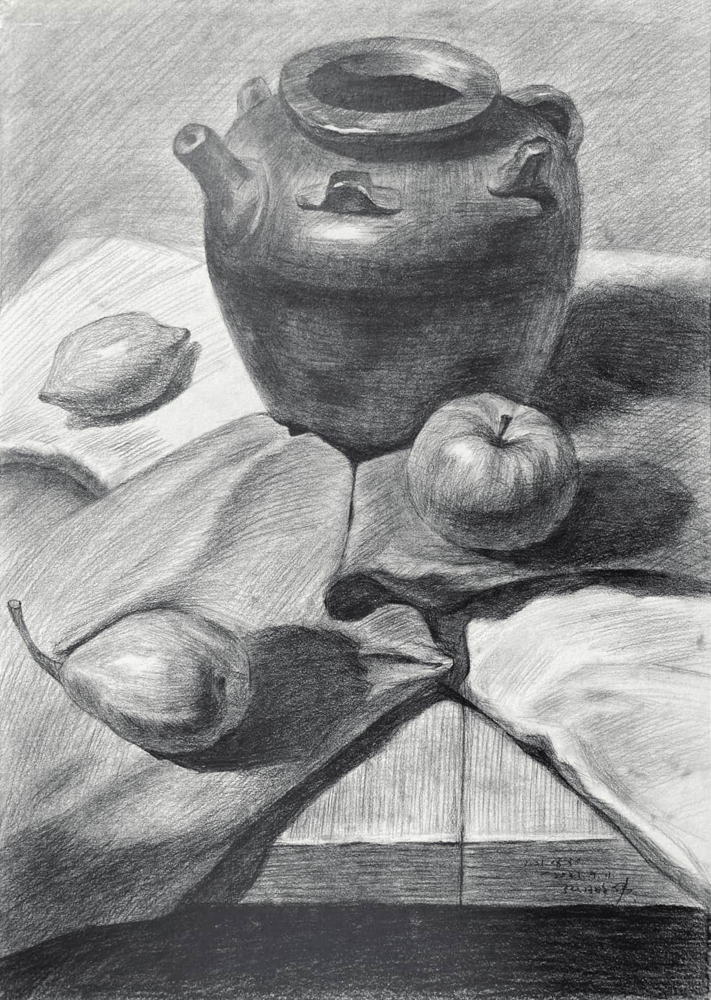

## 3@20210908~19 复杂静物组合@桌面上一堆餐具、水果及杂物
上一张画完之后，老师说可以来一张复杂些的，找了这张含罐（果）量巨高的画让我练习（临摹），课上画完一部分之后把样照拍到手机里拿回家，拖拖拉拉十来天才画完。

画这幅的时候，老师还没有具体教过怎么揉擦，只偶尔提过一句可以适当辅以揉擦，单独去找视频了解了下，这副练习里大部分地方都有揉擦痕迹。

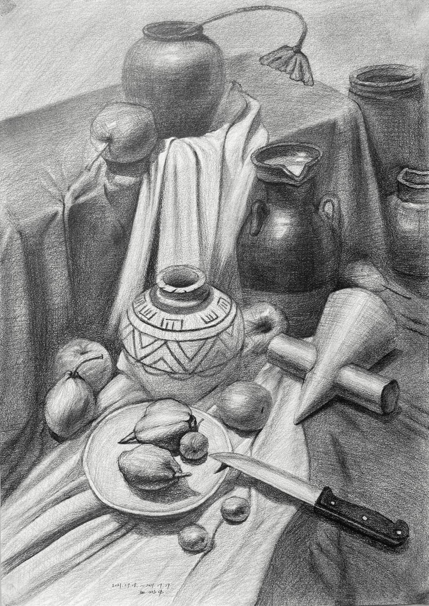


## _@20210911 静物组合@金属水壶映着桌面上的水果
额外进行的练习，尝试体现不锈钢的材质，效果似乎还行。

找有视频演示的画进行练习，能从演示中对比自己画的程度，比简单找张图临摹要好些。

参考视频：[初级静物组合不锈钢壶苹果白衬布 北京华艺名画室](https://www.bilibili.com/video/BV1t4411s7BE)

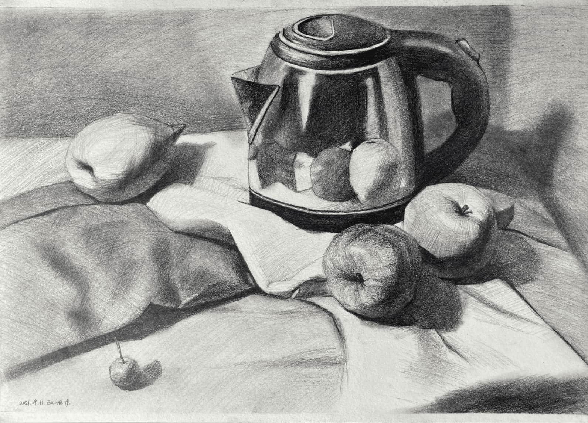


## 4@20210924 石膏耳朵
进入人像部分，但还是从最基础的画起，五官的单块儿石膏像。

这种练习目的大概是为了先了解对应结构，之后画人像时才心中有数，但我画这些的时候，照葫芦画瓢，老师也没具体讲解什么，真正对这些结构有更深理解还是后来画更多人像练习时，回过头来再对照着观察，才理解的，有些本末倒置了。

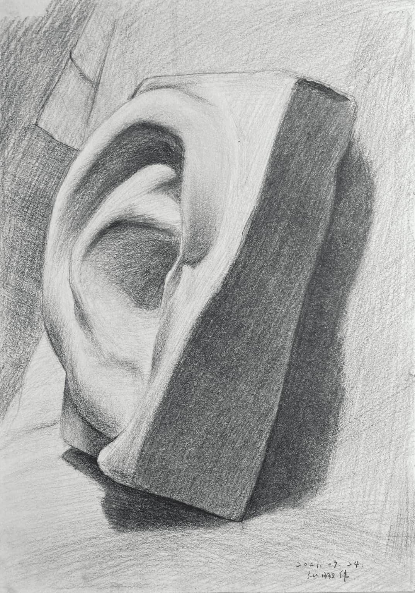

## 5@20210927 石膏眼睛

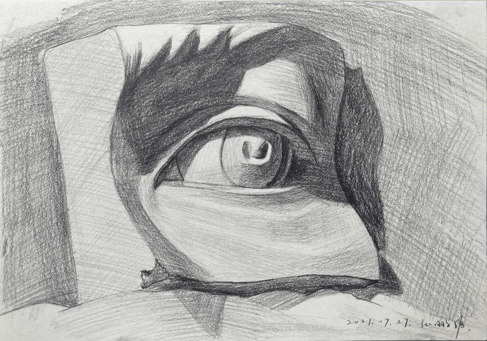

## 6@20211006-08 贝多芬石膏面像
4K的纸，左右两部分是分开两堂课完成的。

这张画完，一扫之前的枯燥，似乎可以开始画小人了，很有成就感。其实还差得远。这些都是照着别人画好的素描，临摹的，离自己观察真正的石膏像，靠自己画出来，还隔着一道观察的鸿沟。

但即使如此，半年前让我照着画这样一张，是难以实现的，所以还是有成就感，正反馈比较强。

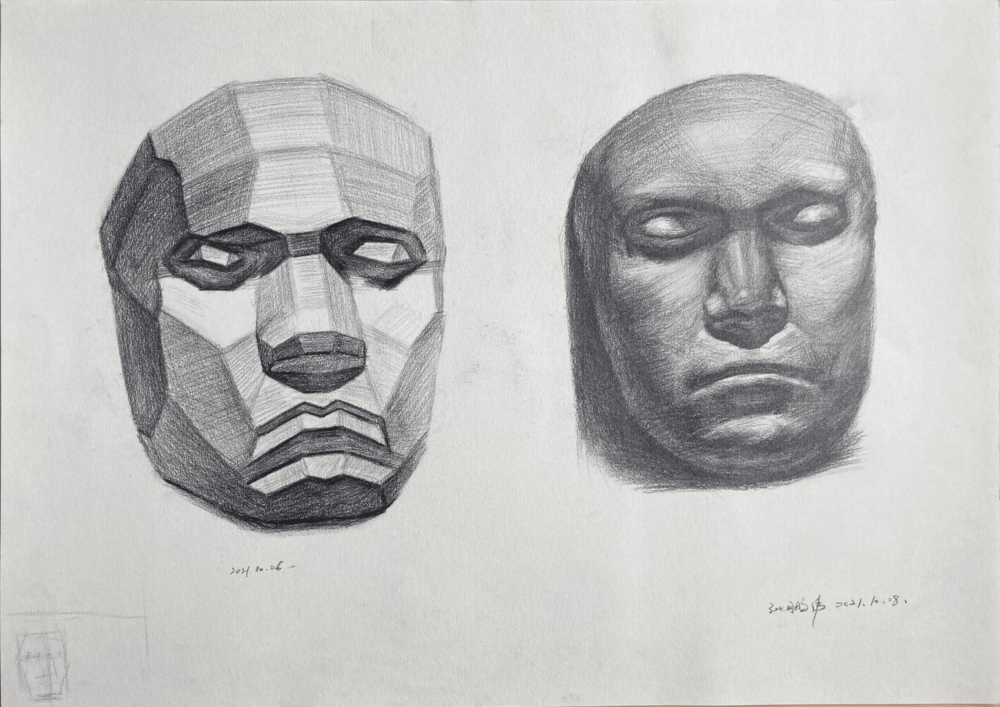

## 7@20211011~1104 四分之三大卫石膏面像
大体同上一幅，但头发占据很多工作量，照着画抄作业，也是需要一定观察能力才行，不然抄不明白。

学习到这里，不太涉及更多的理论知识，有也是五官结构这种，不属于素描基本功的范畴。于是核心诉求在于提升基本功，更高效准确的观察概况能力、起形能力、塑造能力等，而途径则是，堆练习量上去。

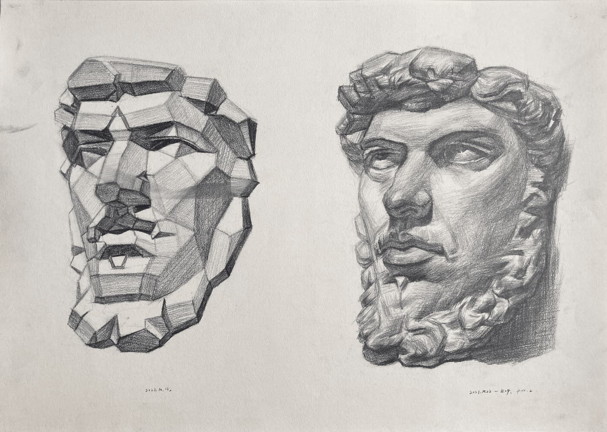


## 8@20211112-15 战神石膏头像
第一次画，一个完整的脑袋。也是两堂课才完成，署名15号是完成的日期，实际12号就用了一堂课画了。

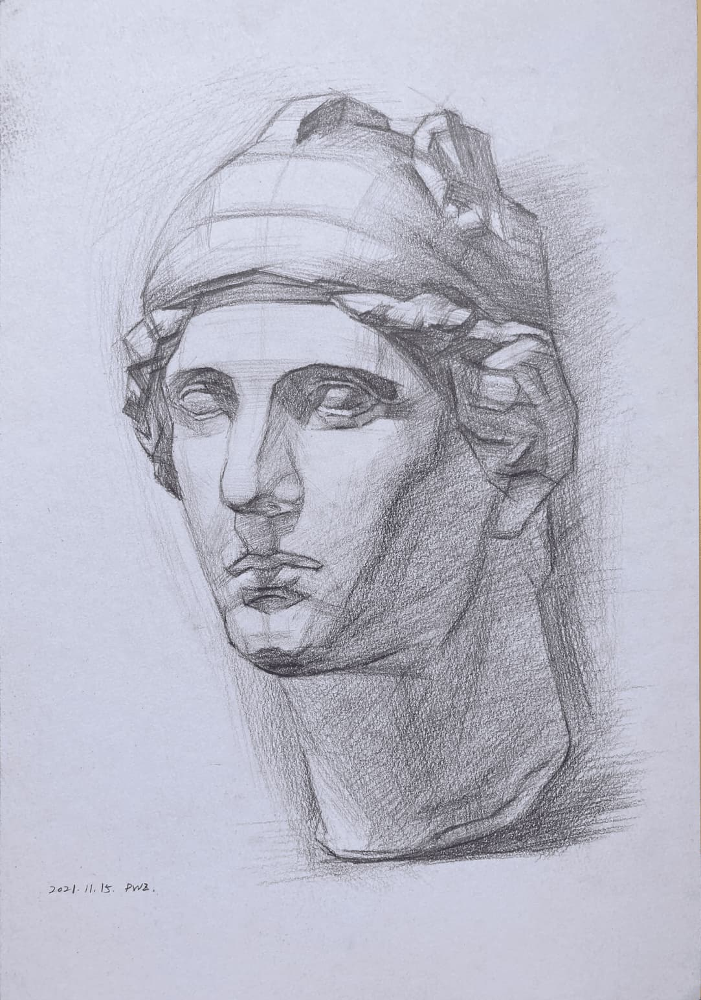


## _@20211114-15 石膏头像结构练习（哭孩、荷矛者、将军）
对头像有了基本认识后，有天晚上一口气画了很久，没具体刻画，但大体感觉是可以的。整个过程没怎么意识到时间流逝，这种沉浸在绘画中的感觉很不错。

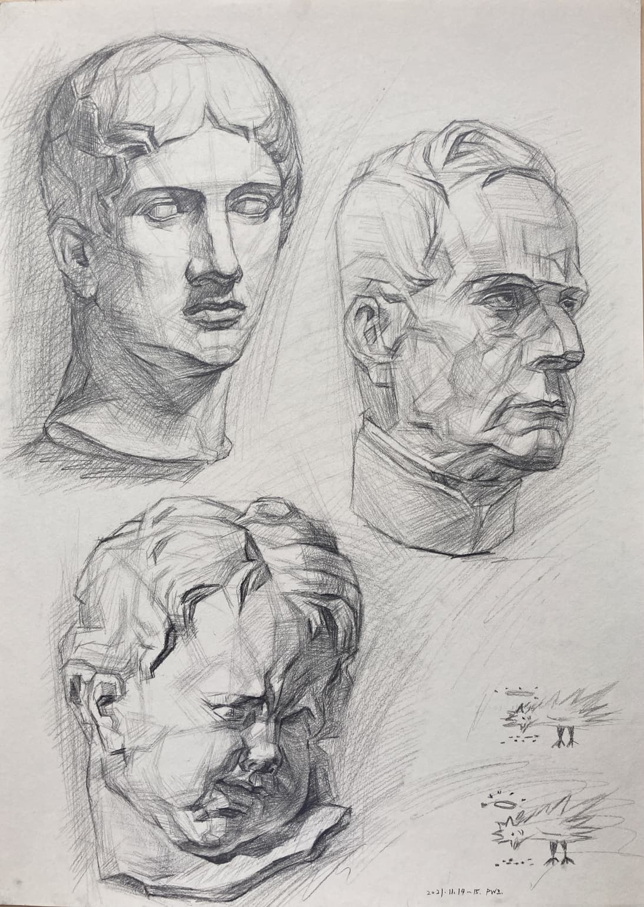


