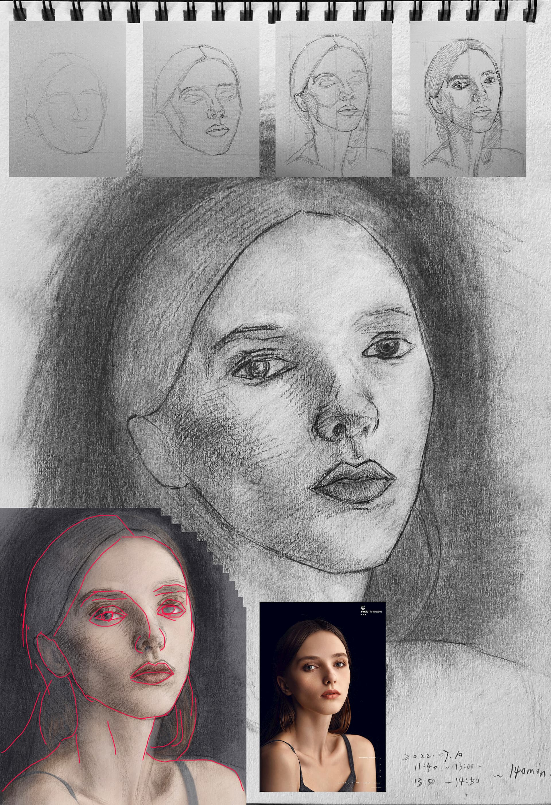

# 理解素描::三::停滞以及尝试画人像
*Posted on 2022.06.05 by [pwz](http://pwz.wiki) under [CC BY-NC-ND 4.0](https://creativecommons.org/licenses/by-nc-nd/4.0/)*  
*Updated on 2022.06.25 typo fix, format fix*
*Updated on 2022.07.10 add new sketch*

- [理解素描::三::停滞以及尝试画人像](#理解素描三停滞以及尝试画人像)
  - [停滞](#停滞)
    - [2021.11.15~2022.02.15 维纳斯石膏头像 4K ~4h](#2021111520220215-维纳斯石膏头像-4k-4h)
    - [2022.02.20 维纳斯石膏头像 4K ~2h](#20220220-维纳斯石膏头像-4k-2h)
    - [2022.03.19 阿格里巴石膏头像 4K ~2h](#20220319-阿格里巴石膏头像-4k-2h)
  - [尝试画人像](#尝试画人像)
    - [05.13-06.22 若干尝试\*8](#0513-0622-若干尝试8)
    - [06.25-07.10 尝试找准大形\*5](#0625-0710-尝试找准大形5)

## 停滞

2021.11.15~2022.04.04，这期间因为各种事情，素描练习基本停滞。

维纳斯头像是第二期课程最后一堂课的作业，拖了三个月才完成，起形有很多问题，重复画的第二遍偏差更大。阿格里巴是另外找的练习，没画完就开始涂鸦，草草结束掉了。

这个阶段没什么有效练习，因为没好好画/想好好画但没能画好，打击了自信心，消极反馈拉满，更不愿意练。时间跨度很长，也算是素描学习的一个阶段（摆烂），单独记录下。

### 2021.11.15~2022.02.15 维纳斯石膏头像 4K ~4h

### 2022.02.20 维纳斯石膏头像 4K ~2h

### 2022.03.19 阿格里巴石膏头像 4K ~2h

## 尝试画人像

2022年5月13日~7月10日，因为上海疫情没继续上第三期课程，短时间内也不想继续上课，想独自练习一阵。之前的石膏像没心情继续画，直接尝试画真实的人像。

### 05.13-06.22 若干尝试*8

  
*越画偏差越大，想的不是修正而是放弃，胡乱涂鸦，草草结束*  
 

  
*完成度极低，但似乎做到了兼顾“整体进度？*  
*“作画的任一阶段，都应该是完整的，而不是画了某个局部”，大概是这样说的，某种指导思想。*  
 

  
*企图用涂抹提高画面完成度，行不通，基础的刻画不到位，涂抹（揉擦）没有意义*  
 

  
*纸上记的：透视上需要改进，右眼的朝向以及下巴的朝向、长度；控制笔试，刻画上干净些*  
 

  
*最直观的偏差是头的长度太长了*  
 

  
*找了几个视频了解头骨结构，找了个3D模型网站，照着模型熟悉了下*  
*从观察的角度讲，没必要了解从外部看不到的骨骼结构，看到什么画什么就是*
*但从经验作画（默画）的角度讲，结构是作画的底线规则，可以帮忙确认画面关键特征点（每张脸都应该有那样几个明显的转折）*  
 

  
*花费精力在一个错误的大比例形状基础上刻画*  
 

  
*抱歉*  
 

### 06.25-07.10 尝试找准大形*5

  
*不使用揉擦，花费大部分时间观察块面形状、比例、角度*  
*大形状相比之前有进展*  
*面部的角度没有表现出来，并且是快画完才意识到，另外线条凌乱*  
 

  
*参照着网格确定大的比例关系，最终大的比例确实还说得过去*  
*细微的比例关系、角度关系，如右眼的角度、脖子的左侧边界、额头边界，导致整体神态垮掉*  
*光影刻画暂时不多关注，先解决基本的形状、透视问题*  
 

  
*继续练习大形状，下巴与脖子偏差比较大，其它及格*  
*《素描的诀窍》里开篇先讲批判性对话（这个下巴不对劲）&实用性对话（下巴的长度比实际长了一些）*  
*要适应用实用性对话进行总结（画完）&促进画面发展（作画中）*  
*保持对大关系的观察与落实程度，后续花更多精力关注细小形状的刻画*  
 

  
*看偏差图，几个比较明显的偏差（左侧眼部，上嘴唇厚度，头箍右下边界）没有注意到*  
*稍微详细些处理细节比如鼻子的时候，有种无从下手的感觉，要努力观察+总结概括几何形状，实在观察不来找参考练习*  
 

  
*画到一半的时候就觉得已经没救了，上纸巾擦了一遍，还想尝试把形状找一找，徒劳无功*  
*花费的时间并不短，这样的越级练习停掉吧，练习效率太低了*    
 