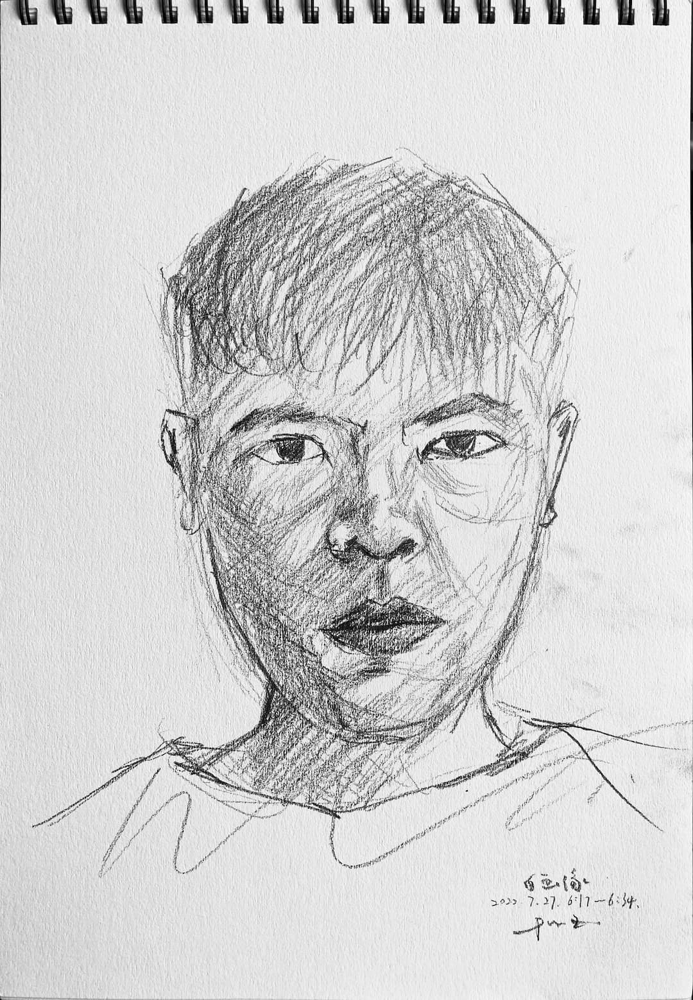
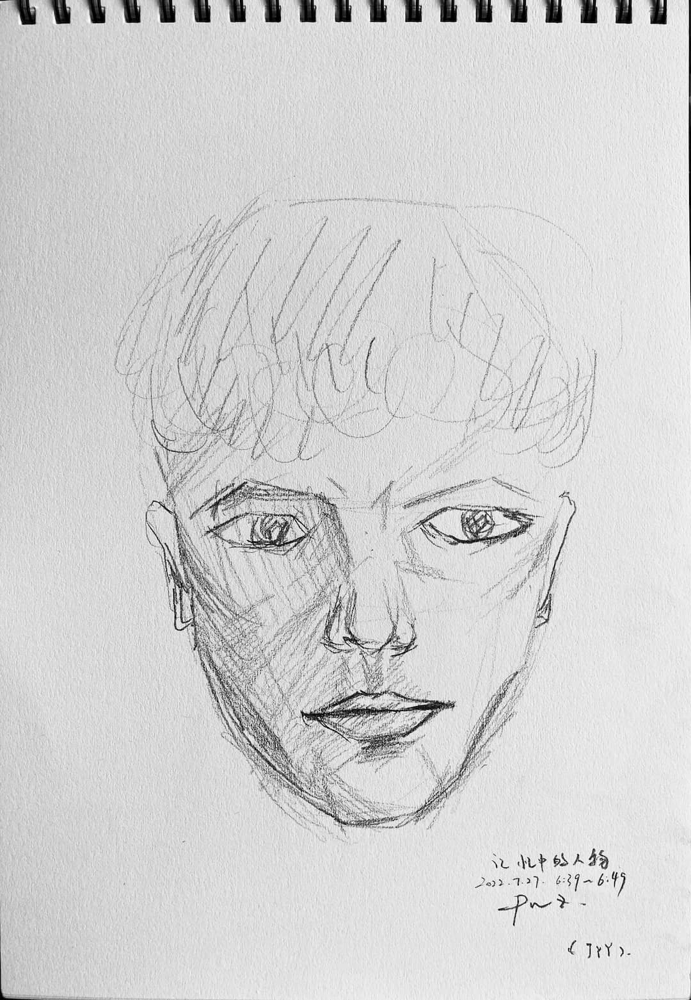
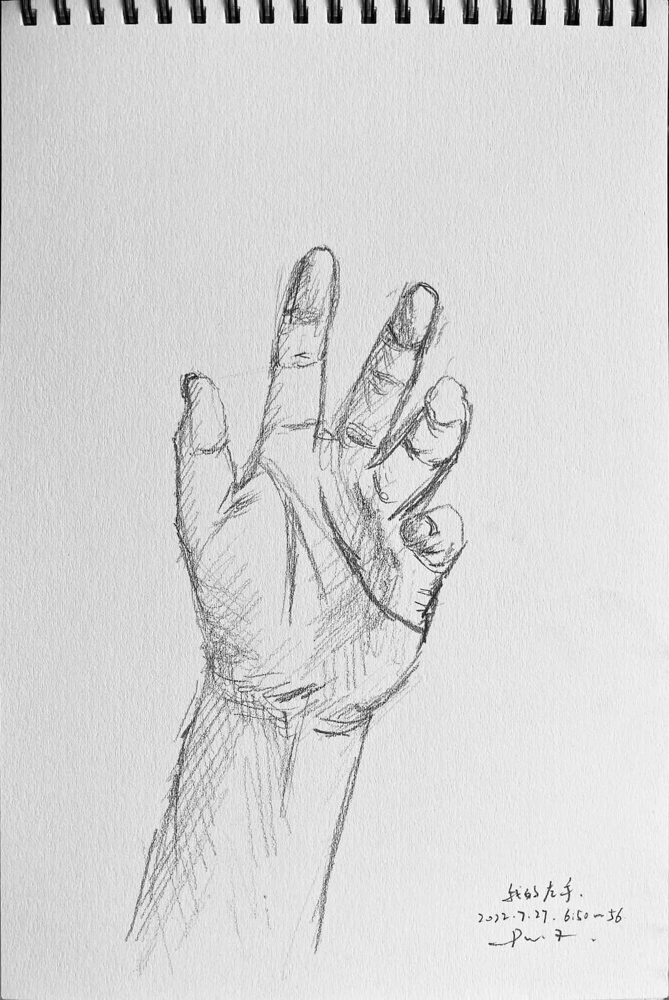
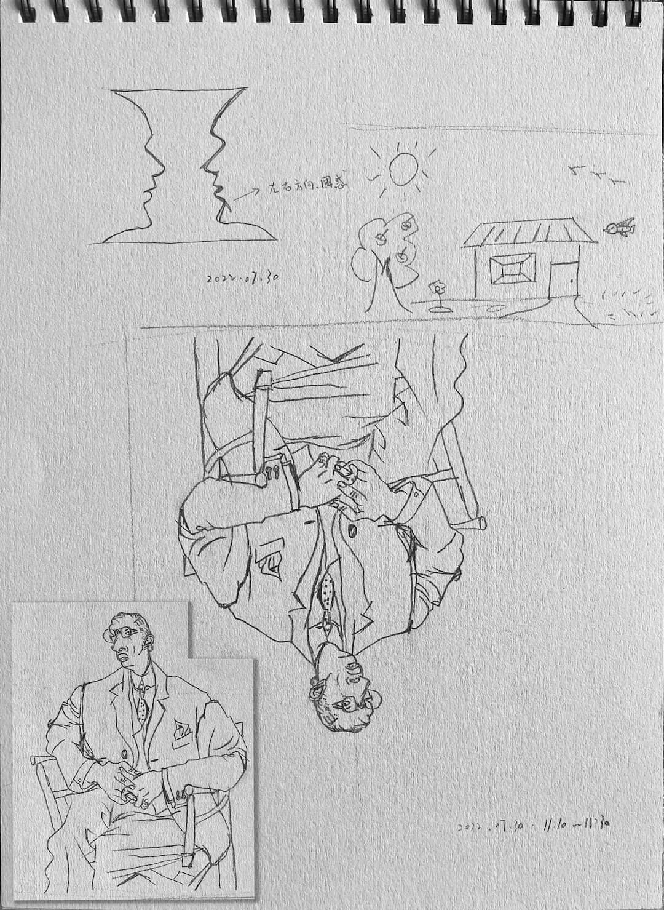
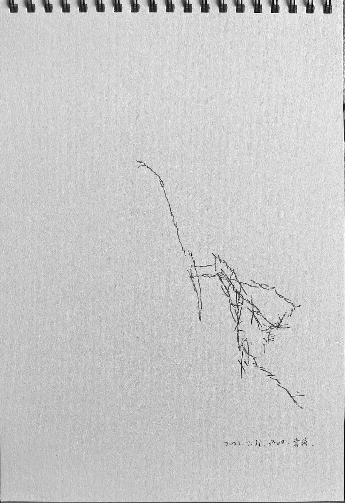
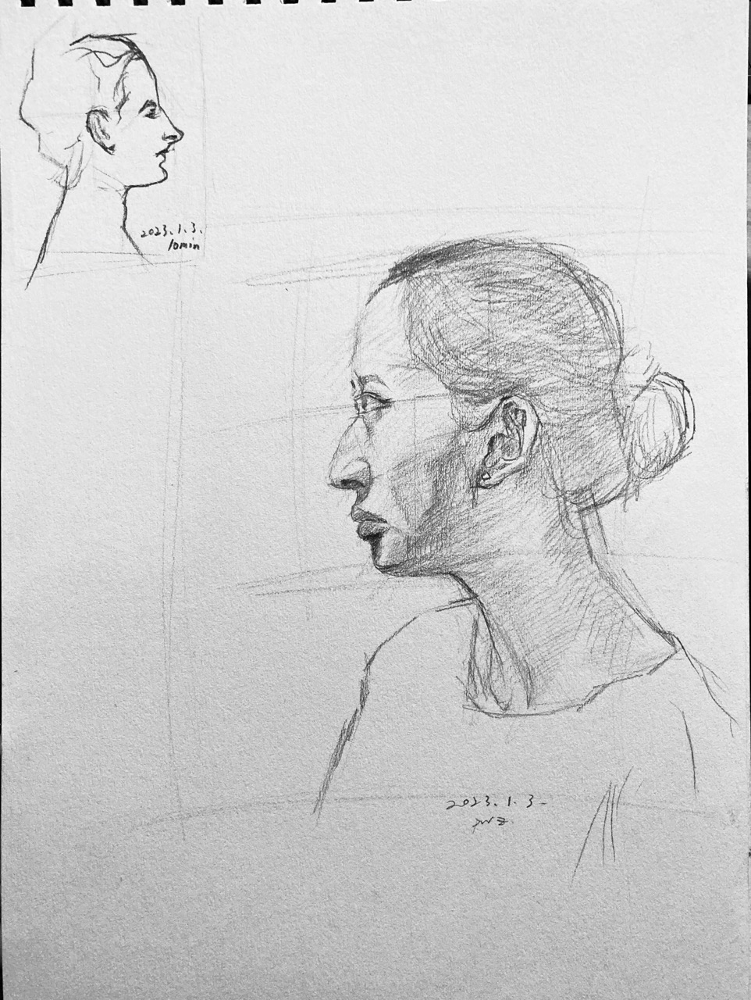
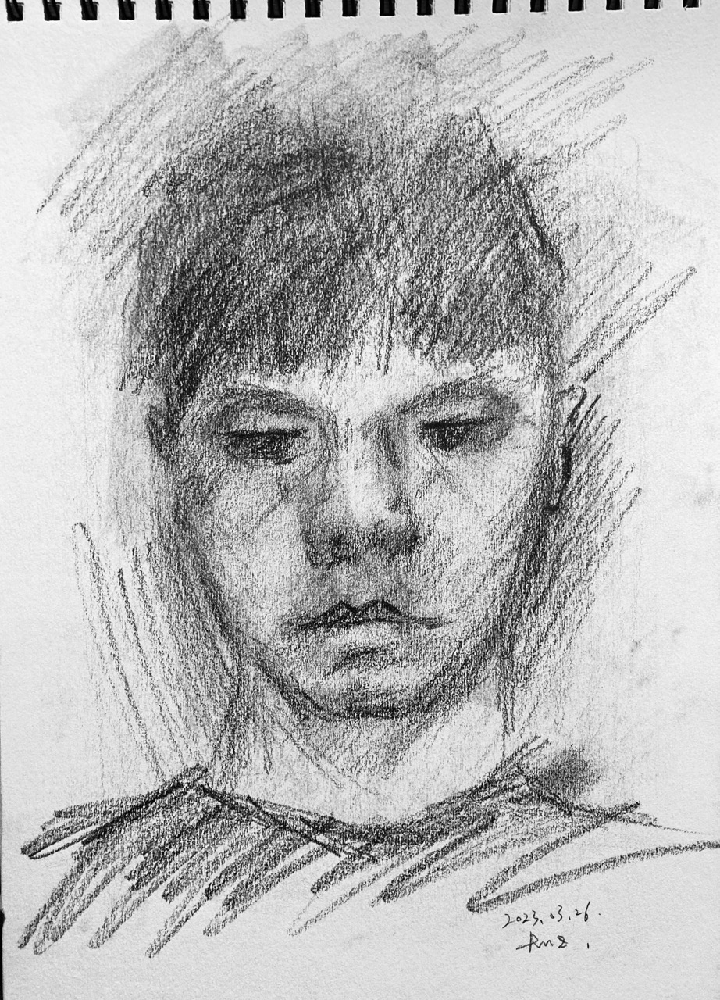
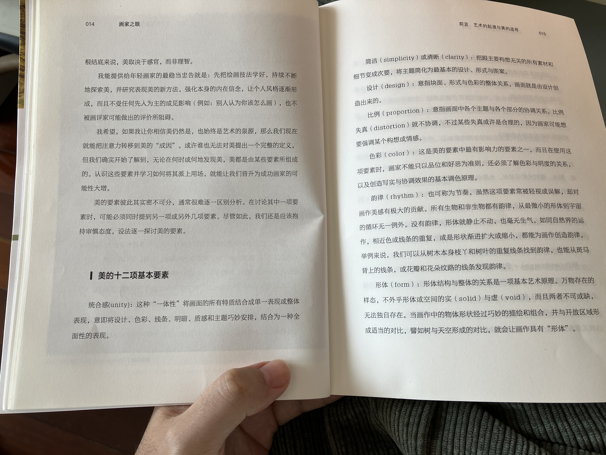
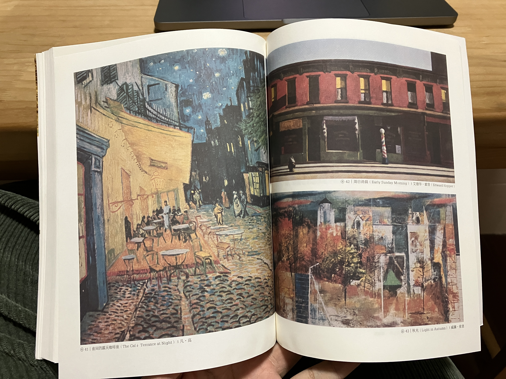
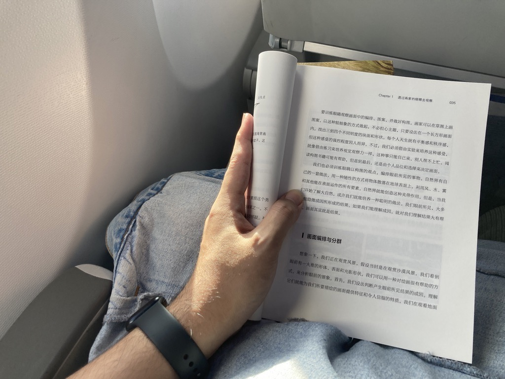

# 理解素描::四::读读书是否会有长进？
*Posted on 2022.07.10 by [pwz](http://pwz.wiki) under [CC BY-NC-ND 4.0](https://creativecommons.org/licenses/by-nc-nd/4.0/)*  
*Last updated on 2023.04.05*

- [理解素描::四::读读书是否会有长进？](#理解素描四读读书是否会有长进)
  - [Drawing on the Right Side of the Brain (《像艺术家一样思考》) by Betty Edwards](#drawing-on-the-right-side-of-the-brain-像艺术家一样思考-by-betty-edwards)
    - [01. 绘画和骑单车的艺术](#01-绘画和骑单车的艺术)
    - [02. 素描训练基础说明](#02-素描训练基础说明)
    - [03. 左脑与右脑](#03-左脑与右脑)
    - [04-06. 右脑模式体验\&儿时符号系统\&绕开符号系统](#04-06-右脑模式体验儿时符号系统绕开符号系统)
    - [07-08. 感知空间的形状（阴形）\&透视基础](#07-08-感知空间的形状阴形透视基础)
    - [09. 画头像](#09-画头像)
    - [10. 光线与阴影的逻辑](#10-光线与阴影的逻辑)
    - [99. 读后小记#20230327](#99-读后小记20230327)
  - [The Eye of the Painter and the Elements of Beauty (《画家之眼》) by Andrew Loomis](#the-eye-of-the-painter-and-the-elements-of-beauty-画家之眼-by-andrew-loomis)
    - [01. 序言](#01-序言)
    - [02. 我的理解](#02-我的理解)
      - [简洁（Simplicity）](#简洁simplicity)
      - [色彩（Color）](#色彩color)
      - [质感（Texture）](#质感texture)
    - [03. 读后小记#20230402](#03-读后小记20230402)
  - [Keys to Drawing (《素描的诀窍》) by Bert Dodson](#keys-to-drawing-素描的诀窍-by-bert-dodson)
    - [1. The Drawing Process](#1-the-drawing-process)
    - [2. The Artist's Handwriting](#2-the-artists-handwriting)
    - [3. Proportions: Taking the Measure of Things](#3-proportions-taking-the-measure-of-things)
    - [4. The Illusion of Light](#4-the-illusion-of-light)
    - [5. The Illusion of Depth](#5-the-illusion-of-depth)
    - [6. The Illusion of Texture](#6-the-illusion-of-texture)
    - [7. Pattern and Design](#7-pattern-and-design)
    - [8. Drawing and Imagination](#8-drawing-and-imagination)

## Drawing on the Right Side of the Brain (《像艺术家一样思考》) by Betty Edwards

### 01. 绘画和骑单车的艺术

可以从某种角度将知识分类为思考类知识和运动类知识[*(Refer~YJango-大脑运作模式视角下的知识分类)*](https://zhuanlan.zhihu.com/p/50793837)，关于学习绘画的相当一部分内容属于构建运动类知识这个过程，所以我们不能简单通过听课、阅读来掌握绘画。

>大多数美术教师和美术教科书的作者们忠告初学者“改变你们看事物的方法”以及“学习如何看事物”。
>问题是这种看事物的不同方法很难解释，就像如何在单车上平衡一样。
>大多数人永远也没学会更好地看事物，以至于不能绘画。

>每个有一般视力和一般眼手协调能力的普通人都能学会绘画

>神秘的绘画能力似乎就是一种将大脑的状态转换到不同的视觉／感知模式的能力。
>当你能够掌握画家们看事物的特殊方法时，你就能画画了。
>学习绘画的关键是把大脑转换到不同的信息处理模式，即一种意识模式的轻微转换，为你能够更好地看事物建立条件。

### 02. 素描训练基础说明

这一章介绍（本书中）关于素描训练的基本信息，需要用到的工具，布置了三项“学前练习”，分别是“自画像”、“某位记忆中的人物”和“自己的手”。

### 03. 左脑与右脑

大多数人左右脑具有偏侧性，左右脑擅长的东西不一样。相比于擅长逻辑分析的总在进行概括归类的词汇性的左脑，右脑更擅长处理绘画这项任务。

>就我们所知，在这个星球的所有生物中，人类是惟一一个能够画出自己所在环境中人和事物形象的物种

>左脑控制身体的右侧，右脑控制身体的左侧

>在使用右脑模式处理信息时，我们拥有直觉和卓越的洞察力——这时我们不用按照逻辑顺序解决问题。
>这就是右脑模式：一个直觉性的、主观的、相关的、整体的、没有时间概念的模式

>今天，教育家们越来越关心直觉和创意的重要性。然而，学校系统通常仍然构建在左脑模式的基础上。
>我们的文化太倾向于奖励左脑的技能，以至于我们的孩子们丧失了一大部分右脑的潜力。科学家洁儿·乐伟曾经幽默地说——经历过美式科学培训的研究生们有可能完全摧毁自己的右脑

| |左脑模式	|	|右脑模式|
|---|---|---|---|
|词汇性	|使用词汇进行命名，描述和定义。|	非词汇性|	使用非词汇性认识来处理感知。
|分析性	|有步骤地解决问题，一部分一部分地来。	|综合性	|把事物整合成为一个整体。
|象征性	|使用符号来象征某些事物。比如说，象形图画代表笑脸，＋代表加法。	|真实性|	涉及事物当时的原样。
|抽象性	|取出很少的一点信息代表整个事物。	|类似性	|看到事物相同的地方，理解事物象征性的含义。
|时间性	|有时间概念，将事物排序；首先做什么，然后做什么，等等。	|非时间性	|没有时间概念。
|理性	|根据理由和事实得出结论。	|非理性	|不需要以理由和事实为基础；自动自发地不做出判断。
|数字性	|使用数字进行计算。	|空间立体性	|看到事物与其他事物之间的联系以及怎样由各个部分组合成为一个整体。
|逻辑性	|根据逻辑得出结论；把事物按照逻辑顺序排列，比如说一个数学定律或一个理由充分的论据。|	直觉性|	根据不完整的规律，感觉或视觉图像洞察出事物的真相。
|线性	|进行连贯性思维，一个想法紧接着一个想法，往往引出一个集合性的结论。	|整体性	|一下子看到整个事物；感知整体规律和结构，往往引出分散性的结论。

*上表来自原书*

### 04-06. 右脑模式体验&儿时符号系统&绕开符号系统

对应原书4~6章。通过一些设计好的绘画任务，感受左脑的符号系统对绘画的（不利）影响以及纯粹的右脑模式对绘画的帮助。右脑模式实际对应以前总结过的，“如实的观察”。

>左脑对这种详细的感知毫无耐性，实际上它会说：“我告诉你，那就是把椅子。知道这些就够了”

>这些符号从哪来呢？在画儿童画的那些年里，每个人都发展了一套符号系统。这个符号系统根植于你的记忆中，符号们随时准备被提取出来，就像画你的儿童风景画时那样。

>总的来说，成年学生在绘画的初级阶段并没有真正看到他们眼前的东西，也就是说，他们没有按照绘画所必需的特殊方法感知事物。他们记下需要画的是什么，然后根据自己小时侯发明的符号系统和对眼前事物的认识，快速地把感知翻译成词汇和符号。

>重复一遍，关键是如何完成从左脑模式到右脑模式的认知转换。像我在第四章说的那样，最有效的方法是向大脑提交一项左脑不能或不想处理的任务。

>向十岁以上的人教授写实画的中心问题是，当那些绘画符号不再适用于这个任务时，它们挥之不去。

>双目视觉使我们看到的世界是三维的。这个能力有时也被称作“深度透视”。当你闭上一只眼睛，看到的图像是两维的，也就是说，图像看起来是平的，像一张照片。我们绘画时用的纸也是平的或两维的。

>到目前为止，我们已经发现了左脑在能力上的一些缺陷。它不喜欢对称的图像（如酒杯／人脸画）。它不能应付颠倒过来的感知信息（如在颠倒的斯特拉文斯基的画像中那样）。它拒绝处理缓慢、复杂的感知（如纯的和改良轮廓画）。我们通过利用这些缺陷来帮助右脑模式有机会在没有左脑模式干扰的情况下处理视觉信息。

### 07-08. 感知空间的形状（阴形）&透视基础

构图的定义：阳形（目标物体/人物）+阴形（空白区域）+框架（平面外围边线）

阴形的作用
* 阴形让“困难”的绘画任务变得简单
* 对阴形的强调可以统一你的画面，并加强画面的构图，甚至更重要的是，改善了你的感知能力

比率是相互关系的基础

丢勒的装置（“正式透视”） 过于左脑化、显得呆板僵硬

观察、耐心观察、相信自己对角度和比例关系的观察

>如果画中任何部分似乎有点“变形”或“画得不精确”，用你的透明塑料显像板把有问题的区域检查一遍

>“如果在你的画中，你习惯性地漠视比例关系，你将会习惯失真的视野，并失去鉴定的能力。生活于贫困的人最终将习惯于此。”
>    ——《艺术的精神》，1923。

### 09. 画头像
人像画要求非常精确的感知，比例关系至关重要，右脑善于识别人脸，像与不像立刻就能知道

除了复杂程度，某种类型的画（比如人像）不会比另一种类型的画更难，进行任何类型的绘画时所做的工作都是相同的，每一幅画都要求你学习这些基本感知技巧

大脑总是强制刚刚接收到的视觉信息去适应已有的观念和信仰，这减少引入信息的复杂性，但对绘画是干扰，要试着用逻辑方法证明某些比例关系是怎样就是怎样的

从“被削掉的头骨之谜”引出若干关键比例  
* 眼睛到下巴的距离与眼睛到头顶的距离相等
* 眼睛水平线到下巴的长度与眼外角到耳朵背后的距离相等

正侧面肖像练习：

### 10. 光线与阴影的逻辑

如左脑对阴形与颠倒的画面的不感兴趣一样，左脑对光与影也不重视，需要调动意识客观地观察光影。

人像画三个基本角度：正面、侧面、四分之三侧面

运用光线逻辑画一幅完全相似、带有色调、充满立体感的自画像：

### 99. 读后小记#20230327

<video src="./sketch/Drawing-on-the-Right-Side-of-the-Brain/20230327-video.mp4" controls="controls" width="960px"> </video>

最后一张自画像，傍晚坐窗前开始画，没多会儿天完全黑掉懒得开灯摸黑涂鸦，开灯后真是“惊喜”。对比开始读这本书时第一张自画像，绘画能力没啥进展（归咎于若干练习敷衍了事），认知方面书中关于左脑右脑模式的论述最有趣，理解并运用这种差异可以更好地进行绘画。有一种观念在读这本书时又不断被强化，即不带抽象总结的客观的观察与落笔，是描绘准确的关键，对于这本书而言，就是进入右脑模式感知现实情况，借助左脑模式评估修正，屏蔽左脑的符号系统。

## The Eye of the Painter and the Elements of Beauty (《画家之眼》) by Andrew Loomis

### 01. 序言

全书列出美的12项基本要素，围绕这些要素一一进行讲述：这些要素具体指什么，如何做到。如作者前言写的一样，**要素彼此其实密不可分**，在书中被如此拆分独立，有些有道理没什么辩驳的空间，比如颜色，这是很明确的画面物理属性，但有些有很大的讨论空间怎么说怎么有理，比如韵律，我在阅读时一直觉得这样的词汇适合表达感受，它是由其他更实在的要素组合出来的结果，它本身不适合作为基本要素来描述美。

具体对这些要素的描述如下，摘自原书：

>**The elements of beauty are so well integrated** that it is often very difficult to separate them for purposes of analysis. In discussing one principle or element it may be necessary to embrace another or even several others at the same time. Nevertheless, the attempt should be made to bring each one, separately, under our scrutiny. These are the basic twelve:
>1. Unity. The "oneness" which brings all the pictorial qualities together into a single or whole expression; the organization of design, color, line, values, textures, and subject into a combined and total expresion.
>2. Simplicity, or Clarity. The subordination of all material and detail that is irrelevant to the main thought; the reduction of the subject into the fundamentals of design, form, and pattern.
>3. Design. The over-all relationship of areas, form, and color. Design makes the picture.
>4. Proportion. Harmonious relation of each subject and each part of the picture. Distortion is the opposite of proportion, though some distortion may be legitimate, where an idea or an emotion might need greater emphasis.
>5. Color. This is one of the strongest elements of beauty, and in using it the artist cannot simply be guided by tastes, likes or dislikes. The relationship of color to values must be understood, as well as the basic principles of mixing and producing colors for realistic and harmonious effects.
>6. Rhythm. Though this is often underestimated or misunderstood, it is a quality that contributes greatly to the beauty of a painting. There is rhythm in all animate and inanimate life, from the smallest forms to the cycles of the universe. Without it, form is static and lifeless. The repetition of similar colors or of lines or shapes of increasing or diminishing size will create rhythm in a painting just as it does in nature. For instance there is rhythm, in the repeating lines of trees with their branches and leaves, or in the lines of a zebra's back, or in the petals or markings of a flower.
>7. Form. The structure of form in relation to the whole is a fundamental art principle. Everything is either form or space (solid or void) and neither can exist without the other. A painting is said to have "form" when the shapes of the objects contained in it are well outlined, well composed, and properly contrasted with the open areas — such as a tree against the sky.
>8. Texture. The rendering of surface. There is characteristic surface to all form, and this is as important as its structure. We cannot achieve true beauty by painting all form with the same type of surface, as if all things were made of the same material, which is precisely what happens too often in otherwise good painting.
>9. Values. Values and color are inseparably dependent upon each other. Neither can be true or beautiful alone. The proper relationship of values creates the effects of light and contributes to the unity of the picture. Tncorrect relationships can do more than anything else to destroy beauty.
>10. Quality of Light. An element of prime im- portance. The quality of the light in a painting blends with the actual light falling upon the picture and becomes part of it. There are many kinds of light — indoor, outdoor sunlight, diffused light, reflected light. The source of light must be related to the modeling of form, to the kind and brilliancy of color, and to texture. Without a true understanding of light a picture can become mere planes of paint and canvas.
>11. Choice of Subject. This offers the artist his greatest chance to exercise individual taste. The limitless sources of life and nature are his to tap and from them he can select, design, and produce a concentrated example of his own appreciation of beauty.
>12. Technique. The means of expression rather than the expression itself. Technique includes understanding of surface and texture, knowledge of medium and its many methods of application. It is the personal rendering by which all the other elements are brought together.

### 02. 我的理解

挑几个我比较有感触的结合自己的理解聊一聊。

#### 简洁（Simplicity）

听以前在学校作摄影经验分享的学长讲过：绘画是加法，从一张白布上不断添加所要表达的内容；摄影是减法，调整画面突出重点减少无关元素的干扰。

无论从什么角度把绘画摄影看成加法或减法，目标其实是“简洁”。摄影、绘画都在通过描绘些什么进而表达些什么，现实的或者脑海中想象的，描绘的过程要做取舍，用恰到好处的内容进行表达，好过啰哩啰嗦画蛇添足，三两句话能讲清楚的不必多费口舌写一大段，现在，这一段试图描述对“简洁”理解的话，已经超出简洁的阈值了。

一些关于简洁的思路与技巧：
* 正式作画之前在小草图中试画想呈现的效果，在最开始时就决定好把一些东西去掉
* 简化眼前所见或者一开始就挑选简单的主题，专注有趣的部分
* 画作该有一个焦点，焦点区要有最鲜明的细节或色彩，对应的要弱化其他部份
* 简化画面要尽可能把图案或色调区域当成平面看待，不要拆解过于零碎或过度立体化（参考各种有大块面的海报，不是说没有图案或明度的精细变化，是说精细之处应由更强有力的大图案囊括）
* 组成物体的平面要保持简单，将太多复杂小平面简化为几个大平面，去掉不必要的线条，例如去掉衣服中不必要的褶皱
* 减少锐利的边缘
* 减少明度数量

一些有道理的言论：
>* It is in massing and grouping (in creating design which did not exist before) that the artist can outdo the best results of color photography.
>* 写实艺术或具象艺术要继续发展，主要依赖某种创意。
>* Art is stressed in schools today, and there are many special art schools and summer classes for amateurs and budding professionals. But the question is: How much creativeness can be taught? This is something that is either inborn or developed by the unflagging interest, study, and hard work of the individual himself.

#### 色彩（Color）

前一本书色彩的章节直接跳过了，对色彩一无所知，目前学习素描也不会画颜色，这本书讲色彩的部分不多就读一读，积累些零散的色彩基础认知。

色彩加上其他美的要素，能让美达到极致，其中明度比任何要素更能掌控色彩。具体的颜色是我们可以在商店直接买到的，但颜色的明度要靠人工控制，`The point is that we do not buy shades and tints and variations of color; we produce them on our palette from basic primaries.`，这里我没太理解，颜色的明度（深浅色调）是不是如今也是可以直接买到的？当然了，不管买不买得到，连续的细微明度变化总是要靠人来通过离散的能买得到的颜色控制。

大多数画只需要几管颜料就能完成，利用红黄蓝各自的寒暖色，可以调出任何色彩或色调，以及各颜色的明暗色度。颜色调制有很多技术细节需要注意，有些成分之间互相会产生化学反应导致变色。这个知识细节对我来说太硬核了先跳过。补充下额外去查的三原色：
* 颜料三原色（CMYK）：红、黄、蓝。色彩三原色可以混合出所有颜料的颜色，同时相加为黑色。
* 光学三原色（RGB）：红、绿、蓝。光学三原色混合后，组成显示屏显示颜色，三原色同时相加为白色。

将纯色紧密连画彼此留些许间隔，人眼看上去就会看到其他色彩，或者用基本颜色调出期望的颜色作为**中间色（neutralized color）**，然后在这个中间色上分别涂上原来调出这个颜色所用到的颜色，这是所谓的**破色（broken color）**。红黄蓝两两混合产生**二次色（secondariy color）**，红+黄=橘色，红+蓝=紫色，黄+蓝=绿色，橘色、紫色、绿色分别是蓝、绿、红的**补色（complementary color）**。二次色加一种原色就是**三次色（tertiary color）**。

三原色基本上并不相关，绘画时不可让三原色力量均等，会彼此失衡。不是说画面必须由一个原色主导，我们只是调和颜色让色彩和谐，若想扩大和谐感，就挑一个二次色或三次色，少量加到画面的色彩上。

#### 质感（Texture）

应该是全书最短章节，书中描述不多，但质感这个话题，无论素描还是油画，想想在二维平面上用同样的画笔画出来的感觉，物体表面的质感可以完全不同，很有趣。

质感与形体无关，与笔法、技法比较相关。质感通常可以借由暗示来表现，不必以刻画的方式临摹，更具体的例子书中没举，我在网上查了查，有一说法是质感主要靠物体高光和反光的色调变化来表现，这与书中说不必刻画而是暗示，似乎是一个意思。关于质感的体现，还没做过什么练习，后续实际画画过程可以再体会一番。

除了暗示，还有人通过真实的物理属性表现质感。画布本身的质感会影响画作的质感，有的画家会把沙子加进打底的媒材，让画布产生颗粒状，另外用不同的绘画工具画出来的内容也会具有不同的质感。

### 03. 读后小记#20230402

回上海的途中读完这本很久之前买回到家中一直没动放在书架上的书，15万字多是论述没有练习外加有些基础的了解于是读的很快，写这些笔记时又找来了英文版本重新对照阅读了一次，有收获但不多，原因也在于很多内容之前已经有所了解。看到个还不错的视频可以[快速了解这本书](https://www.bilibili.com/video/BV1XZ4y1w7A1/?spm_id_from=333.788&vd_source=215226f55ec25efebe70612682143c68)。

## Keys to Drawing (《素描的诀窍》) by Bert Dodson

This may be my third or fourth time reading this book, definitely more than twice. Before taking the formal course from the sketch teacher, I knew about this book and learned the basics of painting through it. I'd like to review some inspiring or important viewpoints in this book and do some casual exercises. It's midnight and raining outside, let's go have fun.

### 1. The Drawing Process

>It takes courage to ignore knowledge and to respond to what we see instead.

### 2. The Artist's Handwriting

### 3. Proportions: Taking the Measure of Things

### 4. The Illusion of Light

### 5. The Illusion of Depth

### 6. The Illusion of Texture

### 7. Pattern and Design

### 8. Drawing and Imagination

